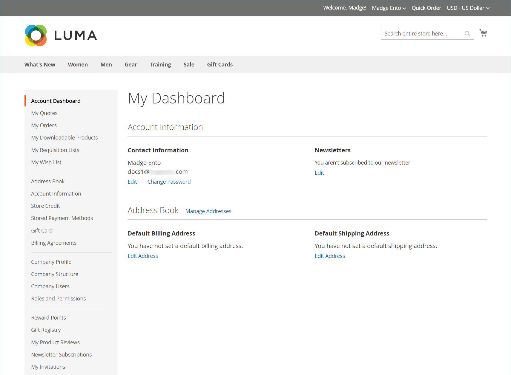

# Cuentas de empresa

Al incorporar cuentas de empresa B2B en su tienda, puede simplificar la experiencia de compra corporativa permitiendo que las empresas creen varias subcuentas con permisos flexibles basados en las funciones de usuario en su organización. Dependiendo de la empresa, un administrador de tienda puede ajustar las promociones y los precios para adaptarlos a sus necesidades, y crear ofertas altamente personalizadas que se adapten a las demandas de los compradores y aumenten los pedidos. Adición de una asociación de cuenta de compañía a un estándar [particular](../customers/account-create.md) permite al cliente utilizar los flujos de trabajo de compra específicos definidos para la empresa.

Ventajas de una cuenta de empresa:

- Ofertas ilimitadas [usuarios de empresa](account-company-users.md) y la creación de cuentas adicionales, lo que simplifica las compras corporativas.

- Incluye compatibilidad con un _inteligente_ jerarquía de cuenta de empresa con diferente [funciones y permisos](account-company-roles-permissions.md) para realizar pedidos.

- Proporciona un mecanismo para que los comerciantes aumenten sus ingresos mediante ofertas [crédito en tienda de empresa](credit-company.md) como forma de pago.

- Admite el [administración](account-company-manage.md) de todas las cuentas de compañía en el administrador.

## Ver cuentas de empresa

El _Compañías_ la cuadrícula muestra todas las cuentas de empresa activas y las solicitudes pendientes, independientemente de la configuración de estado. También proporciona las herramientas para [creación](account-company-create.md) y [administrar](account-company-manage.md) cuentas de empresa. Utilice los controles de cuadrícula estándar para filtrar la lista y ajustar el diseño de la columna. Para obtener una lista de descripciones de columnas, consulte la _Descripciones de columna_ sección en [Administración de cuentas de compañía](account-company-manage.md).

Los clientes pueden crear una cuenta de compañía desde la tienda o un comerciante puede crear una desde el administrador. De forma predeterminada, la capacidad de crear cuentas de compañía desde la tienda está habilitada. Si la configuración lo permite, un visitante de la tienda puede solicitar abrir una cuenta de empresa. Una vez aprobada la cuenta de la empresa, el administrador de la empresa puede configurar la estructura de la empresa y los usuarios con varios niveles de permisos.

En el _Administrador_ barra lateral, vaya a **[!UICONTROL Customers]** > **[!UICONTROL Companies]**.

{width="700" zoomable="yes"}

El [!UICONTROL Companies] la cuadrícula enumera todas las compañías independientemente de su estado. El ejemplo mostrado muestra las cuentas de dos compañías: la compañía &quot;ACME&quot; y la compañía &quot;Vandelay&quot;.

## Administrador de empresa

El siguiente ejemplo muestra el _Clientes_ cuadrícula con las cuentas iniciales del administrador de la empresa.

{width="700" zoomable="yes"}

Es posible que la persona que sirve como administrador de la compañía tenga varias funciones dentro de la compañía. Si se introduce una dirección de correo electrónico independiente para el administrador de la empresa, la estructura inicial de la empresa incluye el administrador de la empresa más una cuenta de usuario individual en el nombre del administrador de la empresa. En tal caso, el administrador de la empresa puede iniciar sesión en la cuenta como empresa o como usuario individual.

Después de crear la cuenta, el administrador de la empresa define la estructura de la empresa de [equipos](account-company-structure.md), configura el [usuarios de empresa](account-company-users.md), y establece [funciones y permisos](account-company-roles-permissions.md) para cada uno.

### Establecer la contraseña de administrador de la empresa antes del primer inicio de sesión

1. El administrador de la empresa encuentra un correo electrónico de bienvenida de la tienda.

   {width="500"}

   >[!NOTE]
   >
   >Los destinatarios de las direcciones de correo electrónico y el contenido del correo electrónico están determinados por las opciones especificadas en la variable [opciones de correo electrónico de empresa](email-company-configuration.md) configuración.

1. Sigue las instrucciones y los clics [!UICONTROL **vincular**] para establecer su contraseña.

1. Introduce un [!UICONTROL **Nueva contraseña**] para su cuenta y, de nuevo, para confirmar.

   La contraseña debe incluir al menos tres de los siguientes tipos de caracteres:

   - Caracteres en minúsculas (abc...)
   - Caracteres en mayúsculas (ABC...)
   - Números (1234567890)
   - Caracteres especiales (!@#$...)

1. Clics [!UICONTROL **Establecer una nueva contraseña**].

   {width="700" zoomable="yes"}

1. Si la variable [!UICONTROL Customer Login] cuando aparece la página, el cliente introduce su [!UICONTROL **Correo electrónico**] y [!UICONTROL **Contraseña**].

1. Clics [!UICONTROL **Iniciar sesión**] para acceder a su tablero de cuentas.

   {width="700" zoomable="yes"}

## Estructura de la empresa

Se puede configurar una cuenta de compañía para reflejar la estructura de la empresa. Inicialmente, la estructura de la empresa incluye solo el administrador de la empresa, pero se puede expandir para incluir equipos de usuarios. Los usuarios pueden estar asociados a equipos u organizados dentro de una jerarquía de divisiones y subdivisiones dentro de la compañía. La estructura está diseñada para admitir el uso de [reglas de aprobación](account-dashboard-approval-rules.md) para [pedidos de compra](purchase-order-flow.md) (PO) asociados a la cuenta de la empresa.

{width="450"}

En el panel de cuentas del administrador de la empresa, la estructura de la empresa se representa como un árbol y consiste inicialmente solo en el administrador de la empresa.

{width="600"}

Cuando se crea la cuenta, el administrador de la empresa puede utilizar la dirección de correo electrónico de la empresa o tener asignada una dirección de correo electrónico diferente.

En el ejemplo siguiente, la estructura inicial de la empresa incluye el administrador de la empresa más una cuenta de usuario individual en el nombre del administrador de la empresa. Sin embargo, las funciones de administrador de la empresa (como la estructura de la empresa y las reglas de aprobación) solo están disponibles cuando se inicia sesión en la cuenta de usuario designada como administrador de la empresa.

{width="600"}
