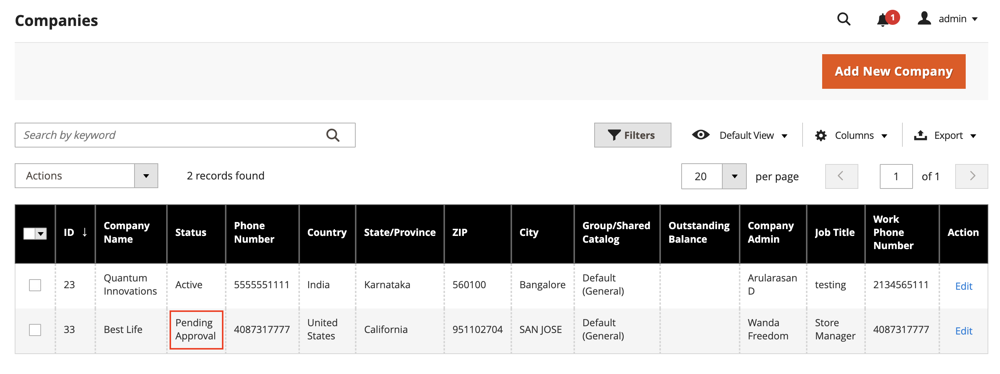

# Aprobar una cuenta de compañía

El estado de las solicitudes recibidas de la tienda para crear una compañía es el siguiente `Pending Approval` hasta que el administrador del almacén revise la solicitud y la apruebe o rechace. El estado de una cuenta de compañía puede establecerse en cualquiera de las siguientes opciones:

- [!UICONTROL Active]
- [!UICONTROL Pending Approval]
- [!UICONTROL Rejected]
- [!UICONTROL Blocked]

También puede utilizar la variable [Control de acciones](account-company-manage.md) para aprobar varias solicitudes de la compañía.

{width="700" zoomable="yes"}

## Aprobar una cuenta de empresa pendiente

1. En el _Administrador_ barra lateral, vaya a **[!UICONTROL Customers]** > **[!UICONTROL Companies]**.

   Puede usar el complemento _[!UICONTROL Columns]_sobre la cuadrícula para mostrar el **[!UICONTROL Status]**columna.

1. En el _[!UICONTROL Action]_, haga clic en **[!UICONTROL Edit]**.

1. Establecer **[!UICONTROL Company Status]** hasta `Active`.

   {width="700" zoomable="yes"}

1. Cuando se le pida que confirme, haga clic en **[!UICONTROL Change status]**.

   El administrador de la empresa recibe una notificación por correo electrónico avisando que la empresa está activa.

1. Si procede, establezca **[!UICONTROL Sales Representative]** a una cuenta de usuario de administrador específica.

1. Expandir   el **[!UICONTROL Account Information]** y utilice la sección **[!UICONTROL Comment]** para introducir notas sobre la cuenta.

   Los comentarios no son visibles desde la tienda.

1. Cuando termine, haga clic en **[!UICONTROL Save]**.

   Se envía un correo electrónico de confirmación al administrador de la empresa y a la empresa para confirmar que la cuenta de la empresa está aprobada.

## Estado de compañía

| Estado | Descripción |
|------------------|--------------------------------------------------------------------------------------------------------------------------------------------|
| [!UICONTROL Active] | La empresa está aprobada y el administrador de la empresa puede administrarla desde la tienda. |
| [!UICONTROL Pending Approval] | Se ha enviado una solicitud para crear una cuenta de compañía desde la tienda, pero aún no se ha revisado. |
| [!UICONTROL Rejected] | La solicitud para crear una cuenta de empresa fue rechazada por el administrador del almacén. |
| [!UICONTROL Blocked] | La cuenta de la compañía ya no está al día. El cliente puede acceder a la cuenta desde la tienda, pero no puede realizar compras. |

{style="table-layout:auto"}
