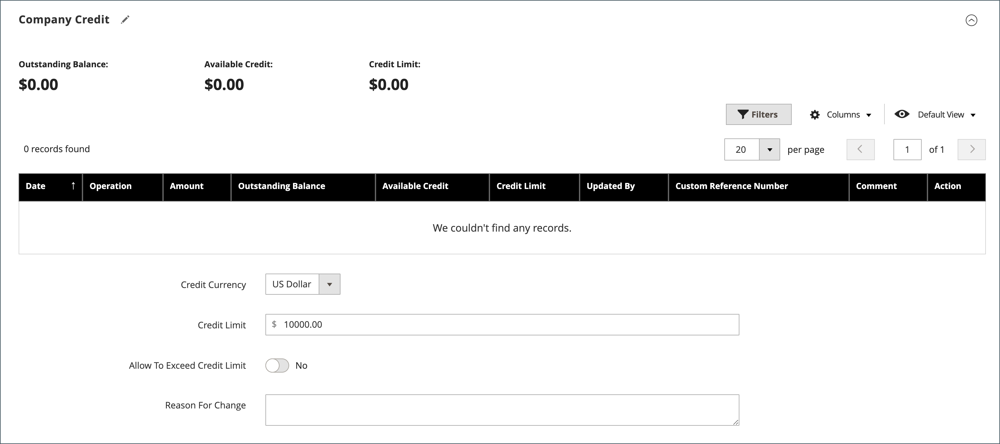

# Crear una cuenta de empresa

El cliente o el administrador pueden configurar las cuentas de la compañía desde la tienda. El administrador de la tienda debe aprobar todas las solicitudes para crear una cuenta de empresa antes de que la cuenta se active.

A la persona que configura una cuenta de compañía desde la tienda se le asigna una función como [administrador de empresa](account-company-admin.md). Una vez aprobada la solicitud para crear una cuenta de empresa, el administrador de la empresa puede establecer una contraseña de cuenta e iniciar sesión en ella.

## Método 1: el cliente crea la cuenta a partir de la tienda

>[!IMPORTANT]
>
>Para admitir este método (que permite a los clientes registrar su empresa desde la tienda), asegúrese de que la variable [Funciones B2B](enable-basic-features.md) están configuradas para que **[!UICONTROL Allow Company Registration from the Storefront]** se establece en `Yes`.

1. En la esquina superior derecha del encabezado de la tienda, el cliente hace clic en **[!UICONTROL Create an Account]** y elige **[!UICONTROL Create New Company Account]**.

   {width="700" zoomable="yes"}

   >[!NOTE]
   >
   >Si un visitante ha iniciado sesión en una cuenta de usuario registrada, puede crear una cuenta de empresa navegando a _[!UICONTROL Customer Profile]_>**[!UICONTROL Company Structure]**>**[!UICONTROL Create a Company Account]**. Al crear la cuenta de compañía, la cuenta del cliente se asigna como contacto principal. De lo contrario, el sistema crea un cliente, que recibe un correo electrónico para establecer una contraseña.

1. En el _[!UICONTROL Company Information]_, el cliente hace lo siguiente:

   - Rellena los campos obligatorios:

      - **[!UICONTROL Company Name]**
      - **[!UICONTROL Company Email]**

   - Completa los campos restantes, según corresponda:

      - **[!UICONTROL Company Legal Name]**
      - **[!UICONTROL VAT/TAX ID]**
      - **[!UICONTROL Re-seller ID]**

   {width="700" zoomable="yes"}

1. Rellena los campos obligatorios en la _[!UICONTROL Legal Address]_sección.

   - **[!UICONTROL Street Address]**
   - **[!UICONTROL City]**
   - **[!UICONTROL Country]**
   - **[!UICONTROL State/Province]**
   - **[!UICONTROL ZIP/Postal Code]**
   - **[!UICONTROL Phone Number]**

   {width="700" zoomable="yes"}

1. En el _[!UICONTROL Company Administrator]_, hace lo siguiente:

   - Ingresa el **[!UICONTROL Email address]** para el administrador de la empresa.

     La dirección de correo electrónico del administrador de la empresa puede ser la misma que la dirección de correo electrónico de la empresa o una dirección de correo electrónico diferente. Si se introduce una dirección de correo electrónico diferente, se crea una cuenta de usuario de la empresa, además de la cuenta de administrador de la empresa.

   - Ingresa el **[!UICONTROL First Name]** y **[!UICONTROL Last Name]** del administrador de la empresa.

   - Opcionalmente, rellena los campos siguientes:

      - **[!UICONTROL Job Title]**
      - **[!UICONTROL Gender]**

   

1. Completa la validación si reCAPTCHA está habilitado para esta función de tienda.

1. Cuando se complete la información, hace clic en **[!UICONTROL Submit]**.

   Cuando el comerciante aprueba la solicitud de creación de una cuenta de empresa, se envía una notificación por correo electrónico al administrador de la empresa.

   {width="500"}

   Cuando se establece la contraseña, el administrador de la empresa puede [iniciar sesión](../customers/customer-sign-in.md) a la cuenta.

## Método 2: El comerciante crea la cuenta a partir del administrador

El proceso de creación de una empresa desde el administrador es esencialmente el mismo que desde la tienda, pero con campos adicionales.

{width="700" zoomable="yes"}

1. En el _Administrador_ barra lateral, vaya a **[!UICONTROL Customers]** > **[!UICONTROL Companies]**.

1. Clic **[!UICONTROL Add New Company]** y haga lo siguiente:

   - Rellene estos campos obligatorios:

      - **[!UICONTROL Company Name]**
      - **[!UICONTROL Company Email]**

   - Si no está listo para que la cuenta se active, establezca **[!UICONTROL Status]** hasta `Pending Approval`. (Se establece en `Active` de forma predeterminada).

   - Si procede, seleccione la cuenta de administrador de **[!UICONTROL Sales Representative]** quién debe administrar la cuenta.

1. En el _[!UICONTROL Account Information]_, haga lo siguiente:

   - Rellene los campos siguientes según corresponda:

      - **[!UICONTROL Company Legal Name]**
      - **[!UICONTROL VAT/TAX ID]**
      - **[!UICONTROL Reseller ID]**

   - Para **[!UICONTROL Comment]**, introduzca cualquier información adicional acerca del cliente que pueda ser necesaria.

     Los comentarios solo son visibles desde el administrador.

   {width="700" zoomable="yes"}

1. En la creación inicial de la empresa, la variable _[!UICONTROL Company Hierarchy]_la cuadrícula está vacía al expandirla. Una vez guardada la compañía, puede incluirla en una jerarquía de compañías. Consulte [Administración de empresa](manage-companies.md).

1. En el _[!UICONTROL Legal Address]_, rellene estos campos obligatorios:

   - **[!UICONTROL Street Address]**
   - **[!UICONTROL City Country]**
   - **[!UICONTROL ZIP/Postal Code]**
   - **[!UICONTROL Phone Number]**

1. En el _[!UICONTROL Company Admin]_, haga lo siguiente:

   - Rellene estos campos obligatorios:

      - **[!UICONTROL Email]**
      - **[!UICONTROL First Name]**
      - **[!UICONTROL Last Name]**

   - Complete las siguientes partes opcionales del nombre, que pueden aplicarse a algunos nombres de clientes más que a otros y pueden utilizarse a su discreción:

      - **[!UICONTROL Prefix]**
      - **[!UICONTROL Middle Name/Initial]**
      - **[!UICONTROL Suffix]**

   - Si la información está disponible, rellene los campos restantes para describir al administrador de la empresa:

      - **[!UICONTROL Website]**
      - **[!UICONTROL Job Title]**
      - **[!UICONTROL Gender]**
      - **[!UICONTROL Send Welcome Email From]**

   {width="700" zoomable="yes"}

1. En el _[!UICONTROL Company Credit]_, que muestra un resumen de la actividad crediticia del cliente, rellene tantos campos de la parte inferior de la sección como corresponda:

   - **[!UICONTROL Credit Currency]**
   - **[!UICONTROL Credit Limit]**
   - **[!UICONTROL Allow to Exceed Credit Limit]**
   - **[!UICONTROL Reason for Change]**

   {width="700" zoomable="yes"}

1. En el _[!UICONTROL Advanced Settings]_, haga lo siguiente:

   >[!NOTE]
   >
   >La asignación del grupo de clientes determina qué catálogo compartido está disponible para la compañía y sus empleados. De forma predeterminada, la empresa se asigna al grupo de clientes establecido como predeterminado en la configuración.

   - Puede cambiar el **[!UICONTROL Customer Group]** asignación para la empresa y sus empleados a un grupo que tiene acceso a un catálogo compartido diferente o a un grupo de clientes estándar. Se le pedirá que confirme antes de cambiar el grupo.

     {width="600"}

   - Si desea permitir que los empleados de la empresa generen presupuestos a partir de su cuenta, establezca **[!UICONTROL Allow Quotes]** hasta `Yes`.

   - Si desea permitir que los empleados de la empresa creen y utilicen pedidos de compra desde su cuenta, establezca **[!UICONTROL Enable Purchase Orders]** hasta `Yes`.

   - Para cambiar el **[!UICONTROL Applicable Payment Methods]** que están disponibles para la compañía, borre la **[!UICONTROL Use config settings]** y elija una de las siguientes opciones:

     | Opción | Descripción |
     | ------ | ----------- |
     | `B2B Payment Methods` | (Predeterminado) Habilita todas las [métodos de pago definidos como predeterminados](../configuration-reference/general/b2b-features.md#default-b2b-payment-methods) para pedidos B2B. |
     | `All Enabled Payment Methods` | Hace todo [métodos de pago habilitados](../configuration-reference/sales/payment-methods.md) disponible para cuentas de cliente asociadas a la cuenta de compañía. |
     | `Selected Payment Methods` | Permite seleccionar los métodos de pago disponibles para las cuentas de cliente asociadas a la cuenta de compañía. Para seleccionar varios métodos de pago, mantenga pulsada la tecla Ctrl (PC) o la tecla Comando (Mac) y haga clic en cada opción. |

     {style="table-layout:auto"}

   - Para cambiar el **[!UICONTROL Applicable Shipping Methods]** que están disponibles para la compañía, borre la **[!UICONTROL Use config settings]** y elija una de las siguientes opciones:

     | Opción | Descripción |
     | ------ | ----------- |
     | `B2B Shipping Methods` | (Predeterminado) Habilita todas las [métodos de envío definidos como predeterminados](../configuration-reference/general/b2b-features.md#default-b2b-shipping-methods) para pedidos B2B. |
     | `All Enabled Shipping Methods` | Hace todo [métodos de envío habilitados](../configuration-reference/sales/delivery-methods.md) disponible para cuentas de cliente asociadas a la cuenta de compañía. |
     | `Selected Shipping Methods` | Permite seleccionar los métodos de envío disponibles para las cuentas de cliente asociadas a la cuenta de compañía. Para seleccionar varios métodos de envío, mantenga pulsada la tecla Ctrl (PC) o la tecla Comando (Mac) y haga clic en cada opción. |

     {style="table-layout:auto"}

1. Cuando termine, haga clic en **[!UICONTROL Save]**.

   Cuando el comerciante aprueba la solicitud de creación de una cuenta de empresa, se envía una notificación por correo electrónico a la dirección de correo electrónico del administrador de la empresa.

   Cuando se establece la contraseña, el administrador de la empresa puede [iniciar sesión](../customers/customer-sign-in.md) a la cuenta.

## Barra de botones

| Botón | Descripción |
|------- | ----------- |
| [!UICONTROL Back] | Vuelve a la página Compañías sin guardar los cambios. |
| [!UICONTROL Reset] | Restaura los valores originales en cualquier campo con cambios no guardados. |
| [!UICONTROL Save] | Guarda los cambios en la empresa y mantiene el perfil abierto. |
| [!UICONTROL Save & Close] | Guarda los cambios realizados en la empresa y cierra el perfil. |

{style="table-layout:auto"}

## Descripciones de campos

| Campo | Descripción |
|--- |--- |
| [!UICONTROL Company Name] | El nombre de la empresa se introduce la primera vez que se crea la cuenta de la empresa y puede ser una versión abreviada del nombre legal completo. |
| [!UICONTROL Status] | (Solo administrador) Indica el estado actual de la cuenta de la compañía. Opciones:  **[!UICONTROL Active]**: el administrador de la tienda aprueba la cuenta de la empresa. El administrador de la empresa y los miembros asociados pueden iniciar sesión en la cuenta desde la tienda y realizar compras. **[!UICONTROL Pending Approval]** - Se ha enviado una solicitud para abrir una cuenta de empresa, pero el administrador de la tienda aún no la ha aprobado.  **[!UICONTROL Rejected]**- Se ha enviado una solicitud para abrir una cuenta de empresa, pero el administrador del almacén no la ha aprobado. Las credenciales de inicio de sesión iniciales utilizadas para enviar la solicitud están bloqueadas. ** Bloqueado **- Los miembros de la empresa pueden iniciar sesión y acceder al catálogo, pero no pueden realizar compras. El administrador de la tienda podría bloquear una cuenta de empresa que no esté al día. El administrador de la tienda puede eliminar el bloque de la cuenta en cualquier momento. |
| [!UICONTROL Company Email] | La dirección de correo electrónico asociada a la cuenta de la empresa. |
| [!UICONTROL Sales Representative] | (Solo administrador) El usuario administrador que es el contacto principal de la cuenta de la compañía. |

{style="table-layout:auto"}

### [!UICONTROL Account Information]

| Campo | Descripción |
|--- |--- |
| [!UICONTROL Company Legal Name] | El nombre legal completo de la compañía. |
| [!UICONTROL VAT / TAX ID] | El [impuesto sobre el valor añadido](../stores-purchase/vat.md) número asignado a la compañía por algunas jurisdicciones con fines de declaración de impuestos. Para configurar el ID de IVA/IMPUESTO del cliente para que aparezca en la tienda, consulte [Crear nuevas opciones de cuenta](../configuration-reference/customers/customer-configuration.md).   **_Nota:_** El administrador de la empresa y otros usuarios de la empresa no tienen sus propios números de identificación fiscal/IVA independientes en sus cuentas de cliente. |
| [!UICONTROL Reseller ID] | El número de reventa asignado a la compañía con fines de información fiscal. |
| [!UICONTROL Comment] | (Solo administrador) Estas notas sobre la cuenta de la compañía son de referencia y visibles solo desde el administrador. |

{style="table-layout:auto"}

### [!UICONTROL Company Hierarchy]

| Campo | Descripción |
|--- |--- |
| [!UICONTROL Company ID] | El número de ID de la empresa. |
| [!UICONTROL Company Name] | El nombre completo de la empresa.  A `current company indicator` aparece en la línea compañía que se está editando. |
| [!UICONTROL Company Email] | La dirección de correo electrónico asociada a la cuenta de la empresa. |
| [!UICONTROL Phone Number] | El número de teléfono principal de la empresa. |
| [!UICONTROL State/Province] | El estado o provincia donde la compañía está registrada para llevar a cabo actividades comerciales. |
| [!UICONTROL City] | La ciudad donde está registrada la compañía para realizar negocios. |
| [!UICONTROL Customer Group] | (Solo administrador) Indica el [grupo de clientes](../customers/customer-groups.md) o [catálogo compartido](catalog-shared.md) que se asigna a la compañía. |
| [!UICONTROL Company Admin] | Nombre completo del administrador de la empresa. |
| [!UICONTROL Action] | La lista de posibles acciones para esa línea de compañía. |

{style="table-layout:auto"}

### [!UICONTROL Legal Address]

| Campo | Descripción |
|--- |--- |
| [!UICONTROL Street Address] | Dirección de la calle donde está registrada la empresa para realizar actividades comerciales. |
| [!UICONTROL City] | La ciudad donde está registrada la compañía para realizar negocios. |
| [!UICONTROL Country] | El país donde está registrada la compañía para llevar a cabo sus negocios. |
| [!UICONTROL State/Province] | El estado o provincia donde la compañía está registrada para llevar a cabo actividades comerciales. |
| [!UICONTROL ZIP/Postal Code] | El código postal en el que la empresa está registrada para llevar a cabo actividades comerciales. |
| [!UICONTROL Phone Number] | El número de teléfono principal de la empresa. |

{style="table-layout:auto"}

### [!UICONTROL Company Admin]

| Campo | Descripción |
|--- |--- |
| [!UICONTROL Website] | Determina el sitio web al que pertenece el administrador de la empresa. |
| [!UICONTROL Job Title] | El título del administrador de la empresa que administra la cuenta de la empresa. |
| [!UICONTROL Email] | La dirección de correo electrónico del administrador de la empresa puede ser la misma que la dirección de correo electrónico de la empresa. Si se introduce una dirección de correo electrónico diferente, se crea una cuenta individual independiente para el administrador de la empresa, además de la cuenta de la empresa. |
| [!UICONTROL Prefix] | Si procede, el prefijo asociado al nombre del administrador de la empresa (por ejemplo, `Mr.`, `Ms.`, `Mrs.`, o `Dr.`). Según la configuración, el campo de entrada puede ser un campo de texto o una lista. |
| [!UICONTROL First Name] | El nombre del administrador de la empresa. |
| [!UICONTROL Middle Name/Initial] | El segundo nombre o la inicial del administrador de la empresa. |
| [!UICONTROL Last Name] | Apellidos del administrador de la empresa. |
| [!UICONTROL Suffix] | Si procede, el sufijo asociado al nombre del administrador de la empresa (por ejemplo, `Jr.`, `Sr.`, o `III.`). Según la configuración, el campo de entrada puede ser un campo de texto o una lista. |
| [!UICONTROL Gender] | El sexo del administrador de la empresa. Opciones: `Male` / `Female` / `Not Specified` |
| [!UICONTROL Send Welcome Email From] | La vista de tienda desde la que se enviará el correo electrónico de bienvenida. |

{style="table-layout:auto"}

### [!UICONTROL Company Credit]

| Campo | Descripción |
|--- |--- |
| [!UICONTROL Credit Currency] | (Solo administrador) La moneda que acepta la tienda para compras a crédito de la empresa. |
| [!UICONTROL Credit Limit] | (Solo administrador) El límite de crédito que se amplía a la cuenta de la compañía. |
| [!UICONTROL Allow to Exceed Credit Limit] | (Solo administrador) Indica si la empresa tiene permiso para superar el límite de crédito. Opciones: `Yes` / `No` |
| [!UICONTROL Reason for Change] | (Solo administrador) Una nota que explica por qué se permite a la compañía o no exceder el límite de crédito. Este campo solo está activo si cambia el permiso para superar el límite de crédito. |

{style="table-layout:auto"}

### [!UICONTROL Advanced Settings]

| Campo | Descripción |
|--- |--- |
| [!UICONTROL Customer Group] | (Solo administrador) Indica el [grupo de clientes](../customers/customer-groups.md) o [catálogo compartido](catalog-shared.md) que se asigna a la compañía. |
| [!UICONTROL Allow Quotes] | (Solo administrador) Determina si los miembros de la compañía pueden preparar y enviar presupuestos negociables en nombre de la compañía. |
| [!UICONTROL Enable Purchase Orders] | (Solo administrador) Determina si los miembros de la empresa pueden enviar pedidos como [pedidos de compra](account-dashboard-my-purchase-orders.md) en nombre de la empresa. |
| Métodos de pago aplicables | (Solo administrador) Indica los métodos de pago disponibles para las compras de la empresa. Opciones: `B2B Payment Methods` / `All Enabled Payment Methods` / `Selected Payment Methods` |
| [!UICONTROL Payment Methods] | (Solo administrador) Se activa si se activan métodos de pago específicos. Para que varios métodos de pago estén disponibles para la cuenta de la empresa, mantenga pulsada la tecla Ctrl (PC) o la tecla Comando (Mac) y haga clic en cada opción. |
| [!UICONTROL Applicable Shipping Methods] | (Solo administrador) Indica los métodos de envío disponibles para las compras de la empresa. Opciones: `B2B Shipping Methods` / `All Enabled Shipping Methods` / `Selected Shipping Methods` |
| [!UICONTROL Shipping Methods] | (Solo administrador) Se activa si se activan métodos de envío específicos. Para que varios métodos de pago estén disponibles para la cuenta de la empresa, mantenga pulsada la tecla Ctrl (PC) o la tecla Comando (Mac) y haga clic en cada opción. |

{style="table-layout:auto"}
