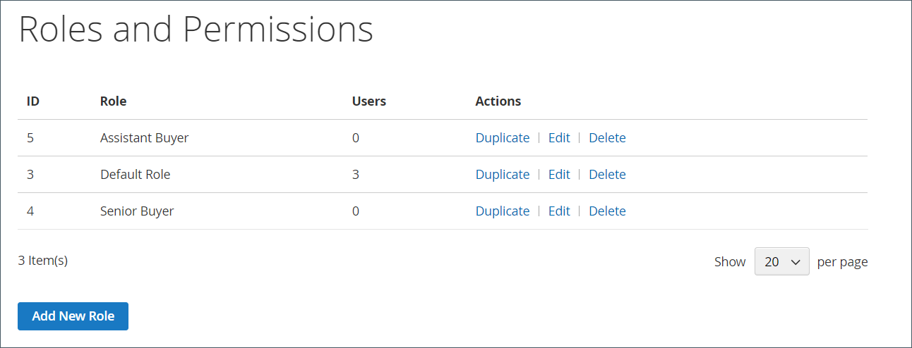
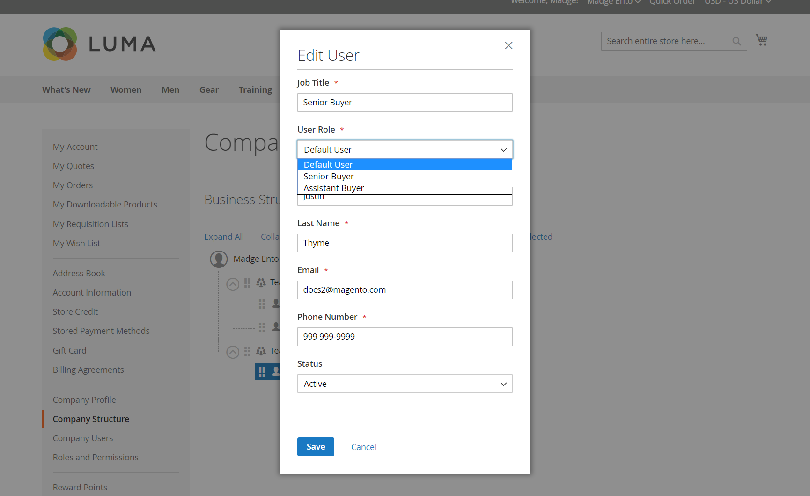

# Roles y permisos de la compañía

Las funciones de los usuarios de la empresa se configuran con varios niveles de permisos para acceder a la información y los recursos de ventas. De manera predeterminada, el administrador de la empresa es un _superusuario_ con permisos completos. La página [Acceso denegado](../content-design/pages.md#access-denied) aparece si el usuario no tiene permiso para acceder a la página.

{width="700" zoomable="yes"}

El sistema tiene una función de usuario predeterminado predefinida, que puede usar _tal cual_ o modificar para adaptarla a sus necesidades. Puede crear tantas funciones como sea necesario para adaptarse a la estructura de su empresa y a las responsabilidades organizativas, como las siguientes:

- **Usuario predeterminado**: el usuario predeterminado tiene acceso completo a las actividades relacionadas con ventas y presupuestos, así como acceso de sólo lectura a la información de crédito y perfil de la compañía.

- **Comprador sénior**: Un comprador sénior podría tener acceso a todos los recursos de Ventas y Ofertas y permisos de sólo lectura para el Perfil de la compañía, el Usuario y los Equipos, la Información de pago y el Crédito de la compañía.

- **Comprador asistente**: un comprador asistente podría tener permiso para realizar un pedido con _Finalizar compra con presupuesto_ y para ver pedidos, presupuestos e información en el perfil de la compañía.

## Administración de funciones y permisos

1. El administrador de la empresa inicia sesión en su cuenta de la tienda.

1. En el panel izquierdo, elija **[!UICONTROL Roles and Permissions]**.

1. Completa cualquiera de las siguientes tareas.

### Crear una función

1. Clics **[!UICONTROL Add New Role]**.

   {width="600" zoomable="yes"}

1. Introduce un **[!UICONTROL Role Name]** descriptivo.

1. En _[!UICONTROL Role Permissions]_, realiza una de las siguientes acciones:

   - Activa la casilla de verificación de cada recurso o actividad para el que los usuarios asignados a la función tienen permiso de acceso.

   - Activa la casilla de verificación **[!UICONTROL All]** y desactiva la de cada recurso o actividad para los que los usuarios asignados a la función no tienen permiso de acceso.

1. Clics **[!UICONTROL Save Role]**.

1. Crea tantas funciones como sea necesario repitiendo estos pasos.

### Modificación de un rol

1. Para que se modifique la función, el administrador de la empresa hace clic en **[!UICONTROL Edit]** en la columna _[!UICONTROL Actions]_.

1. Realiza los cambios necesarios en la configuración de nombre y permisos.

1. Una vez finalizado, hace clic en **[!UICONTROL Save Role]**.

### Duplicación de un rol

1. Para que se duplique la función, el administrador de la empresa hace clic en **[!UICONTROL Duplicate]** en la columna _[!UICONTROL Actions]_.

1. Realiza los cambios necesarios en la configuración de nombre y permisos.

1. Una vez finalizado, hace clic en **[!UICONTROL Save Role]**.

### Eliminar un rol

1. El administrador de la empresa encuentra la función que se va a eliminar en la lista de funciones.

   Solo se pueden eliminar los roles sin usuarios asignados.

1. Hace clic en **[!UICONTROL Delete]** en la columna _[!UICONTROL Actions]_.

1. Cuando se le pida que confirme, hace clic en **[!UICONTROL OK]**.

## Acciones

| Acción | Descripción |
|-----------| ----------- |
| [!UICONTROL Duplicate] | Crea una copia del rol seleccionado. El nombre de la función duplicada tiene `- Duplicated` agregado al final. |
| [!UICONTROL Edit] | Cambie el nombre o el conjunto de permisos. |
| [!UICONTROL Delete] | Elimine la función. Solo se pueden eliminar los roles sin usuarios asignados. |

{style="table-layout:auto"}

## Permisos de funciones

- Todo
   - Ventas
      - Permitir cierre de compra (realizar pedido)
         - Utilizar el método de pago a cuenta
      - Ver pedidos
         - Ver pedidos de usuarios subordinados
- Comillas
   - Ver
      - Solicitar, Editar, Eliminar
      - Cierre de compra con cotización
      - Ver las comillas de los usuarios subordinados
- Aprobaciones de pedidos
   - Ver mis pedidos de compra
      - Ver para subordinados
      - Ver para toda la compañía
   - Aprobación automática de pedidos creados dentro de este rol
   - Aprobar pedidos sin otras aprobaciones
   - Ver reglas de aprobación
      - Crear, editar y eliminar
- Perfil de empresa
   - Información de la cuenta (vista)
      - Editar
   - Dirección legal
      - Editar
   - Contactos (vista)
   - Información de pago (vista)
   - Información de envío (vista)
- Administración de usuarios de empresa
   - Ver funciones y permisos
      - Administración de funciones y permisos
   - Ver usuarios y equipos
      - Administrar usuarios y equipos
- Crédito de empresa
   - Ver

## Asignar una función a un usuario de la empresa

Después de definir las funciones necesarias, el administrador de la empresa asigna una función a cada usuario de la empresa.

1. Inicia sesión en su cuenta de empresa como administrador de la empresa.

1. En el panel izquierdo, elija **[!UICONTROL Company Users]**.

   {width="700" zoomable="yes"}

1. Busca al usuario en la lista y hace clic en **[!UICONTROL Edit]**.

1. Elige el(la) **[!UICONTROL User Role]** apropiado(a) para el usuario.

   {width="700" zoomable="yes"}

1. Clics **[!UICONTROL Save]**.
