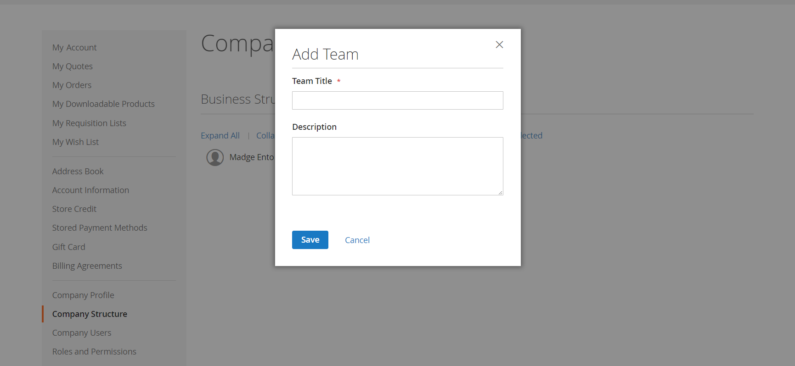

# Estructura de cuenta de compañía

Se puede configurar una cuenta de compañía para reflejar la estructura de la empresa. Inicialmente, la estructura de la empresa incluye solo el administrador de la empresa, pero se puede expandir para incluir equipos de usuarios. Los usuarios pueden estar asociados a equipos u organizados dentro de una jerarquía de divisiones y subdivisiones dentro de la compañía.

{width="500"}

En el panel de cuentas del administrador de la empresa, la estructura de la empresa se representa como un árbol y consiste inicialmente solo en el administrador de la empresa.

{width="600" zoomable="yes"}

Cuando se crea y aprueba la cuenta, el administrador de la empresa puede utilizar la dirección de correo electrónico de la empresa o tener asignada una dirección de correo electrónico diferente.

Es posible que la persona que sirve como administrador de la compañía tenga varias funciones dentro de la compañía. Si se introduce una dirección de correo electrónico independiente para el administrador de la empresa, la estructura inicial de la empresa incluye el administrador de la empresa más una cuenta de usuario individual en el nombre del administrador de la empresa. En tal caso, el administrador de la empresa puede iniciar sesión en la cuenta como empresa o como usuario individual.

{width="600" zoomable="yes"}

Para los comerciantes, la estructura completa de la compañía se refleja en las cuadrículas de _Empresas_ y _Clientes_ dentro del Administrador. La cuadrícula Compañías enumera todas las compañías independientemente de su estado. El siguiente ejemplo muestra las cuentas de dos compañías: la compañía _ACME_ y la compañía _Vendelay_.

{width="700" zoomable="yes"}

El siguiente ejemplo muestra la cuadrícula [!UICONTROL Customers] con las cuentas iniciales de administrador de la empresa para estas empresas.

{width="700" zoomable="yes"}

Después de crear la cuenta, el administrador de la compañía debe definir la estructura de la compañía de [equipos](account-company-structure.md), configurar los [usuarios de la compañía](account-company-users.md) y establecer [roles y permisos](account-company-roles-permissions.md) para cada uno.

## Iconos de estructura de empresa

| Icono | Descripción |
| ---- | ----------------- |
|  | Representa al administrador de la empresa en la estructura de la empresa. |
|  | Representa un equipo en la estructura de la compañía. |
|  | Representa a un usuario en la estructura de la compañía. |
|  | Mueve un equipo a otra posición en la estructura de la compañía. |
|  | Amplía un equipo en la estructura de la compañía. |
|  | Contrae un equipo en la estructura de la compañía. |

{style="table-layout:auto"}

## Crear equipos de empresa

La estructura de una cuenta de empresa debe reflejar la organización de compra, ya sea simple y plana o una organización compleja con diferentes equipos para cada subdivisión y división de la empresa.

Si el almacén está [configurado](enable-basic-features.md) para permitir que las empresas administren sus propias cuentas, configurar la estructura de la empresa es una de las primeras tareas que debe realizar un administrador de empresa una vez aprobada la cuenta. En la cuenta de compañía, la estructura de la compañía se representa como un árbol con el administrador de la compañía en la parte superior.

{width="450"}

1. El administrador de la empresa inicia sesión en su cuenta.

1. En el panel izquierdo, elija **[!UICONTROL Company Structure]**.

1. En **[!UICONTROL Business Structure]**, hace clic en **[!UICONTROL Add Team]** y realiza las siguientes acciones:

   - Escribe **[!UICONTROL Team Title]** y **[!UICONTROL Description]**.

     El Título de equipo puede ser cualquier elemento que represente la estructura de la compañía, como un equipo, una oficina o una división dentro de la compañía

     {width="700" zoomable="yes"}

   - Una vez finalizado, hace clic en **[!UICONTROL Save]**.

   - Crea tantos equipos como sea necesario.

     {width="600" zoomable="yes"}

1. Para crear una jerarquía de equipos, haga lo siguiente:

   - Selecciona el equipo principal y hace clic en **[!UICONTROL Add Team]**.

     {width="600" zoomable="yes"}

   - Escribe **[!UICONTROL Team Title]** y **[!UICONTROL Description]**.

   - Clics **[!UICONTROL Save]**.

1. Repite estos pasos para crear tantos equipos o divisiones y subdivisiones como sea necesario.

   {width="600" zoomable="yes"}

## Mover un equipo

A medida que el administrador de la empresa trabaja con la estructura de la empresa, puede arrastrar equipos o divisiones a otras ubicaciones de la estructura.

1. El administrador de la empresa localiza el equipo que se va a mover.

1. Hace clic en y arrastra el equipo a una nueva posición en la estructura de la compañía.

## Eliminación de un equipo

>[!NOTE]
>
>Antes de eliminar un equipo, se recomienda asegurarse de que está seleccionado el equipo correcto: los equipos eliminados no se pueden restaurar.

1. El administrador de la empresa selecciona el equipo que se va a eliminar.

1. Clics **[!UICONTROL Delete Selected]**.

1. Cuando se le pida que confirme, hace clic en **[!UICONTROL Delete]**.

## Expandir o contraer la estructura del equipo

A medida que el administrador de la empresa trabaja con la estructura de la empresa, puede contraer o expandir el árbol:

- Hace clic en **[!UICONTROL Collapse All]** o **[!UICONTROL Expand All]**.

- Hace clic en  para contraer un equipo o en  para expandir un equipo.

## Asignar usuarios a equipos

Cuando los equipos y usuarios se agregan por primera vez a la [estructura de la compañía](account-company-structure.md), se colocan en el mismo nivel bajo el administrador de la compañía.

{width="700" zoomable="yes"}

| Control | Descripción |
|--- |--- |
| [!UICONTROL Collapse All / Expand All] | Contrae o expande el árbol de estructura empresarial |
| [!UICONTROL Add User] | Crea un usuario debajo del equipo actual |
| [!UICONTROL Add Team] | Crea un equipo |
| [!UICONTROL Edit Selected / Delete Selected] | Edita o elimina usuarios del árbol de negocios |

{style="table-layout:auto"}

1. En el panel izquierdo, el administrador de la empresa elige **[!UICONTROL Company Structure]**.

1. Para asignar un usuario a un equipo existente, arrastra () al usuario debajo del equipo correspondiente.

   {width="700" zoomable="yes"}
