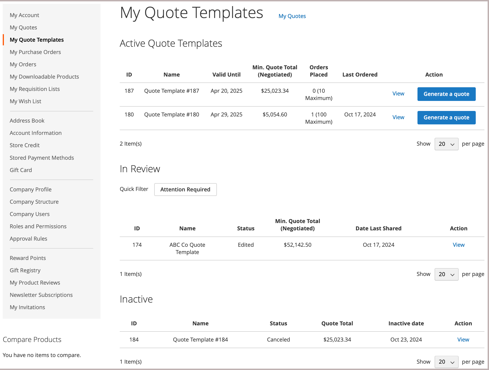

# [!UICONTROL My Quote Templates]

Si las ofertas están habilitadas, la sección _[!UICONTROL My Quotes Template]_&#x200B;del panel de control de cuentas del cliente enumera todas las plantillas de ofertas asociadas a la cuenta del cliente. Según sus permisos, solo los compradores que realizan compras en nombre de una empresa pueden solicitar una plantilla de presupuesto y negociar los precios de presupuesto y las condiciones de los pedidos recurrentes.

{width="700" zoomable="yes"}

La lista de plantillas de oferta organiza las plantillas por estado.

- **[!UICONTROL Active Quote Templates]** enumera las plantillas que se han negociado y aprobado para su uso. La información incluye el total mínimo de la oferta y los pedidos realizados si estas opciones se configuraron durante el proceso de negociación. Los compradores pueden generar una oferta vinculada a partir de la plantilla para enviar un pedido basado en las condiciones de la oferta.

- **[!UICONTROL In Review]** enumera las plantillas en el proceso de negociación que muestran el estado actual y proporcionan un vínculo para abrir la plantilla.

- **[!UICONTROL Inactive]** enumera las plantillas que han caducado, que se han cancelado o que ya no son válidas porque un comprador ha consumido el número de pedidos confirmados permitidos.

Para el comprador, la página *[!UICONTROL My Quotes Templates]* es el punto focal de todas las comunicaciones entre el comprador y el vendedor durante el proceso de negociación.

Un comprador que acepte las condiciones negociadas ofrecidas por el vendedor puede aceptar la plantilla y, a continuación, utilizarla para generar presupuestos vinculados previamente aprobados que se pueden utilizar para realizar pedidos.

- Acciones relacionadas con la gestión de la plantilla de oferta:

   - Cancelar una plantilla
   - Enviar al vendedor para que lo revise
   - Aceptar la plantilla de presupuesto
   - Cambiar la fecha de caducidad de la plantilla de oferta
   - Añadir una dirección de envío
   - Administrar vínculos de documentos de referencia

- Acciones para actualizar detalles de plantilla de oferta durante el proceso de negociación:

   - Revisa el precio del artículo y las actualizaciones.
   - Si se han configurado umbrales de cantidad en la plantilla de oferta, ajuste los valores mínimo y máximo.
   - Rastree el proceso de negociación de las secciones [!UICONTROL Comments] y [!UICONTROL History].
   - Para las plantillas que aún se están revisando, el comprador puede modificar el plantilla de cotización eliminando elementos.
   - Comunícate y negocia con el vendedor agregando notas a nivel de elemento de línea y cotización.
   - añadir, edite o elimine enlaces de referencia documento a contratos y acuerdos externos.

  Después de realizar cambios, el comprador devuelve el plantilla al vendedor para que lo revise.

- Acciones generales durante la negociación:

   - Enviar presupuesto plantilla al vendedor para su revisión
   - Acepte el presupuesto plantilla
   - Cancelar para finalizar la negociación y cerrar la cotización

En el siguiente ejemplo se muestra un plantilla de presupuesto que el comprador actualizó y devolvió al vendedor para que lo revisara.

{width="700" zoomable="yes"}

Las plantillas con el `Submitted` estado se bloquean hasta que el vendedor revise y actualice el plantilla y lo devuelva al comprador.

## Creación de una plantilla de presupuesto

El comprador puede iniciar el proceso de negociación de la plantilla de oferta utilizando cualquiera de los siguientes métodos:

- Cree una plantilla a partir de una oferta existente haciendo clic en la acción **[!UICONTROL Create quote template]**.

- Envíe una solicitud de presupuesto desde la tienda y añada comentarios pidiendo al representante de ventas que cree una plantilla de presupuesto a partir de la solicitud de presupuesto.

## Ver una plantilla de presupuesto

1. El comprador inicia sesión en su cuenta.

1. En el panel izquierdo, elija **[!UICONTROL My Quote Templates]**.

1. Busca la plantilla de oferta en la lista y hace clic en **[!UICONTROL View]** en la columna _[!UICONTROL Action]_.

## Añadir una dirección de envío

El comprador no puede aceptar una plantilla de presupuesto hasta que tenga una dirección de envío.

1. El comprador inicia sesión en su cuenta.

1. En el panel izquierdo, elija **[!UICONTROL My Quote Templates]**.

1. Selecciona la plantilla de oferta deseada.

1. En la sección **[!UICONTROL Shipping Information]**, hace clic en **[!UICONTROL Add New Address]**.

1. Completa los detalles de la nueva dirección.

1. Clics **[!UICONTROL Save Address]**.

Cuando el comprador añade la dirección, vuelve a enviar la plantilla al vendedor para que la revise. El vendedor proporciona las opciones de envío y entrega. Estas actualizaciones pueden afectar a los precios de las ofertas negociadas. Las opciones de envío están bloqueadas en el cierre de compra.

## Generación de una oferta vinculada

Una vez que el comprador acepta una plantilla de presupuesto, puede utilizarla para generar presupuestos preaprobados y vinculados a partir de *[!UICONTROL My Quote Templates dashboard]* o de la plantilla de presupuesto mediante la acción **[!UICONTROL Generate a quote]**.

La oferta vinculada incluye una notificación que indica que está aprobada y lista para el cierre de compra. También proporciona un vínculo a la plantilla de oferta en la información del encabezado.

{width="700" zoomable="yes"}

Si el plantilla de presupuesto se configuró con un umbral de pedido, el recuento aumenta cuando se genera el presupuesto vinculado.

Los compradores pueden completar las siguientes acciones desde una oferta vinculada:

- Si la oferta está configurada con umbrales de cantidad, ajuste la cantidad del pedido para los artículos de línea.
- Continúe con el cierre de compra para enviar una solicitud.
- Elimine o imprima la oferta.
- Abra la plantilla de oferta utilizada para generar la oferta.

## Cancelar una plantilla de presupuesto

En la página de plantilla de oferta, haga clic en **[!UICONTROL Cancel Quote Template]**.

La plantilla de presupuesto se cancela y el estado de la oferta cambia a `Closed`. La oferta cerrada permanece en su lista de *[!UICONTROL Inactive]* comillas y permanece en la lista _[!UICONTROL Quote Templates]_&#x200B;de la administración.

## Administrar vínculos de documentos de referencia

La función de enlaces de documentos de referencia permite a compradores y vendedores añadir, editar y gestionar enlaces a documentos externos (como contratos, acuerdos o especificaciones) durante el proceso de la plantilla de oferta.

### Añadir un vínculo al documento de referencia

1. Abra la plantilla de oferta.

1. En la sección **[!UICONTROL Reference Documents]**, haga clic en **[!UICONTROL Add]**.

1. En el cuadro de diálogo Información del documento:
   - Escriba un **[!UICONTROL Document Name]** (obligatorio)
   - Escriba un **[!UICONTROL Document Identifier]** (opcional)
   - Escriba un **[!UICONTROL Reference Document URL]** (obligatorio)

1. Haga clic en **[!UICONTROL Add to Quote Template]**.

   El vínculo del documento de referencia se añade a la plantilla de oferta con el siguiente formato:
   `Document Name, Document Identifier https://document-url`

### Edición de un vínculo a un documento de referencia

1. Abra la plantilla de oferta.

1. En la sección **[!UICONTROL Reference Documents]**, haga clic en **[!UICONTROL Edit]** junto al vínculo al documento que desea modificar.

1. Actualice la información del documento en el cuadro de diálogo:
   - Nombre de documento
   - Identificador de documento
   - Documento de referencia URL

1. Haga clic en **[!UICONTROL Add to Quote Template]**.

### Quitar referencia documento vincular

1. Abra el plantilla de cotización.

1. En la **[!UICONTROL Reference Documents]** sección, haga clic **[!UICONTROL Remove]** junto a la documento vincular desea eliminar.

### Ver una referencia documento

1. Abra el plantilla de cotización.

1. En la **[!UICONTROL Reference Documents]** sección, haga clic en el nombre del documento vincular.

   El documento se abre en un nuevo ventana del explorador.

### Restricciones de vincular documento de referencia

- Los enlaces de documento de referencia solo se pueden agregar, editar o eliminar cuando el plantilla de citas está en un estado editable.
- Una vez que la plantilla de presupuesto se envía para su revisión o se acepta, los vínculos del documento de referencia pasan a ser de solo lectura.
- El campo Nombre del documento es necesario al añadir o editar un vínculo de documento de referencia.
- Los vínculos de documentos de referencia siguen siendo accesibles incluso después de que se acepte o complete la plantilla de oferta.
