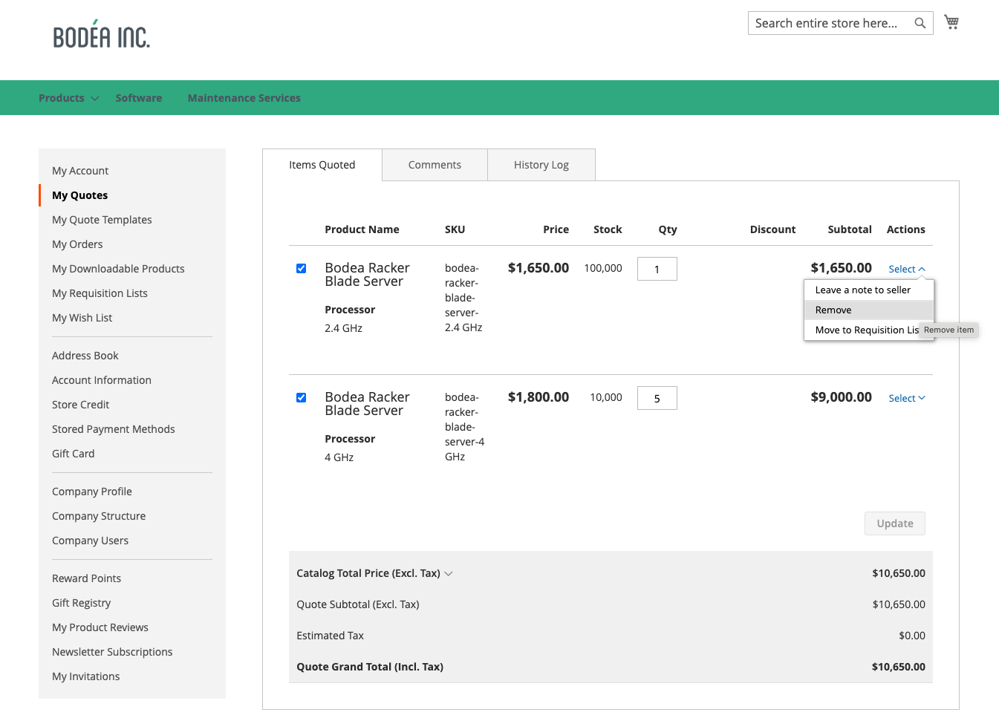

# [!UICONTROL My Quotes]

Si las ofertas están habilitadas, la sección _[!UICONTROL My Quotes]_del panel de cuentas del cliente enumera todas las ofertas enviadas por el cliente. Según sus permisos, solo los compradores que realizan compras en nombre de una empresa pueden enviar solicitudes para negociar el precio de una compra.

{width="700" zoomable="yes"}

El comprador inicia el proceso al [enviar una solicitud](quote-request.md) para obtener un presupuesto del carro de compras. El correo electrónico se intercambia entre el comprador y el vendedor durante el [proceso de negociación](quote-price-negotiation.md). Para el comprador, la página [!UICONTROL My Quotes] es el punto focal de todas las comunicaciones entre el comprador y el vendedor durante el proceso de negociación. Un comprador que acepta el precio negociado ofrecido por el vendedor puede ir directamente a la página de pago desde la oferta. No se pueden añadir descuentos adicionales al presupuesto negociado.

Al negociar una oferta, el comprador tiene varias opciones para gestionarla o para actualizar los detalles de la oferta.

* Acciones relacionadas con la gestión de la oferta:

   * Crear una copia del presupuesto
   * Cerrar la cotización
   * Eliminar el presupuesto
   * Cambie el nombre del presupuesto
   * Imprimir el presupuesto
   * Creación de una plantilla

* Acciones para actualizar los detalles de la oferta:

   * Revisar precios y actualizaciones de artículos
   * Rastrear el proceso de negociación de [!UICONTROL Comments] y [!UICONTROL History] secciones
   * Modifique la oferta para eliminar elementos
   * Comunicarse y negociar con el vendedor añadiendo notas en el nivel de artículo de línea y presupuesto
   * Añadir una dirección de envío
   * Mover artículos de línea a una lista de solicitudes
   * Convierta la oferta en un pedido si los términos son aceptables

* Acciones generales durante la negociación:

   * Enviar presupuesto al vendedor para que lo revise
   * Continuar con el cierre

En el siguiente ejemplo se muestra una oferta que el comprador ha actualizado y que se ha devuelto al vendedor para que la revise.

{width="700" zoomable="yes"}

Las ofertas con el estado `Updated` se bloquean hasta que el vendedor las devuelva.

## Mostrar comillas

Con los [permisos requeridos para su rol](account-company-roles-permissions.md), los compradores asociados con una cuenta de compañía pueden ver las ofertas solicitadas por [usuarios subordinados](account-company-structure.md). Los administradores de la empresa pueden ver todas las ofertas de la cuenta de la empresa.

1. El comprador inicia sesión en su cuenta de la tienda.

1. Hace clic en **[!UICONTROL My Quotes]** en el panel de navegación izquierdo.

1. Para ver todas las ofertas que han creado, hace clic en el vínculo **[!UICONTROL Show My Quotes]** (mostrado solo para el administrador de la empresa o la cuenta con usuarios subordinados).

1. Para ver todas las ofertas de todos los usuarios de la compañía, haga clic en **[!UICONTROL Show All Quotes]**.

## Ver un presupuesto

1. El comprador inicia sesión en su cuenta.

1. En el panel izquierdo, elija **[!UICONTROL My Quotes]**.

1. Busca el presupuesto en la lista y hace clic en **[!UICONTROL View]** en la columna _[!UICONTROL Action]_.

## Copiar un presupuesto

1. El comprador inicia sesión en su cuenta de la empresa en la tienda.

1. En el panel izquierdo, elija **[!UICONTROL My Quotes]**.

1. Busque y acceda al presupuesto deseado en la lista y haga clic en **[!UICONTROL Create Copy]** en el presupuesto original.

## Crear plantilla

1. El comprador inicia sesión en su cuenta.

1. En el panel izquierdo, elija **[!UICONTROL My Quote Templates]**.

1. Busca el presupuesto en la lista **[!UICONTROL My Quotes]** y hace clic en **[!UICONTROL Create Quote Template]** en la columna _[!UICONTROL Action]_.

## Mover artículos de línea de una oferta a una lista de solicitudes

1. El comprador inicia sesión en su cuenta.

1. En el panel izquierdo, elija **[!UICONTROL My Quotes]**.

1. Busque y acceda al presupuesto deseado en la lista.

1. Seleccione los elementos de línea.

1. Haga clic en **[!UICONTROL Move to Requisition list]** en la lista desplegable _[!UICONTROL Actions]_.

1. Seleccione una lista de solicitudes existente para mover los artículos seleccionados.

1. Haga clic en **[!UICONTROL Move item]**.

Consulte [Agregar productos a una lista de solicitudes](requisition-lists.md) para obtener más información sobre este proceso.

>[!NOTE]
>
> No se puede crear una nueva lista de solicitudes al mover artículos. Los artículos sólo se pueden mover a una lista de solicitudes existente.

## Mover elementos de línea a una nueva oferta

1. El comprador inicia sesión en su cuenta.

1. En el panel izquierdo, elija **[!UICONTROL My Quotes]**.

1. Busque y acceda al presupuesto deseado en la lista.

1. Seleccione los elementos de línea.

1. Haga clic en **[!UICONTROL Move item to new quote]** en la lista desplegable _[!UICONTROL Actions]_.

1. Asigne un nombre a la nueva oferta en el modal.

1. Seleccione **[!UICONTROL Move to quote]** para mover el elemento seleccionado a la nueva oferta.

>[!NOTE]
>
> Al seleccionar varios elementos, el modal se muestra como **[!UICONTROL Move selected items to new quote]**.

## Adición de una dirección de envío

1. El comprador inicia sesión en su cuenta.

1. En el panel izquierdo, elija **[!UICONTROL My Quotes]**.

1. Selecciona la cotización deseada.

1. En la sección **[!UICONTROL Shipping Information]**, hace clic en **[!UICONTROL Add New Address]**.

1. Completa los detalles de la nueva dirección.

1. Clics **[!UICONTROL Save Address]**.

Cuando el comprador añade la dirección, el vendedor proporciona las opciones de envío y entrega. Estas actualizaciones pueden afectar a los precios de las ofertas negociadas. Las opciones de envío están bloqueadas en el cierre de compra.

## Imprimir una oferta

1. En la oferta abierta a la derecha de la sección _[!UICONTROL Items Quoted]_, el comprador hace clic en **[!UICONTROL Print]**.

1. Comprueba **[!UICONTROL Destination]** como impresora o como PDF.

1. Clics **[!UICONTROL Print]**.

## Cancelar una solicitud de presupuesto

1. En la cita abierta justo encima de la sección Elementos citados, hace clic en **[!UICONTROL Close quote]**.

   La solicitud se ha cancelado y el estado de la oferta cambia a `Closed`. El presupuesto cerrado permanece en su lista de presupuestos y permanece en la lista _[!UICONTROL Quotes]_de la administración.

1. Para quitar el presupuesto cancelado de la lista de presupuestos, haga clic en **[!UICONTROL Delete]**.

1. Cuando se le pida que confirme, hace clic en **[!UICONTROL OK]**.

   La cotización cerrada se elimina de su lista de cotizaciones. Sin embargo, permanece en la lista de la cuadrícula _[!UICONTROL Quotes]_del Administrador, con el estado `Closed`.

## Acciones de oferta

| Acción | Descripción |
|---------------|------------------------------------------------------------------------------------------------------------------------------------------------------------------------------------------------------------------------------|
| Cambiar nombre | Cambiar el nombre de la oferta |
| Crear copia | Un comprador puede crear una oferta a partir de la oferta actual copiándola y cambiando su nombre. |
| Cerrar cita | Una vez que el comprador cierra una oferta, no se puede volver a abrir. Si es necesario, el comprador puede volver a crearlo con la acción [!UICONTROL Create Copy]. Esta opción no está disponible si el estado de la oferta es `Draft`. |
| Crear plantilla | Cree una plantilla de oferta basada en la oferta actual. Las plantillas de oferta agilizan la negociación de ofertas al permitir que los compradores y los vendedores acuerden las condiciones de contrato y asignación de precios que se pueden aplicar a varias ofertas.  En el momento del acuerdo, el comprador puede generar una oferta vinculada y aprobada previamente a partir de la plantilla para pedidos posteriores en lugar de reiniciar el proceso de solicitud de oferta. |
| Eliminar presupuesto | Cuando un comprador elimina una oferta, esta se elimina del sistema y ya no está disponible. |
| Imprimir | Abre un formulario de impresión para guardar el presupuesto como un PDF, archivo o imprimirlo en una impresora configurada. |

## Descripciones de columna

| Columna | Descripción |
|-------------------------|-------------------------------------------------------------------------------------------------------------------------------------------------------------------------------------------------------------------------------------------------------------------------------------------------------------------------------------------------------------------------------------------------------------------------------------------------------------------------------------------------------------------------------------------------------------------------------------------------------------------------------------------------------------------------------------------------------------------------------------------------------------------------------------------------------------------------------------------------------------------------------------------------------------------------------------------------------------------------------------------------------------------------------------------------------------------------------------------------------------------------------------------------------------------------------------------------------------------------------------------------------------------------------------------------------------------------------------------------------------------------------------------------------------------------------------------------------------------------------------------------------------------------------------------------------------------------------------------------------------------------------------------------------------------------------------------------------------------------------------------------------------------------------------------------------------------------------------------------------------------------------------------------------------------------------------------------------------------------------------------------------------------------------------------------------------------------------------------------------------------------------------------------------------------------------------------------------------------------------------------------------------------------------------------------------------------------------------------------------------------------------------------------------------------------------------------------------------------------------------------------------------------------------------------|
| [!UICONTROL Quote Name] | El nombre asignado a la solicitud de presupuesto por el comprador. |
| [!UICONTROL Created] | La fecha en la que se envió la solicitud de presupuesto por primera vez. |
| [!UICONTROL Created By] | El nombre y apellidos del comprador que envió la solicitud de presupuesto. |
| [!UICONTROL Status] | Indica el estado de la oferta. El estado de una oferta solo se puede cambiar por acción del comprador o del vendedor.  **[!UICONTROL Submitted]**- El vendedor aún no ha abierto la solicitud de presupuesto del comprador. En este estado, el comprador puede modificar la solicitud de presupuesto. Acciones disponibles: `View` / `Close` / `Edit Quantity` / `Delete SKU` / `Add Comments` / `Edit Shipping Address` **[!UICONTROL Pending]**: el vendedor ha abierto la solicitud y está revisándola y preparando una respuesta. Acciones disponibles: `View` / `Close`  **[!UICONTROL Updated]**- El vendedor ha enviado una respuesta al comprador y el botón _[!UICONTROL Proceed to Checkout]_está habilitado. En este estado, el comprador puede seguir modificando la oferta. Acciones disponibles: `View` / `Send for Review` / `Proceed to Checkout` / `Delete Quote` / `Close` / `Edit Quantity` / `Delete SKU` / `Add comments` / `Edit Shipping Address` **[!UICONTROL Open]**- El comprador sigue actualizando la oferta y el botón_[!UICONTROL Proceed to Checkout]_ está desactivado. Acciones disponibles: `View` / `Send for Review` / `Delete Quote` / `Edit quantity` / `Delete SKU` / `Add Comments` / `Edit Shipping Address`  **[!UICONTROL Ordered]**- El comprador ha enviado un pedido basado en el presupuesto negociado. El presupuesto está bloqueado y no se puede editar. Acción disponible: ver **[!UICONTROL Closed]** - El comprador ha finalizado la negociación y cancela la oferta. La oferta está bloqueada y el comprador o el vendedor no pueden modificarla. Acciones disponibles: `View` / `Delete`  **[!UICONTROL Declined]**- El vendedor ha rechazado la solicitud de presupuesto o para realizar un cambio propuesto durante el proceso de negociación. Se puede rechazar una oferta en cualquier fase del flujo de trabajo. Cualquier precio personalizado se elimina del presupuesto. El comprador puede seguir editando la oferta y volver a enviarla o realizar la compra con los precios de catálogo estándar. Acciones disponibles: `View` / `Send for Review` / `Delete Quote` / `Edit Quantity` / `Delete SKU` / `Add Comments` / `Edit Shipping Address` **[!UICONTROL Expired]** - La duración de la oferta ha caducado. Se restablecerán todos los precios propuestos. El comprador puede completar la compra basándose en los precios de catálogo estándar o iniciar otra ronda de negociaciones. Acciones disponibles: `View` / `Send for Review` / `Delete Quote` / `Edit Quantity` / `Delete SKU` / `Add Comments` / `Edit Shipping Address` |

{style="table-layout:auto"}
