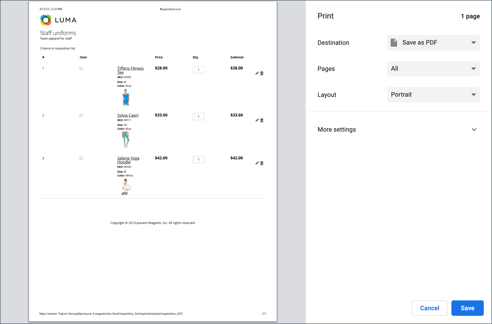
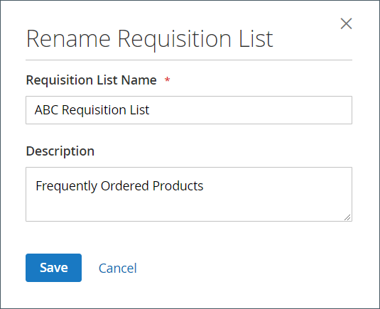

# [!UICONTROL My Requisition Lists]

El motivo principal para mantener una lista de solicitudes es facilitar la reorganización de los productos. Los clientes autorizados pueden reordenar fácilmente artículos de una lista de solicitudes agregándolos al carro de compras y moviendo o copiando artículos de una lista a otra.

{width="700" zoomable="yes"}

## Abrir una lista de solicitudes

1. Desde su panel de cuentas, el cliente elige **[!UICONTROL My Requisition Lists]**.

1. Busca la lista de solicitudes que desea abrir y hace clic en **[!UICONTROL View]** y realiza una de las acciones siguientes:

### Añadir productos al carro de compras

1. El cliente realiza una de las siguientes acciones para seleccionar los productos que desea añadir:

   - Selecciona la casilla de verificación de cada elemento.
   - Clics **[!UICONTROL Select All]**.

1. Ingresa el(la) **[!UICONTROL Qty]** que se agregará al carrito.

1. Para cambiar cualquier opción de producto, haga lo siguiente:

   - En el elemento de línea, hace clic en el icono _Editar_ ().
   - Cambia las opciones que sean necesarias.
   - Clics **[!UICONTROL Update Requisition List]**.

1. Clics **[!UICONTROL Add to Cart]**.

   {width="700" zoomable="yes"}

### Copiar elementos en una lista diferente

1. El cliente selecciona la casilla de verificación de cada elemento que se va a mover.

1. Hace clic en **[!UICONTROL Copy Selected]** y realiza una de las siguientes acciones:

   - Permite seleccionar una lista de solicitudes existente.
   - Clics **[!UICONTROL Create New Requisition List]**.

### Exportar una lista

1. El cliente abre la lista de solicitudes que desea exportar.

1. Hace clic en el vínculo **[!UICONTROL Export]**.

Adobe Commerce genera y descarga una lista CSV con `sku` y `qty` valores.

### Mover elementos a una lista diferente

1. El cliente selecciona la casilla de verificación de cada elemento que se va a mover.

1. Hace clic en **[!UICONTROL Move Selected]** y realice una de las acciones siguientes:

   - Permite seleccionar una lista de solicitudes existente.
   - Clics **[!UICONTROL Create New Requisition List]**.

### Imprimir una lista

1. En la esquina superior derecha de la lista, el cliente hace clic en **[!UICONTROL Print]**.

1. Comprueba el dispositivo de salida y hace clic en **[!UICONTROL Print]**.

   {width="500" zoomable="yes"}

### Editar opciones de producto

Para editar las opciones de producto de la lista, el cliente hace lo siguiente:

1. Hace clic en el icono _Lápiz_ () para abrir la página del producto.

1. Cambia las opciones que sean necesarias.

1. Clics **[!UICONTROL Update Requisition List]**.

   {width="700" zoomable="yes"}

Un producto de la lista de solicitudes se puede editar cuando:

- El producto tiene **[!UICONTROL all options set]** (cuando es un [producto configurado](../catalog/product-create-configurable.md) en la Lista de solicitudes).

  El producto es **[!UICONTROL added to this Requisition List]**.

- El producto es [un producto simple con opciones](../catalog/settings-advanced-custom-options.md)

- Se permite la edición para el tipo de producto.

### Eliminar elementos

1. El cliente selecciona la casilla de verificación de cada elemento que se va a eliminar.

1. Clics **[!UICONTROL Remove Selected]**.

1. Cuando se le pida que confirme, hace clic en **[!UICONTROL Delete]**.

### Cambiar nombre de lista

1. Después del título de la lista, el cliente hace clic en **[!UICONTROL Rename]**.

1. Escribe un(a) **[!UICONTROL Requisition List Name]** diferente.

1. Clics **[!UICONTROL Save]**.

   {width="300"}

### Quitar una lista de solicitudes

1. El cliente abre la lista de solicitudes que desea suprimir.

1. Clics **[!UICONTROL Delete Requisition List]**.

1. Cuando se le pida que confirme, hace clic en **[!UICONTROL Delete]**.

>[!NOTE]
>
>Esta acción no se puede deshacer.

## Acciones

| Acción | Descripción |
|--- |--- |
| [!UICONTROL Rename] | Permite cambiar el nombre de la lista de solicitudes y actualizar la descripción. |
| [!UICONTROL Export] | Exporta la lista de solicitudes a un archivo CSV. |
| [!UICONTROL Print] | Imprime la lista de solicitudes actual. |
| [!UICONTROL Select] | Administra las selecciones de elementos que deben ser objeto de una acción.  **[!UICONTROL Select All]**- Selecciona todos los elementos de la lista de solicitudes. **[!UICONTROL Remove Selected]** - Elimina todos los elementos seleccionados de la lista de solicitudes.  **[!UICONTROL Copy Selected]**- Copia todos los elementos seleccionados en otra lista de solicitudes. |
| [!UICONTROL Add to Cart] | Agrega los elementos seleccionados al carro de compras. |
| [!UICONTROL Update List] | Vuelve a calcular el subtotal para reflejar un cambio en la cantidad. |
| [!UICONTROL Delete Requisition List] | Elimina la lista de solicitudes de la cuenta del usuario de la empresa. |

{style="table-layout:auto"}
