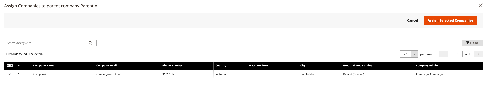

# Administrar el [!UICONTROL Company Hierarchy]

[!BADGE 1.5.0-beta]{type=Informative url="/help/b2b/release-notes.md" tooltip="Disponible solo para participantes del programa beta"}

Los administradores pueden crear un [!UICONTROL Company Hierarchy] asignando empresas vinculadas a una empresa matriz designada, que es la empresa que ocupa la parte superior de la jerarquía organizativa.

Crear una compañía principal editando una compañía que no se ha asignado a una existente [!UICONTROL Company Hierarchy]y asignar compañías relacionadas.

{width="700"}

Después de asignar una compañía a una jerarquía, la variable [!UICONTROL Company type] en la columna **Compañías** la cuadrícula identifica la compañía como `Parent` o  `Child` empresa.  Si la variable [!UICONTROL Company Type] es `Company`, la empresa no forma parte de una jerarquía empresarial y puede convertirse en una empresa matriz o ser asignada a una empresa matriz existente.

>[!NOTE]
>
>Para obtener más información sobre [!UICONTROL Company Hierarchy] cuadrícula, consulte [Jerarquía de compañías](account-company-create.md#company-hierarchy) descripciones de los campos.

En el Administrador, puede administrar las asignaciones de la empresa editando una empresa y utilizando [!UICONTROL Company Hierarchy] de la sección [!UICONTROL Company] página para asignar o anular la asignación de empresas.

## Asignar compañías a una compañía matriz

1. En el _Administrador_ barra lateral, navegue hasta **[!UICONTROL Customers]** > **[!UICONTROL Companies]**.

   {width="700" zoomable="yes"}

1. En la cuadrícula Compañías, abra la página de detalles de la compañía para crear las asignaciones.

   - Para asignar compañías adicionales a una compañía matriz existente, seleccione la **[!UICONTROL Edit]** acción para la compañía matriz.
   - Para crear una nueva empresa principal, seleccione la **[!UICONTROL Edit]** acción para la compañía designada como matriz.

     No se puede crear una nueva empresa principal a partir de una empresa principal o secundaria existente.

   {width="700" zoomable="yes"}

1. En la página de detalles de la compañía, expanda **[!UICONTROL Company Hierarchy]** y seleccione. **[!UICONTROL Assign Companies]**.

   {width="700" zoomable="yes"}

   Al expandir esta vista, puede ver las asignaciones de compañía existentes, si las hay. La empresa principal siempre aparece encima de _[!UICONTROL Company Hierarchy]_cuadrícula con un `current company indicator` se muestra en la línea compañía que se está editando.

1. Las compañías disponibles para su asignación se enumeran en la cuadrícula. Seleccione las empresas que desea asignar y, a continuación, seleccione **[!UICONTROL Assign Selected Companies]**.

1. Puede **Seleccionar todo en esta página** o un elemento de línea de empresa específico y haga clic en **[!UICONTROL Assign Selected Companies]**.

   {width="700" zoomable="yes"}

1. Cuando se le solicite, complete la asignación de la empresa seleccionando **[!UICONTROL Assign]**.

## Quitar la asignación de compañías de una compañía matriz

1. En el _Administrador_ barra lateral, navegue hasta **[!UICONTROL Customers]** > **[!UICONTROL Companies]**.

   {width="700" zoomable="yes"}

1. En la página Compañías, abra la página de detalles de la compañía para la compañía matriz seleccionando la **[!UICONTROL Edit]** acción.

   {width="700" zoomable="yes"}

1. Vea la lista de empresas asignadas expandiendo el **[!UICONTROL Company Hierarchy]** desplegable.

1. En la cuadrícula de jerarquía de la compañía, anule la asignación de una compañía seleccionando la **[!UICONTROL Select]** acción para la compañía y, a continuación, elija **[!UICONTROL Unassign from parent]**.

   {width="700" zoomable="yes"}

1. Cuando se le solicite, elimine la empresa asignada de la jerarquía seleccionando **[!UICONTROL Unassign]**.
