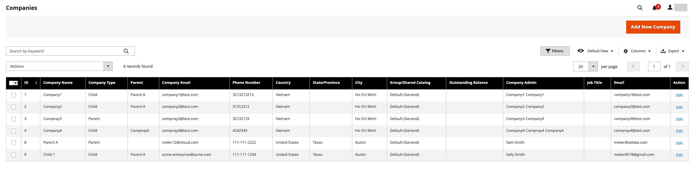

# Administrar el [!UICONTROL Company Hierarchy]

[!BADGE 1.5.0-beta]{type=Informative url="/help/b2b/release-notes.md" tooltip="Disponible solo para participantes del programa beta"}

Los administradores pueden crear un [!UICONTROL Company Hierarchy] asignando empresas vinculadas a una empresa matriz designada, que es la empresa que encabeza la organización. Si la variable [!UICONTROL Company Type] es `Company`, la empresa no forma parte de una organización y puede convertirse en una empresa matriz o ser asignada a una empresa matriz existente.

En el Administrador, puede administrar las asignaciones de la empresa editando una y, a continuación, actualizando el [!UICONTROL Company Hierarchy] configuración para asignar o cancelar la asignación de compañías.

{width="700"}

>[!NOTE]
>
>Para obtener más información sobre [!UICONTROL Company Hierarchy] cuadrícula, consulte [Jerarquía de compañías](account-company-create.md#company-hierarchy) descripciones de los campos.

## Asignar empresas a una organización

1. Desde el _Administrador_ barra lateral, navegue hasta **[!UICONTROL Customers]** > **[!UICONTROL Companies]**.

   {width="700" zoomable="yes"}

1. En el [!UICONTROL Companies] , abra la página de detalles de la empresa para crear las asignaciones.

   - Para asignar compañías adicionales a una compañía matriz existente, seleccione la **[!UICONTROL Edit]** acción para la compañía matriz.
   - Para crear una empresa principal, seleccione la **[!UICONTROL Edit]** acción para que la compañía designe como matriz.

     No se puede crear una compañía primaria a partir de una compañía primaria o secundaria existente.

1. En la página de detalles de la empresa, expanda **[!UICONTROL Company Hierarchy]**.

   {width="700" zoomable="yes"}

   La cuadrícula muestra las asignaciones existentes de la empresa, si las hay. La empresa matriz siempre se coloca en la parte superior de la lista [!UICONTROL Company Hierarchy] rejilla. El `[!UICONTROL Current]` El indicador indica la empresa que se está editando.

1. Agregar compañías a la organización matriz.

   - Elija de una lista de empresas disponibles seleccionando **[!UICONTROL Assign Companies]**.

   - **Seleccionar todo en esta página** o seleccione uno o más elementos de línea de compañía específicos.

   - Seleccionar **[!UICONTROL Assign Selected Companies]**.

   - Complete la asignación de la empresa seleccionando **[!UICONTROL Assign]**.

     {width="675" zoomable="yes"}

## Quitar la asignación de compañías de una compañía matriz

1. En el _Administrador_ barra lateral, navegue hasta **[!UICONTROL Customers]** > **[!UICONTROL Companies]**.

   {width="700" zoomable="yes"}

1. En el [!UICONTROL Companies] , abra la página de detalles de la empresa para la empresa matriz seleccionando **[!UICONTROL Edit]**.

1. Ver la lista de empresas asignadas expandiendo **[!UICONTROL Company Hierarchy]**.

1. Desde el [!UICONTROL Company Hierarchy] cuadrícula, anule la asignación de una compañía mediante el **[!UICONTROL Select]** control de acción para elegir **[!UICONTROL Unassign from parent]**.

   {width="700" zoomable="yes"}

1. Cuando se le solicite, elimine la empresa asignada de la jerarquía seleccionando **[!UICONTROL Unassign]**.
