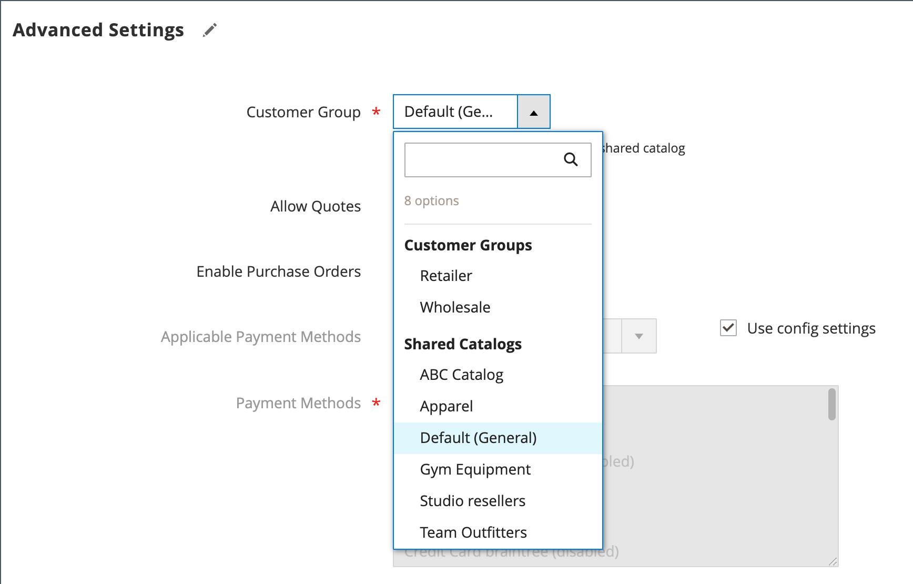

# Asignar empresas a un catálogo compartido

Existen dos formas de asignar una empresa a un catálogo compartido. Puede realizar la asignación desde el _[!UICONTROL Shared Catalogs]_o edite la empresa y asigne el catálogo compartido como lo haría para elegir un grupo de clientes.

{width="700" zoomable="yes"}

## Método 1: asignación de empresas del catálogo compartido

1. En el _Administrador_ barra lateral, vaya a **[!UICONTROL Catalog]** > **[!UICONTROL Shared Catalogs]**.

1. Para el catálogo compartido de la cuadrícula al que desee asignar una empresa, vaya a **[!UICONTROL Action]** y seleccione **[!UICONTROL Assign Companies]**.

   La lista de empresas disponibles aparece en la cuadrícula.

1. Seleccione la empresa que desea asignar al catálogo compartido y haga clic en **[!UICONTROL Actions]** y elija. **[!UICONTROL Assign Catalog]**.

   {width="700" zoomable="yes"}

   También puede hacer clic en **[!UICONTROL Assign]** en el **[!UICONTROL Action]** para cualquier empresa que no esté asignada al catálogo.

1. Repita el proceso para cada empresa que desee asignar al catálogo compartido.

   La empresa se asigna al catálogo compartido.

1. Cuando termine, haga clic en **[!UICONTROL Save]**.

## Método 2: editar la empresa

1. En el _Administrador_ barra lateral, vaya a **[!UICONTROL Customers]** > **[!UICONTROL Companies]**.

1. Para la empresa mostrada en la cuadrícula, vaya a **[!UICONTROL Action]** y haga clic en **[!UICONTROL Edit]**.

   {width="700" zoomable="yes"}

1. En la página de empresa, desplácese hacia abajo y expanda  el **[!UICONTROL Advanced Settings]** sección.

1. Establecer **[!UICONTROL Customer Group]** al catálogo compartido correspondiente.

   Al cambiar la asignación del catálogo compartido, también se cambia la asignación del grupo de clientes para todos los miembros de la empresa.

   {width="600"}

1. Cuando se le pida que confirme, haga clic en **[!UICONTROL Proceed]** y luego **[!UICONTROL Save]**.
