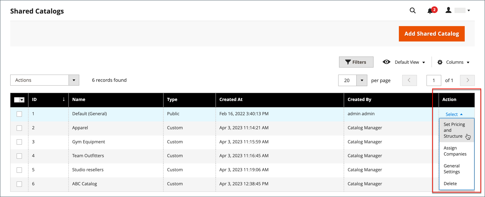
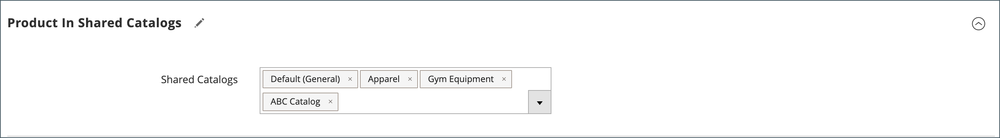
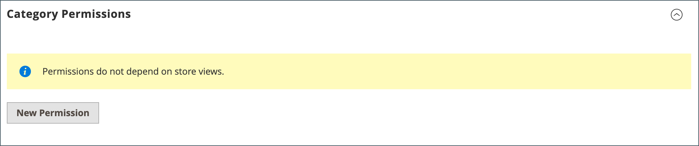

# Administrar los catálogos compartidos

La página _[!UICONTROL Shared Catalogs]_&#x200B;proporciona acceso a las herramientas necesarias para administrar los catálogos compartidos, incluida la selección de productos, los precios personalizados, los permisos de categorías y los detalles del catálogo. La página es similar al espacio de trabajo de administración estándar, con filtros y controles de acción. La cuadrícula enumera todos los catálogos compartidos, incluido el catálogo compartido público predeterminado y los catálogos personalizados que haya configurado.

Si la extensión [!DNL Adobe Commerce Optimizer Connector for B2B] está instalada, la página también proporciona acceso a las vistas de catálogo [!DNL Adobe Commerce Optimizer] creadas cuando el conector sincroniza los datos de cada catálogo compartido con [!DNL Adobe Commerce Optimizer] y a las claves de acceso restringido que protegen las vistas de catálogo para las experiencias de tienda B2B.

## Actualizar la selección del producto

La selección de productos en cualquier catálogo compartido se puede actualizar fácilmente desde la columna _[!UICONTROL Action]_&#x200B;de la cuadrícula de catálogos compartidos. Los cambios que realice serán visibles para los miembros de cualquier cuenta de compañía asociada. El proceso es el mismo que elegir productos para una nueva [estructura de catálogo](catalog-shared-pricing-structure.md), excepto que no se puede cambiar el ámbito de la configuración.

1. En la barra lateral _Admin_, vaya a **[!UICONTROL Catalog]** > **[!UICONTROL Shared Catalogs]**.

1. Para el catálogo compartido en la cuadrícula, vaya a la columna **[!UICONTROL Action]** y seleccione **[!UICONTROL Set Pricing and Structure]**.

   {width="700" zoomable="yes"}

1. Siga las instrucciones de [Paso 2: Elija productos](catalog-shared-pricing-structure.md#step-2-choose-the-products).

   Puede omitir el primer elemento, ya que el ámbito de un catálogo compartido no se puede cambiar después de guardarlo por primera vez.

Si está trabajando con un producto específico, la sección _[!UICONTROL Products In Shared Catalog]_&#x200B;enumera todos los catálogos compartidos en los que el producto está disponible. Para obtener más información, consulte [Agregar productos a un catálogo compartido](catalog-shared-product-add.md).

{width="600" zoomable="yes"}

## Actualizar precios personalizados

Los precios personalizados de los productos en cualquier catálogo compartido se pueden actualizar fácilmente desde la columna Acción de la cuadrícula Catálogos compartidos. Los cambios que realice serán visibles en la tienda para los miembros de la empresa o grupo de clientes asociados. El proceso es el mismo que establecer los precios personalizados para un nuevo [catálogo compartido](catalog-shared-pricing-structure.md), excepto que no se puede cambiar el ámbito de la configuración.

1. En la barra lateral _Admin_, vaya a **[!UICONTROL Catalog]** > **[!UICONTROL Shared Catalogs]**.

1. Para el catálogo compartido en la cuadrícula que desea actualizar, vaya a la columna **[!UICONTROL Action]** y seleccione **[!UICONTROL Set Pricing and Structure]**.

1. En la página _[!UICONTROL Catalog Structure]_, haga clic en **[!UICONTROL Configure]**&#x200B;y realice una de las siguientes acciones:

   - En el indicador de progreso que se encuentra en la parte superior de la página, haga clic en **[!UICONTROL Pricing]**.
   - En la esquina superior derecha, haga clic en **[!UICONTROL Next]**.

1. Siga las instrucciones del [Paso 3: Establecer precios personalizados](catalog-shared-pricing-structure.md#step-3-set-custom-prices).

## Actualizar permisos de categoría

[Los permisos de categoría](../catalog/category-permissions.md) se establecen automáticamente en `Allow` para los productos que se agregan del árbol de categorías a un catálogo compartido. Posteriormente, puede ajustar los permisos o crear reglas adicionales, según sea necesario.

>[!NOTE]
>
>**[Versión B2B 1.3.0](release-notes.md#b2b-v130) y posterior**: al crear un catálogo compartido, cada [permiso de categoría](../catalog/category-permissions.md) se establece en `Allow` para _[!UICONTROL Display Product Prices]_&#x200B;y_[!UICONTROL Add to Cart]_ para los grupos de clientes asignados. Anteriormente, esta configuración se establecía automáticamente en `Deny` incluso cuando los permisos de catálogo se establecían en `Allow`.

>[!IMPORTANT]
>
>**_[!UICONTROL Shared Catalog]_** reemplaza la configuración de permisos de [grupo](../configuration-reference/catalog/catalog.md#category-permissions) existente para **_todas_** las categorías del catálogo cuando está habilitada. [!UICONTROL Shared Catalog] controla completamente todos los permisos de categoría en el catálogo cuando está habilitado.

1. En la barra lateral _Admin_, vaya a **[!UICONTROL Catalog]** > **[!UICONTROL Categories]**.

1. En el árbol de categorías, seleccione la categoría de los productos que desea actualizar.

   Para incluir todos los productos, seleccione la categoría de nivel superior en el árbol.

1. Desplácese hacia abajo y expanda  en la sección **[!UICONTROL Category Permissions]**.

1. Haga clic en **[!UICONTROL New Permission]** y haga lo siguiente:

   {width="600" zoomable="yes"}

   - Elija el **[!UICONTROL Customer Group]** que corresponde al catálogo compartido y cambie la configuración de permisos según sea necesario.

     {width="600" zoomable="yes"}

   - Para crear una regla de permisos para otro grupo de clientes, haga clic en **[!UICONTROL New Permissions]** y repita el proceso.

   - Para eliminar una regla de permiso, haz clic en el icono _Eliminar_ .

1. Una vez finalizado, haga clic en **[!UICONTROL Save]**.

## Actualización de los detalles del catálogo

La información detallada de cualquier catálogo compartido se puede actualizar fácilmente desde la columna Acción de la cuadrícula Catálogos compartidos. Los cambios que realice se reflejarán en las cuentas de compañía asociadas.

{width="700" zoomable="yes"}

1. En la barra lateral _Admin_, vaya a **[!UICONTROL Catalog]** > **[!UICONTROL Shared Catalogs]**.

1. Para el catálogo compartido que desea actualizar, vaya a la columna **[!UICONTROL Action]** y seleccione **[!UICONTROL General Settings]**.

   {width="600" zoomable="yes"}

1. Actualice la información detallada del catálogo según sea necesario.

   - Al cambiar el nombre de un catálogo compartido, también se cambia el nombre del grupo de clientes correspondiente.
   - Si se cambia el tipo de catálogo de `Custom` a `Public`, el catálogo público existente se convierte en un catálogo personalizado. Todas las compañías asociadas con el catálogo público original se reasignan al reemplazo. Un catálogo público no se puede convertir en un catálogo personalizado.
   - Para identificar la clasificación de impuestos aplicada a las compras realizadas a través del catálogo compartido, seleccione [!UICONTROL Customer Tax Class].

1. Una vez finalizado, haga clic en **[!UICONTROL Save]**.

## Administrar configuración de vista de catálogo

Con la extensión [!DNL Adobe Commerce Optimizer Connector for B2B] instalada, la sección _[!UICONTROL Catalog Views]_&#x200B;de un catálogo compartido enumera las vistas de catálogo [!DNL Adobe Commerce Optimizer] proyectadas desde el catálogo compartido y le permite administrar las claves de acceso restringido que las protegen.

1. En la barra lateral _Admin_, vaya a **[!UICONTROL Catalog]** > **[!UICONTROL Shared Catalogs]**.

1. Para el catálogo compartido que desea revisar, vaya a la columna **[!UICONTROL Action]** y seleccione **[!UICONTROL General Settings]**.

1. En el panel _[!UICONTROL Shared Catalog Information]_, seleccione **[!UICONTROL Catalog Views]**.

Para obtener más información acerca de las vistas de catálogo y la edición de claves de acceso restringido, consulte [Administrar configuración de vista de catálogo](catalog-views-manage.md).

## Referencia de página de catálogo compartido

### Barra de botones

| Botón | Descripción |
| --- | --- |
| [!UICONTROL Back] | Vuelve a la página Catálogos compartidos sin guardar el nuevo catálogo compartido. |
| [!UICONTROL Delete] | Elimina el catálogo y reasigna las empresas asociadas y sus miembros al catálogo compartido público. |
| [!UICONTROL Reset] | Borra la forma de los cambios no guardados y restaura la información detallada del catálogo original. |
| [!UICONTROL Duplicate] | Crea una [copia duplicada del catálogo](catalog-shared-create.md). Para un catálogo personalizado, el modelo de precios y la estructura del original, pero sin las asociaciones de empresa. Si se duplica un catálogo compartido público, el tipo de catálogo duplicado cambia a `custom`. También se crea un grupo de clientes correspondiente con el mismo nombre que el catálogo duplicado. De manera predeterminada, un catálogo duplicado se llama _Duplicate of_ el catálogo original. |
| [!UICONTROL Save and Continue Edit] | Guarda todos los cambios y mantiene el formulario abierto en el modo Edición. |
| [!UICONTROL Save] | Guarda los cambios, cierra el formulario y vuelve a la página Catálogos compartidos. |

{style="table-layout:auto"}

### Detalles del catálogo

| Campo | Descripción |
| --- | --- |
| [!UICONTROL Name] | Identifica el catálogo compartido en todo el administrador y en las cuentas de cliente donde está disponible. El nombre del catálogo debe ser descriptivo y no debe tener más de 32 caracteres de longitud. No puede tener dos catálogos compartidos con el mismo nombre. Número máximo de caracteres: 32 |
| [!UICONTROL Type] | **[!UICONTROL Custom]** - Identifica un catálogo con precios personalizados que está disponible solamente para las empresas específicas a las que está asignado. **[!UICONTROL Public]**: identifica el catálogo compartido que está disponible para todos los visitantes invitados y para los clientes que iniciaron sesión y que no están asociados a una compañía. Cuando se instala Adobe Commerce B2B, se crea un catálogo compartido público &quot;predeterminado&quot;, pero el administrador debe configurarlo. Solo puede existir un catálogo compartido público a la vez. |
| [!UICONTROL Customer Tax Class] | Determina la clase de impuesto que se utiliza para las compras realizadas desde el catálogo. Las opciones incluyen todas las clases de impuestos disponibles. La clase de impuesto está asociada al grupo de clientes creado o utilizado para el catálogo compartido. Ver [Clases de impuestos](../stores-purchase/tax-class.md). |
| [!UICONTROL Description] | Una breve explicación de cómo se va a utilizar el catálogo. |

{style="table-layout:auto"}

### Vistas de catálogo

{{$include /help/_includes/catalog-views-reference-table.md}}
