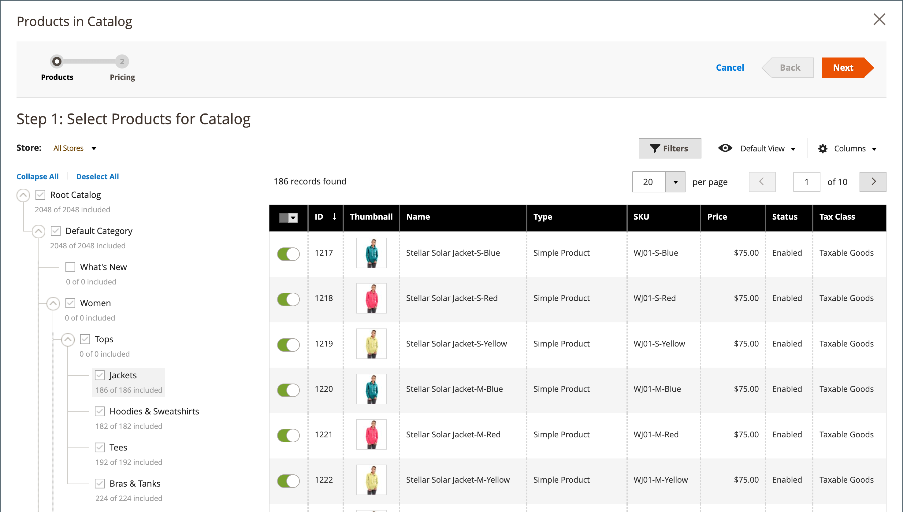

# Añadir productos a un catálogo compartido

Los productos se pueden añadir a un catálogo compartido de forma individual o en grupos de varios productos por categoría.

Se deben cumplir los siguientes requisitos para que un producto complejo (como paquete, agrupado o configurable) sea visible desde la tienda en un catálogo compartido:

- Todos los [productos asociados](../catalog/product-configurations.md) y las opciones deben asignarse al mismo catálogo compartido y habilitarse en el catálogo principal.
- Para los productos [configurables](../catalog/product-create-configurable.md) y [agrupados](../catalog/product-create-grouped.md), solo están visibles los productos asociados habilitados.
- Para un producto [bundle](../catalog/product-create-bundle.md), todas las opciones deben estar incluidas en el catálogo compartido.

  {width="600" zoomable="yes"}

## Método 1: añadir un solo producto

1. En la barra lateral _Admin_, vaya a **[!UICONTROL Catalog]** > **[!UICONTROL Products]**.

1. Para el producto en la cuadrícula que desea agregar, vaya a la columna _[!UICONTROL Action]_y haga clic en **[!UICONTROL Edit]**.

1. Desplácese hacia abajo, expanda  en la sección _[!UICONTROL Product in Shared Catalogs]_y haga lo siguiente:

   - Seleccione la casilla de verificación de cada catálogo compartido en el que debe aparecer el producto. Para elegir todos los catálogos, haga clic en **[!UICONTROL Select all]**.

     {width="600" zoomable="yes"}

     El nombre de cada catálogo seleccionado aparece en el campo _[!UICONTROL Shared Catalogs]_.

     {width="600" zoomable="yes"}

   - Haga clic en **[!UICONTROL Done]** para guardar la configuración.

1. Una vez finalizado, haga clic en **[!UICONTROL Save]**.

## Método 2: añadir varios productos

1. En la barra lateral _Admin_, vaya a **[!UICONTROL Catalog]** > **[!UICONTROL Shared Catalogs]**.

1. Para el catálogo compartido en la cuadrícula, vaya a la columna _[!UICONTROL Action]_y seleccione **[!UICONTROL Set Pricing and Structure]**.

1. En el árbol de categorías, realice una de las acciones siguientes:

   - Para incluir todos los productos, haga clic en **[!UICONTROL Select all]** o seleccione la casilla de verificación de la categoría principal.
   - Para incluir categorías específicas de productos, seleccione la casilla de verificación de cada categoría que desee incluir.
   - Para incluir o excluir un producto individual, seleccione o anule la selección de la casilla de verificación del producto.

   La notación debajo de cada categoría en el árbol muestra el número de productos de la categoría que están actualmente incluidos en el catálogo compartido. La anotación debajo de [categoría raíz](../catalog/category-root.md) muestra el número total de productos de todas las categorías que están seleccionadas actualmente para el catálogo compartido.

1. Para ver los productos de la categoría en la cuadrícula, haga clic en el nombre de la categoría en el árbol.

   Cuando se selecciona una categoría, ocurre lo siguiente:

   - La opción de la primera columna de la cuadrícula se establece en `On` para cada producto seleccionado.
   - Si un producto está asignado a varias categorías y se omite en una de ellas, permanecerá disponible a través de las demás categorías y mediante [búsqueda en el catálogo](../catalog/search.md).
   - El sistema establece automáticamente [Permisos de categoría](../catalog/category-permissions.md) en `Allow` para los productos seleccionados.
