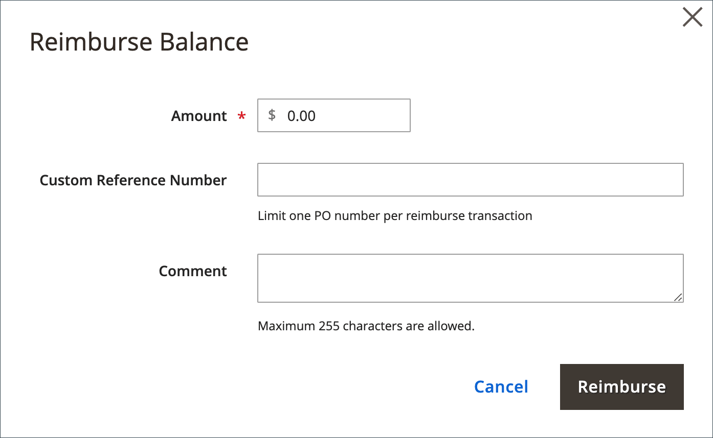
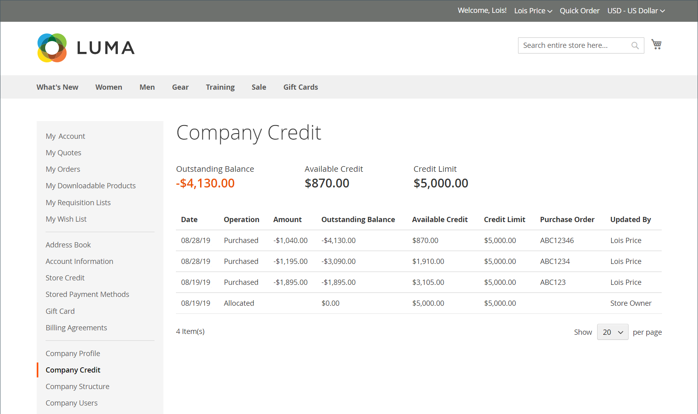

# Administrar crédito de la empresa

El crédito a la empresa permite a las empresas B2B realizar compras con una línea de crédito preaprobada en lugar de requerir un pago inmediato. Cuando [Pago en la cuenta](../b2b/enable-basic-features.md#configure-payment-on-account) está habilitado, las empresas pueden comprar hasta su límite de crédito y ver su estado de crédito desde el panel de cuentas.

{width="700" zoomable="yes"}

El crédito de empresa le permite:

* **Extender términos de crédito**: permite que los clientes empresariales de confianza compren a cuenta con pago diferido
* **Establecer límites de crédito**—Controlar la exposición financiera estableciendo límites de crédito para cada compañía
* **Rastrear actividad de crédito**: supervisa todas las transacciones de crédito, pagos y saldos pendientes en tiempo real
* **Optimizar las transacciones B2B**—Simplificar el proceso de compra para compañías con relaciones de crédito establecidas
* **Admitir flujos de trabajo complejos**: se integra con pedidos de compra, presupuestos y procesos de aprobación

## Requisitos previos

Antes de configurar el crédito de la empresa, asegúrese de lo siguiente:

* Las funciones B2B están habilitadas en la instalación de Adobe Commerce
* [Pago en la cuenta](../b2b/enable-basic-features.md#configure-payment-on-account) está configurado y habilitado
* Las cuentas de compañía están correctamente configuradas con la información empresarial necesaria
* Tiene permisos administrativos para administrar la configuración de crédito de la empresa
* La configuración de moneda se establece si se opera en varias monedas

## Casos de uso

El crédito de empresa es ideal para:

* **Establecimiento de relaciones B2B**: clientes empresariales a largo plazo con historial de pagos probado
* **Clientes de grandes empresas**: Compañías que realizan compras importantes y regulares que requieren términos de pago extendidos
* **Empresas de temporada**—Empresas con flujo de efectivo cíclico que necesitan un tiempo de pago flexible
* **Compras corporativas**—Organizaciones con compras centralizadas pero procesamiento de pagos distribuidos
* **Socios de Supply chain**—Distribuidores, revendedores y socios de canal que requieren líneas de crédito

## Explicación de la configuración de crédito de empresa

Puede configurar los siguientes parámetros relacionados con el crédito para cada perfil de compañía:

* **Divisa de Crédito**—Divisa para todas las transacciones y saldos de crédito
* **Límite de crédito**— Cantidad máxima que la compañía puede deber en cualquier momento
* **Permitir que se supere el límite de crédito**— Si las empresas pueden realizar pedidos que excedan el crédito disponible
* **Motivo del cambio**: campo de documentación para registrar las modificaciones de la configuración de crédito

Para obtener más información acerca de esta configuración y la configuración del perfil de la compañía, consulte [Crear una cuenta de compañía](account-company-create.md).

>[!NOTE]
>
>Si una empresa tiene un saldo pendiente, aparece un aviso al administrador de la tienda en la parte superior de los pedidos de venta cuando se consulta desde el administrador. Esto ayuda a garantizar el conocimiento del estado de crédito durante el procesamiento de los pedidos.

## Actividad de crédito de empresa

La sección [!UICONTROL Company Credit] del perfil de la compañía muestra un historial completo de todas las transacciones de crédito, cambios de saldo y actividades de pago en formato de cuadrícula.

{width="700" zoomable="yes"}

La cuadrícula muestra la siguiente información para cada transacción:

| Columna | Descripción |
|--- |--- |
| [!UICONTROL Date] | La fecha de la transacción. Para mostrar la fecha y la hora, pase el ratón sobre la fecha. |
| [!UICONTROL Operation] | El tipo de actividad asociada con la transacción. Valores:  **[!UICONTROL Allocated]**- Crédito asignado a la compañía. **[!UICONTROL Updated]** - Se aplicó un cambio a uno de los siguientes campos: [!UICONTROL Credit limit] / [!UICONTROL Credit currency] / [!UICONTROL Allow to exceed credit limit]  **[!UICONTROL Purchased]**- Se realizó un pedido. **[!UICONTROL Reimbursed]** - Se reembolsó el saldo pendiente.  **[!UICONTROL Refunded]**: se reembolsó un importe de nota de abono. **[!UICONTROL Reverted]**: el pedido se canceló y se devolvió el importe al saldo acreedor. |
| [!UICONTROL Amount] | El importe de la transacción asociada con los siguientes tipos de transacción: `Purchased` / `Reimbursed` / `Refunded` / `Reverted`  Para los importes de compra, el importe aparece en la moneda de visualización del almacén y en el formato de la configuración de la moneda de crédito, seguido de la tasa de conversión actual (si corresponde). Por ejemplo:  20.000,00 EUR ($22.400,00)  USD/EUR 0,8928 |
| [!UICONTROL Outstanding Balance] | El importe reembolsado, menos el total adeudado de todos los pedidos realizados mediante el método Pago a Cuenta. La cantidad puede aparecer como un valor positivo o negativo.  **[!UICONTROL Positive value]**: un pago anticipado se representa como un valor positivo. **[!UICONTROL Negative value]**: un importe adeudado se representa como un valor negativo. |
| [!UICONTROL Available Credit] | La suma de _[!UICONTROL Credit Limit]_&#x200B;y_[!UICONTROL Outstanding Balance]_. Si la empresa ha superado el límite de crédito, el importe aparece como un valor negativo. |
| [!UICONTROL Credit Limit] | El importe del crédito concedido a la empresa. |
| [!UICONTROL Updated By] | Nombre de la persona que inició la operación. |
| [!UICONTROL Custom Reference Number] | Número de referencia personalizado asociado con la transacción. |
| [!UICONTROL Comment] | Una compilación de los valores del campo `Reason for Change`, según el tipo de operación.  **[!UICONTROL Purchased]**: incluye comentarios de la compra, el número de pedido y el vínculo al pedido. **[!UICONTROL Reimbursed]** - Incluye comentarios de la transacción reembolsada. |
| [!UICONTROL Action] | Solo para `Reimbursed` operaciones. **[!UICONTROL Edit]** - Permite actualizar la cantidad de reembolso. |

{style="table-layout:auto"}

## Actualizar la información de crédito

Cuando los clientes realizan pagos, los administradores actualizan la información de crédito en Admin.

1. En la barra lateral de _Administración_, vaya a **Clientes > Compañías**.

1. Busque la compañía en la cuadrícula y ábrala en el modo _Editar_.

1. Expanda la sección **Crédito de la compañía**.

1. Para **Límite de crédito**, ingrese el nuevo valor.

1. Cambie los demás valores según sea necesario.

1. Cuando se hayan completado las actualizaciones, haga clic en **[!UICONTROL Save]**.

## Recibir pagos

Un saldo reembolsado es un pago fuera de línea que realiza una compañía hacia el saldo de su cuenta. El administrador de la tienda introduce la cantidad manualmente en el perfil de la empresa, con el botón _Saldo de reembolso_. Cuando se envía el importe, el sistema vuelve a calcular el saldo pendiente y el crédito disponible de la empresa y registra la acción en el historial de crédito de la empresa. El importe reembolsado se introduce en la divisa de abono, tal como se especifica en la configuración.

### Aplicar un pago a una cuenta de empresa

1. En la barra lateral _Admin_, vaya a **[!UICONTROL Customers]** > **[!UICONTROL Companies]**.

1. Busque el registro de empresa en la lista y ábralo en el modo **[!UICONTROL Edit]**.

1. En la parte superior de la página, haga clic en **Saldo de reembolsos**.

1. En el cuadro de diálogo, añada la información de pago:

   {width="500"}

   * Escriba el **importe** del pago.

     La cantidad se puede introducir como valor positivo o negativo.

   * Si corresponde, ingrese el **Número de referencia personalizado** para referencia.

     Sólo se puede introducir un número de referencia personalizado por cada reembolso. Para aplicar el pago a varios pedidos, cree un reembolso distinto para cada uno.

   * Si es necesario, escriba un **comentario** para describir el reembolso.

1. Haga clic en **Reembolso**.

   El sistema actualiza automáticamente los saldos y el historial de crédito para reflejar el reembolso.

### Editar un reembolso

1. Abra el perfil de la compañía en el modo **[!UICONTROL Edit]**.

1. Expanda  en la sección **Crédito de la compañía**.

1. Busque la transacción de reembolso en la cuadrícula y haga clic en **[!UICONTROL Edit]**.

1. Realice los cambios necesarios en **Número de referencia personalizado** y **Comentario**.

   No se puede cambiar el importe del reembolso.

1. Haga clic en **[!UICONTROL Save]**.

## Información de crédito de tienda

Los administradores de la compañía pueden ver su información de crédito en el panel de control de cuentas, incluidos el saldo pendiente, el crédito disponible, el límite de crédito y las facturas pendientes. Cuando se cancelan los pedidos, los importes vuelven al saldo de la empresa y aparecen en el campo Historial de Asignación de Crédito.

{width="700" zoomable="yes"}

## Demostración de crédito de empresa

Obtenga información acerca de la administración del crédito de la empresa viendo este vídeo de demostración:

>[!VIDEO](https://video.tv.adobe.com/v/3410758?captions=spa&quality=12&learn=on)

## Consideraciones de seguridad

A la hora de gestionar el crédito de la empresa, implemente medidas de seguridad sólidas para proteger los datos financieros confidenciales:

* **Control de acceso**: Restrinja los permisos de administración de crédito únicamente al personal autorizado
* **Pistas de auditoría**: mantenga registros completos de todas las transacciones y modificaciones de crédito
* **Protección de datos**: codifica la información financiera confidencial tanto en tránsito como en reposo
* **Flujos de trabajo de aprobación**: implemente procesos de aprobación de varios niveles para realizar ajustes de crédito significativos
* **Revisiones regulares**: realice auditorías periódicas del acceso de los usuarios y las relaciones de crédito

## Prácticas recomendadas

* &#x200B;
   * **Administración de directivas de crédito**: al administrar el crédito de la compañía, establezca directivas claras para establecer límites de crédito basados en el historial de pagos del cliente y en las relaciones comerciales. Revise periódicamente los saldos pendientes y los patrones de pago para evaluar el riesgo, y siempre documente los cambios en la configuración de crédito con motivos detallados a efectos de auditoría.

Procese los pagos con prontitud para mantener saldos precisos y garantizar que la configuración de la divisa de crédito se ajuste a las operaciones comerciales principales de cada empresa.

* **Cumplimiento y seguridad**: Restrinja los permisos de administración de crédito únicamente al personal autorizado, implemente flujos de trabajo de aprobación para ajustes de crédito significativos y proteja la información financiera confidencial según las políticas de seguridad de su organización. Las revisiones regulares del acceso de los usuarios y las relaciones de crédito ayudan a mantener una supervisión y un cumplimiento adecuados.

>[!MORELIKETHIS]
>
>* [Habilitar funciones B2B](enable-basic-features.md) * Configurar pago a cuenta y otras funciones B2B
>* [Crear una cuenta de compañía](account-company-create.md) * Configurar cuentas de compañía con capacidades de crédito
>* [Administrar compañías](manage-companies.md) * Información general sobre las funciones de administración de compañías
>* [Roles y permisos de la compañía](account-company-roles-permissions.md) * Configure el acceso de usuario para la administración de crédito
>* [Flujo de trabajo de pedidos de compra](purchase-order-flow.md) * Comprenda cómo se integra el crédito con los pedidos de compra
>* [Referencia de configuración B2B](../configuration-reference/general/b2b-features.md) - Ajustes de configuración detallados para las características B2B
