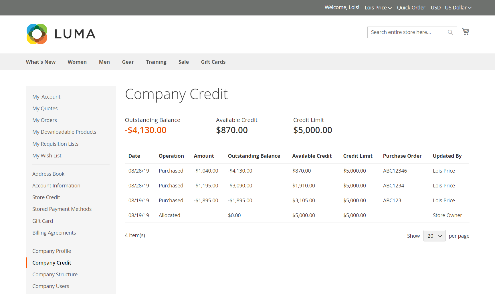

# Administrar crédito de la empresa

Si [Pago en la cuenta](../getting-started/../b2b/enable-basic-features.md#configure-payment-on-account) está habilitado en la configuración, las compañías pueden realizar compras en su cuenta hasta el límite de crédito concedido a la compañía. Cuando se habilita, los clientes pueden comprobar el estado del crédito de su compañía desde su panel de cuentas.

{width="700" zoomable="yes"}

Puede establecer los siguientes parámetros relacionados con el crédito para cada perfil de compañía:

- Divisa de crédito
- Límite de crédito
- Permitir que se supere el límite de crédito
- Motivo del cambio

Si la empresa tiene un saldo pendiente, aparece un aviso al administrador de la tienda en la parte superior del pedido de ventas cuando se consulta desde el administrador. Para obtener más información, consulte [Crear una cuenta de empresa](account-company-create.md).

## Actividad de crédito de empresa

La sección [!UICONTROL Company Credit] del perfil de compañía muestra un resumen de la actividad de crédito del cliente, con una cuadrícula del historial de crédito de la compañía.

{width="700" zoomable="yes"}

| Columna | Descripción |
|--- |--- |
| [!UICONTROL Date] | La fecha de la transacción. Para mostrar la fecha y la hora, pase el ratón sobre la fecha. |
| [!UICONTROL Operation] | El tipo de actividad asociada con la transacción. Valores:  **[!UICONTROL Allocated]**- Crédito asignado a la compañía. **[!UICONTROL Updated]** - Se aplicó un cambio a uno de los siguientes campos: [!UICONTROL Credit limit] / [!UICONTROL Credit currency] / [!UICONTROL Allow to exceed credit limit]  **[!UICONTROL Purchased]**- Se realizó un pedido. **[!UICONTROL Reimbursed]** - Se reembolsó el saldo pendiente.  **[!UICONTROL Refunded]**- Se reembolsó un importe de nota de abono. **[!UICONTROL Reverted]** - Se canceló el pedido y se devolvió el importe al saldo acreedor. |
| [!UICONTROL Amount] | El importe de la transacción asociada con los siguientes tipos de transacción: `Purchased` / `Reimbursed` / `Refunded` / `Reverted`  Para los importes de compra, el importe aparece en la moneda de visualización del almacén y en el formato de la configuración de la moneda de crédito, seguido de la tasa de conversión actual (si corresponde). Por ejemplo:  20.000,00 EUR ($22.400,00)  USD/EUR 0,8928 |
| [!UICONTROL Outstanding Balance] | El importe reembolsado, menos el total adeudado de todos los pedidos realizados mediante el método Pago a Cuenta. La cantidad puede aparecer como un valor positivo o negativo.  **[!UICONTROL Positive value]**: un pago anticipado se representa como un valor positivo. **[!UICONTROL Negative value]** - Una cantidad adeudada se representa como un valor negativo. |
| [!UICONTROL Available Credit] | La suma de _[!UICONTROL Credit Limit]_&#x200B;y_[!UICONTROL Outstanding Balance]_. Si la empresa ha superado el límite de crédito, el importe aparece como un valor negativo. |
| [!UICONTROL Credit Limit] | El importe del crédito concedido a la empresa. |
| [!UICONTROL Updated By] | Nombre de la persona que inició la operación. |
| [!UICONTROL Custom Reference Number] | Número de referencia personalizado asociado con la transacción. |
| [!UICONTROL Comment] | Una compilación de los valores del campo `Reason for Change`, según el tipo de operación.  **[!UICONTROL Purchased]**: incluye comentarios de la compra, el número de pedido y el vínculo al pedido. **[!UICONTROL Reimbursed]** - Incluye comentarios de la transacción reembolsada. |
| [!UICONTROL Action] | Solo para `Reimbursed` operaciones. **[!UICONTROL Edit]** - Permite actualizar la cantidad de reembolso. |

{style="table-layout:auto"}

## Actualizar la información de crédito

Cuando el cliente realiza el pago de su crédito pendiente al comerciante, un administrador de tienda debe actualizar la información de crédito del cliente en el Administrador.

1. En la barra lateral de _Administración_, vaya a **Clientes > Compañías**.

1. Busque la compañía en la cuadrícula y ábrala en el modo _Editar_.

1. Expanda la sección **Crédito de la compañía**.

1. Para **Límite de crédito**, ingrese el nuevo valor.

1. Cambie los demás valores según sea necesario.

1. Cuando se hayan completado las actualizaciones, haga clic en **[!UICONTROL Save]**.

## Recibir pagos

Un saldo reembolsado es un pago fuera de línea que realiza una compañía hacia el saldo de su cuenta. El administrador de la tienda introduce la cantidad manualmente en el perfil de la empresa, con el botón _Saldo de reembolso_. Cuando se envía el importe, el sistema vuelve a calcular el saldo pendiente y el crédito disponible de la empresa y registra la acción en el historial de crédito de la empresa. El importe reembolsado se introduce en la divisa de abono, tal como se especifica en la configuración.

### Aplicar un pago a una cuenta de empresa

1. En la barra lateral _Admin_, vaya a **[!UICONTROL Customers]** > **[!UICONTROL Companies]**.

1. Busque el registro de empresa en la lista y ábralo en el modo **[!UICONTROL Edit]**.

1. En la parte superior de la página, haga clic en **Saldo de reembolsos**.

1. En el cuadro de diálogo, añada la información de pago:

   {width="500"}

   - Escriba el **importe** del pago.

     La cantidad se puede introducir como valor positivo o negativo.

   - Si corresponde, ingrese el **Número de referencia personalizado** para referencia.

     Sólo se puede introducir un número de referencia personalizado por cada reembolso. Para aplicar el pago a varios pedidos, cree un reembolso distinto para cada uno.

   - Si es necesario, escriba un **comentario** para describir el reembolso.

1. Haga clic en **Reembolso**.

   El saldo pendiente de la empresa y el crédito disponible se vuelven a calcular, y el historial de crédito de la empresa se actualiza para reflejar el reembolso.

### Editar un reembolso

1. Abra el perfil de la compañía en el modo **[!UICONTROL Edit]**.

1. Expanda  en la sección **Crédito de la compañía**.

1. Busque la transacción de reembolso en la cuadrícula y haga clic en **[!UICONTROL Edit]**.

1. Realice los cambios necesarios en **Número de referencia personalizado** y **Comentario**.

   No se puede cambiar el importe del reembolso.

1. Haga clic en **[!UICONTROL Save]**.

## Información de crédito de tienda

Para el administrador de la empresa, el panel de cuentas muestra la sección _Crédito de la empresa_. Proporciona el saldo pendiente actual, el crédito disponible y el límite de crédito asignado a su cuenta de compañía seguido de una lista de facturas pendientes.

Si el comerciante cancela un pedido que se cargó al crédito de la compañía, la cantidad del pedido se devuelve al saldo de la compañía y el _Historial de asignación de crédito_ incluye un registro de la acción.

{width="700" zoomable="yes"}

## Demostración de crédito de empresa

Obtenga información acerca de la administración del crédito de la empresa viendo este vídeo de demostración:

>[!VIDEO](https://video.tv.adobe.com/v/3410758?quality=12&learn=on&captions=spa)
