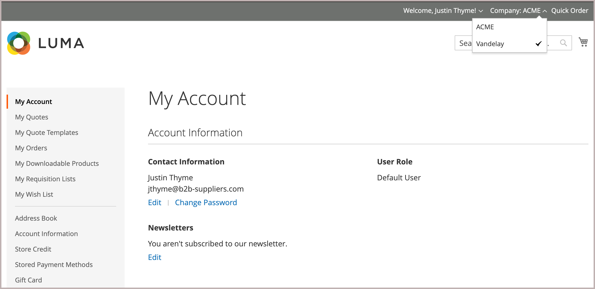

# Añadir usuarios a una cuenta de empresa

Cuando se habilita en la configuración, el administrador de la empresa agrega y administra los usuarios de la empresa desde la tienda. Sin embargo, las cuentas de usuarios de la empresa también se pueden añadir y administrar desde el Administrador.

Si es necesario, puede asignar un usuario a más de una compañía. Por ejemplo, si los compradores B2B admiten varias empresas, puede agregar sus cuentas de usuario a todas las empresas con las que operen. En la tienda, los compradores asignados a varias empresas pueden cambiar entre cuentas de empresa si seleccionan entre las empresas disponibles en el menú *[!UICONTROL Company]*.

{width="700"}

>[!NOTE]
>
>Si una persona ya tiene una cuenta personal en su tienda y más tarde va a trabajar para una empresa, no asigne la cuenta individual de la persona a la empresa. En su lugar, cree una cuenta de usuario de empresa para la persona con una dirección de correo electrónico de empresa.

## Añadir un usuario de empresa

Cuando agrega un usuario de compañía, la primera compañía que asocia a la cuenta de usuario es la compañía predeterminada.

1. En la barra lateral de Administración, vaya a **[!UICONTROL Customers > All Customers]**.

1. Haga clic en **[!UICONTROL Add new customer]**.

1. Configure la nueva cuenta.

   1. Especifique el estado inicial de la cuenta estableciendo la opción **[!UICONTROL Customer Active]**.

      Actívela para activar la cuenta inmediatamente o desactívela para crear una cuenta inactiva.

   1. Seleccione el ámbito del sitio web de la lista **[!UICONTROL Associate to Website]**.

   1. Haga clic en **[!UICONTROL Associate to Company]** para ver las empresas disponibles.

      {width="675"}

      Si es necesario, filtre la lista escribiendo las primeras letras del nombre de la empresa en el cuadro de entrada.

   1. En la lista, seleccione una o varias empresas a las que desee asignar el cliente y haga clic en **[!UICONTROL Done]**.

      Los usuarios de la compañía se agregan automáticamente al grupo de clientes (o [catálogo compartido](catalog-shared.md)) para cada compañía asociada con su cuenta.

   1. Especifique la información de cuenta de usuario requerida: **[!UICONTROL First Name]**, **[!UICONTROL Last Name]** y **[!UICONTROL Email]**.

   1. Permitir que los representantes de ventas inicien sesión en la tienda en nombre del cliente habilitando **[!UICONTROL Allow remote shopping assistance]**.

   1. Aplique los cambios haciendo clic en **[!UICONTROL Save Customer]**.

      {width="675"}

[!UICONTROL Customers grid] muestra una fila independiente para cada compañía a la que está asignado el usuario. Se actualizan las siguientes columnas.

- La columna _[!UICONTROL Customer Type]_&#x200B;se actualiza para mostrar el rol asignado al usuario.

  Si es la primera vez que se asigna al cliente a una compañía, la columna _[!UICONTROL Customer Type]_&#x200B;se actualiza de&#x200B;_[!UICONTROL Individual user]_ a _[!UICONTROL Company User]_.

- La columna _[!UICONTROL Group]_&#x200B;cambia al nombre del grupo de clientes (o catálogo compartido) asignado a la compañía.

- La columna _[!UICONTROL Company]_&#x200B;muestra el nombre de la compañía a la que está ahora asociado el perfil del cliente.

## Asignar un usuario a una o varias cuentas de empresa

Al asignar un nuevo usuario, la primera compañía que asocia a la cuenta de usuario es la compañía predeterminada.

1. En la barra lateral _Admin_, vaya a **[!UICONTROL Customers]** > **[!UICONTROL All Customers]**.

1. Busque al cliente en la cuadrícula y haga clic en **[!UICONTROL Edit]** en la columna _[!UICONTROL Action]_.

1. En el panel izquierdo, elija **[!UICONTROL Account Information]**.

1. En la lista **[!UICONTROL Associate to Company]**, seleccione una o más compañías para asignarlas al usuario de la compañía y haga clic en **[!UICONTROL Done]**.

1. Aplique los cambios haciendo clic en **[!UICONTROL Save Customer]**.

## Quitar la asignación de la empresa de una cuenta de usuario

Al eliminar una compañía de un perfil de usuario, se anula el acceso de los usuarios a esa compañía. Los datos de usuario permanecen accesibles en el Administrador. Si quita todas las asignaciones de la compañía, _[!UICONTROL Customer Type]_&#x200B;cambia a *[!UICONTROL Individual user]*, lo que deshabilita las capacidades B2B de la cuenta.

1. En la cuadrícula Cliente de la administración, edite el perfil del cliente que desea actualizar.

1. En la sección *[!UICONTROL Account Information], quite una compañía asignada del campo **[!UICONTROL Associate to Company]** haciendo clic en **[!UICONTROL X]** en la etiqueta de nombre de compañía.

1. Aplique los cambios haciendo clic en **[!UICONTROL Save Customer]**.

>[!NOTE]
>
>Si un usuario de la empresa está asignado como administrador de la empresa, no podrá eliminar la asociación de la empresa de este usuario hasta que actualice la cuenta de la empresa para asignar un nuevo administrador de la empresa.
