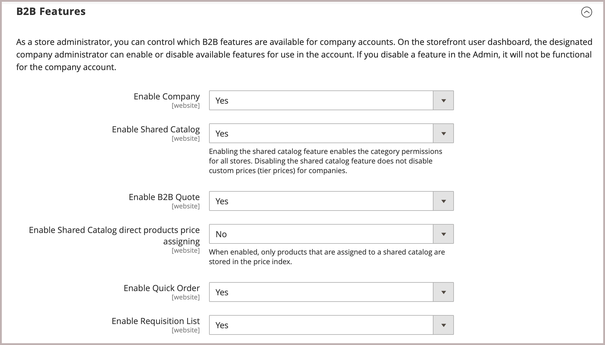

# Activar funciones B2B

De forma predeterminada, todas las funciones B2B se desactivan inicialmente. Un administrador de tienda puede habilitar o deshabilitar las funciones B2B que se necesitan en las tiendas Commerce. Para obtener una lista completa de las opciones de configuración B2B, consulte [Referencia de configuración de las características B2B](../configuration-reference/general/b2b-features.md).

Al habilitar la compatibilidad para las empresas de los clientes, se habilitan automáticamente las siguientes funciones B2B adicionales:

- [[!DNL Shared Catalog]](catalog-shared.md)

  Admite la configuración de precios personalizada para diferentes empresas y también habilita permisos de categoría para todas las tiendas.

- [!DNL Enable Shared Catalog direct products price assigning]

  Mejora el rendimiento del sitio al almacenar únicamente los productos asignados a un catálogo compartido en el índice de precios. Habilitar esta función es una práctica recomendada para los comerciantes que tienen muchos catálogos compartidos para administrar los precios personalizados para diferentes empresas.

- [[!DNL B2B Quotes]](quotes.md)

  Permite a los vendedores y compradores de la empresa negociar precios.

- [!DNL B2B default payment and shipping methods]

  Determina la selección de opciones de pago y envío disponibles para los compradores B2B en la tienda.

Las opciones de configuración de estas características solo son visibles cuando [!DNL Enable Company] se establece en `Yes`.

Las características B2B [[!DNL Quick Order]](quick-order.md) y [[!DNL Requisition List]](requisition-lists.md) se pueden habilitar y deshabilitar de forma independiente.

## Configuración de funciones B2B

Las opciones para configurar las características de Adobe Commerce B2B solo están disponibles en proyectos de Commerce que tengan instalada la [extensión Adobe Commerce B2B](install.md).

1. En la barra lateral _Admin_, vaya a **[!UICONTROL Stores]** > _[!UICONTROL Settings]_>**[!UICONTROL Configuration]**.

   Si tiene una instalación de varios sitios, establezca el control **[!UICONTROL Store View]** en la esquina superior izquierda del sitio web donde se aplica la configuración.

1. En el panel izquierdo bajo _[!UICONTROL General]_, elija **[!UICONTROL B2B Features]**:

   {width="600"}

   - Permitir que los clientes administren sus propias cuentas de compañía y habilitar la compatibilidad con características B2B adicionales estableciendo **[!UICONTROL Enable Company]** en `Yes`.

     Al activar la asistencia técnica de la empresa, se activan automáticamente el catálogo compartido, la oferta B2B, los métodos de pago B2B y los métodos de envío B2B.

     {width="600"}

   - Para permitir que los clientes e invitados realicen pedidos rápidamente según el SKU o el nombre del producto, establezca **[!UICONTROL Enable Quick Order]** en `Yes`.

   - Para permitir a los clientes crear y administrar listas de solicitudes desde su panel de cuentas, establezca **[!UICONTROL Enable Requisition List]** en `Yes`.

     También puede [configurar el número máximo de listas](configure-requisition-lists.md) que un cliente puede tener para su cuenta.

1. Una vez finalizado, haga clic en **[!UICONTROL Save Config]**.

## Configuración de métodos de envío y pago B2B predeterminados

1. Expanda  en la sección **[!UICONTROL Default B2B Payment Methods]**.

1. Para establecer los métodos de pago predeterminados para los pedidos B2B, establezca **[!UICONTROL Applicable Payment Methods]** en uno de los siguientes:

   - `All Payment Methods`

   - `Selected Payment Methods`

     Para la opción específica, seleccione el(la) **[!UICONTROL Payment Methods]** que desee poner a disposición de sus clientes manteniendo presionada la tecla Ctrl (PC) o la tecla Comando (Mac) mientras hace clic en cada opción.

   La lista de [métodos de pago](../configuration-reference/sales/payment-methods.md) muestra qué opciones están habilitadas o deshabilitadas actualmente en tu tienda. Además de los métodos de pago estándar, la lista también incluye lo siguiente:

   - No se requiere información de pago
   - [Pago a cuenta](#configure-payment-on-account)
   - Cuentas almacenadas
   - Tarjetas almacenadas

   {width="600"}

1. Expanda  en la sección **[!UICONTROL Default B2B Shipping Methods]**.

1. Para especificar los métodos de envío predeterminados para los pedidos B2B, establezca **[!UICONTROL Applicable Shipping Methods]** en uno de los siguientes:

   - `All Shipping Methods`
   - `Selected Shipping Methods`

     Para la opción específica, seleccione el(la) **[!UICONTROL Shipping Methods]** que desee poner a disposición de sus clientes manteniendo presionada la tecla Ctrl (PC) o la tecla Comando (Mac) mientras hace clic en cada opción.

     La lista de métodos de envío muestra los que están [habilitados o deshabilitados](../configuration-reference/sales/delivery-methods.md) actualmente.

   {width="600"}

1. Una vez finalizado, haga clic en **[!UICONTROL Save Config]**.

## Configurar opciones de correo electrónico de empresa

El [representante de ventas](account-company-manage.md#assign-a-sales-representative) asignado como contacto principal de una compañía está configurado de manera predeterminada como remitente de muchos mensajes de correo electrónico automatizados enviados a la compañía.

1. En la barra lateral _Admin_, vaya a **[!UICONTROL Stores]** > _[!UICONTROL Settings]_>**[!UICONTROL Configuration]**.

1. En el panel izquierdo, expanda **[!UICONTROL Customers]** y elija **[!UICONTROL Company Configuration]**.

1. Si es necesario, establezca **[!UICONTROL Store View]** en la vista de almacén para definir el [ámbito](../getting-started/websites-stores-views.md#scope-settings) de la configuración.

1. Complete la sección **[!UICONTROL Company Registration]**:

   >[!NOTE]
   >
   >Desactive la casilla **[!UICONTROL Use system value]** para poder editar el campo.

   - Establezca **[!UICONTROL Company Registration Email Recipient]** en el [contacto de tienda](../getting-started/store-details.md#store-email-addresses) al que se le notificará cuando se reciba una nueva solicitud de registro de empresa.

   - Para **[!UICONTROL Send Company Registration Email Copy To]**, escriba la dirección de correo electrónico de cada persona que vaya a recibir una copia de la notificación de registro. Separe varias direcciones de correo electrónico con una coma.

   - Para determinar cómo se envía la copia de la notificación, establezca **Enviar copia del correo electrónico** en uno de los siguientes valores:

      - `Bcc` - Envía una _copia de cortesía a ciegas_ incluyendo el destinatario en el encabezado del mismo correo electrónico que se envía al cliente. El destinatario CCO no es visible para el cliente.
      - `Separate Email` - Envía la copia como un correo electrónico independiente.

   - Si ha preparado una plantilla de correo electrónico que se va a utilizar en lugar de la predeterminada, establezca **[!UICONTROL Default Company Registration Email]** en el nombre de la plantilla. De manera predeterminada, se utiliza la plantilla `Company Registration Request`.

     {width="600"}

1. Complete la sección **[!UICONTROL Customer-Related Emails]**:

   Si ha preparado plantillas de correo electrónico alternativas para utilizarlas en lugar de las predeterminadas, elija la plantilla que desee utilizar para cada una de las siguientes opciones:

   - **[!UICONTROL Default 'Sales Rep Assigned' Email]**
   - **[!UICONTROL Default 'Assign Company to Customer' Email]**
   - **[!UICONTROL Default 'Assign Company Admin' Email]**
   - **[!UICONTROL Default 'Company Admin Inactive' Email]**
   - **[!UICONTROL Default 'Company Admin Changed to Member' Email]**
   - **[!UICONTROL Default 'Customer Status Active' Email]**
   - **[!UICONTROL Default 'Customer Status Inactive' Email]**

   {width="600"}

1. Complete la sección **[!UICONTROL Company Status Change]**:

   - Para **[!UICONTROL Send Company Status Change Email Copy To]**, escriba la dirección de correo electrónico de cada persona que vaya a recibir una copia de la notificación de cambio de estado. Separe varias direcciones de correo electrónico con una coma.

   - Para determinar cómo se envía la copia de la notificación, establezca **Enviar copia del correo electrónico** en uno de los siguientes valores:

      - `Bcc` - Envía una _copia de cortesía a ciegas_ incluyendo el destinatario en el encabezado del mismo correo electrónico que se envía al cliente. El destinatario CCO no es visible para el cliente.
      - `Separate Email` - Envía la copia como un correo electrónico independiente.

   - Si ha preparado una plantilla de correo electrónico que se utilizará cuando el estado de la compañía cambie de `Pending Approval` a `Active`, establezca **[!UICONTROL Default 'Company Status Change to Active 1' Email]** en el nombre de la plantilla. De manera predeterminada, se utiliza la plantilla `Company Status Active 1`.

   - Si ha preparado una plantilla de correo electrónico que se utilizará cuando el estado de la compañía cambie de `Rejected` o `Blocked` a `Active`, establezca **[!UICONTROL Default 'Company Status Change to Active 2' Email]** en el nombre de la plantilla. De manera predeterminada, se utiliza la plantilla `Company Status Active 2`.

   - Si ha preparado una plantilla de correo electrónico que se utilizará cuando el estado de la compañía cambie a `Rejected`, establezca **[!UICONTROL Default 'Company Status Change to Rejected' Email]** en el nombre de la plantilla. De manera predeterminada, se utiliza la plantilla `Company Status Rejected`.

   - Si ha preparado una plantilla de correo electrónico que se utilizará cuando el estado de la compañía cambie a `Blocked`, establezca **[!UICONTROL Default 'Company Status Change to Blocked' Email]** en el nombre de la plantilla. De manera predeterminada, se utiliza la plantilla `Company Status Blocked`.

   - Si ha preparado una plantilla de correo electrónico que se utilizará cuando el estado de la compañía cambie a `Pending Approval`, establezca **[!UICONTROL Default 'Company Status Change to Pending Approval' Email]** en el nombre de la plantilla. De manera predeterminada, se utiliza la plantilla `Company Status Pending Approval`.

   {width="600"}

1. Complete la sección **[!UICONTROL Company Credit Emails]**:

   - Establezca **[!UICONTROL Company Credit Change Email Sender]** en el [contacto de tienda](../getting-started/store-details.md#store-email-addresses) al que se le notificará cuando se realice un cambio en el límite de crédito asignado a una compañía. De manera predeterminada, la notificación se envía a _Representante de ventas_.

   - Para **[!UICONTROL Send Company Credit Change Email Copy To]**, escriba la dirección de correo electrónico de cada persona que vaya a recibir una copia de la notificación de cambio de crédito. Separe varias direcciones de correo electrónico con una coma.

   - Para determinar cómo se envía la copia de la notificación, establezca **Enviar copia del correo electrónico** en uno de los siguientes valores:

      - `Bcc` - Envía una _copia de cortesía a ciegas_ incluyendo el destinatario en el encabezado del mismo correo electrónico que se envía al cliente. El destinatario CCO no es visible para el cliente.
      - `Separate Email` - Envía la copia como un correo electrónico independiente.

   - Si ha preparado plantillas de correo electrónico para utilizarlas en lugar de los valores predeterminados, elija la plantilla para cada una de las siguientes notificaciones que se envían al administrador de la empresa.

      - **[!UICONTROL Allocated Email Template]**
      - **[!UICONTROL Updated Email Template]**
      - **[!UICONTROL Reimbursed Email Template]**
      - **[!UICONTROL Refunded Email Template]**
      - **[!UICONTROL Reverted Email Template]**

   {width="600"}

1. Una vez finalizado, haga clic en **[!UICONTROL Save Config]**.

## Configuración de aprobación de pedidos

La capacidad de realizar un seguimiento del procesamiento de pedidos y de los pedidos de compra proporciona a los administradores de la empresa control sobre las acciones de los compradores de la empresa. La funcionalidad de aprobación de pedidos está disponible cuando el administrador de una tienda activa la función de pedidos de compra.

1. En la barra lateral _Admin_, vaya a **[!UICONTROL Stores]** > _[!UICONTROL Settings]_>**[!UICONTROL Configuration]**.

1. En el panel izquierdo, expanda **[!UICONTROL General]** y elija **[!UICONTROL B2B Features]**.

1. Expanda  en la sección **[!UICONTROL Order Approval Configuration]**.

   {width="600"}

1. Para permitir que las empresas creen sus propios pedidos de compra, establezca **[!UICONTROL Enable Purchase Orders]** en `Yes`.

1. Una vez finalizado, haga clic en **[!UICONTROL Save Config]**.

   La función de pedidos de compra está habilitada en el nivel de sitio web. Para habilitar este tipo de pedido para una compañía, haga lo mismo con la configuración apropiada en cada [perfil de compañía](account-company-manage.md).

## Configuración de pedidos de compra

1. En la barra lateral _Admin_, vaya a **[!UICONTROL Customers]** > **[!UICONTROL Companies]**.

1. Busque la empresa en la lista y haga clic en **[!UICONTROL Edit]**.

1. Expanda  en la sección **[!UICONTROL Advanced Settings]**.

1. Establezca **[!UICONTROL Enable Purchase Orders]** en `Yes`.

1. Una vez finalizado, haga clic en **[!UICONTROL Save]**.

Después de la activación, la sección **[!UICONTROL Approval Rules]** se muestra en la tienda [Tablero de cuentas](../customers/account-dashboard.md) de un administrador de la empresa.

>[!NOTE]
>
>El administrador de la empresa debe otorgar acceso a las órdenes de compra en la tienda en función de [los permisos de la función de usuario de la empresa](account-company-roles-permissions.md).

## Configuración del pago a cuenta

Pago a cuenta es un método de pago sin conexión que permite a las empresas realizar compras hasta el límite de crédito especificado en su perfil. El pago a cuenta se puede habilitar a nivel global o por empresa, y solo aparece durante el cierre de compra si está habilitado. Cuando se usa _Pago en la cuenta_ como método de pago, aparece un mensaje en la parte superior del pedido que indica el estado de la cuenta. Para configurar este método de pago para una compañía específica, consulta [Administrar cuentas de compañía](account-company-manage.md).

>[!NOTE]
>
>El pago a cuenta no es compatible con pedidos con [varias direcciones de envío](../stores-purchase/shipping-settings.md#multiple-addresses) y no aparece entre las opciones de pago de estos pedidos.

Para habilitar el pago a cuenta en la tienda:

1. En la barra lateral _Admin_, vaya a **[!UICONTROL Stores]** > _[!UICONTROL Settings]_>**[!UICONTROL Configuration]**.

1. En el panel izquierdo, expanda **[!UICONTROL Sales]** y elija **[!UICONTROL Payment Methods]**.

1. Expanda  en la sección **[!UICONTROL Payment on Account]**.

   {width="600"}

   >[!NOTE]
   >
   >Si es necesario, anule primero la selección de la casilla de verificación **[!UICONTROL Use system value]** para cambiar esta configuración.

1. Para permitir el pago a cuenta, establezca **[!UICONTROL Enabled]** en `Yes`.

1. Escriba un **[!UICONTROL Title]** que identifique el método de pago durante el cierre de compra, o bien puede aceptar el título predeterminado de `Payment on Account`.

1. Si los pedidos suelen esperar la aprobación, acepte el valor predeterminado **[!UICONTROL New Order Status]** como `Pending` hasta que se apruebe.

   Si lo prefiere, puede utilizar el estado `Processing` o `Suspected Fraud` para nuevos pedidos con esta forma de pago.

1. Establezca **[!UICONTROL Payment from Applicable Countries]** en una de las siguientes opciones:

   - `All Allowed Countries`: los clientes de todos los [países](../getting-started/store-details.md#country-options) especificados en la configuración de su tienda pueden usar este método de pago.
   - `Specific Countries` - Después de elegir esta opción, aparece la lista _[!UICONTROL Payment from Specific Countries]_. Para seleccionar varios países, mantenga pulsada la tecla Ctrl (PC) o la tecla Comando (Mac) y haga clic en cada opción.

1. Establezca **[!UICONTROL Minimum Order Total]** y **[!UICONTROL Maximum Order Total]** en los importes de pedido necesarios para calificar para este método de pago.

   >[!NOTE]
   >
   >Una solicitud cualifica si el total se encuentra entre los valores totales mínimo o máximo, o si coincide exactamente con ellos.

1. Escriba un número **[!UICONTROL Sort Order]** que establezca la posición de este artículo en la lista de métodos de pago que se muestra durante el cierre de compra.

   El valor es relativo a los otros métodos de pago. (`0` = primero, `1` = segundo, `2` = tercero, etc.)

1. Una vez finalizado, haga clic en **[!UICONTROL Save Config]**.
