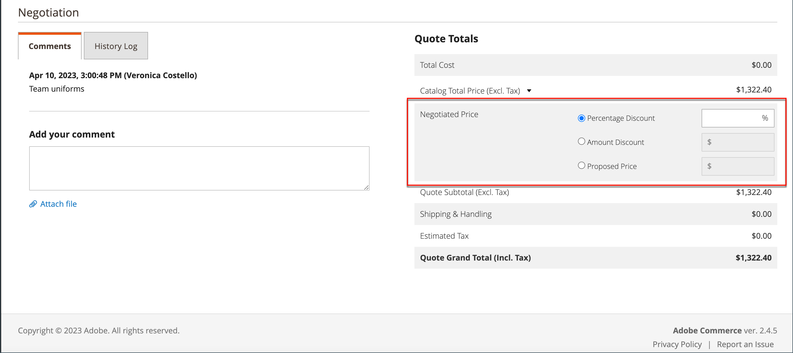
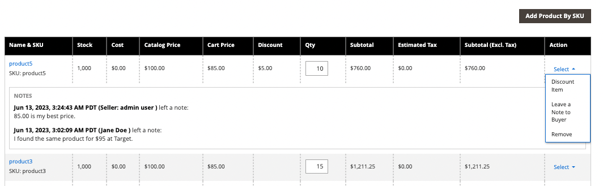

# Negociación de una cotización

Si las [ofertas B2B están habilitadas](configure-quotes.md) en la configuración, un comprador autorizado de una compañía o un representante de ventas puede iniciar la negociación de precios.

Los compradores inician el proceso de negociación de precios al [solicitar un presupuesto](quote-request.md) del carro de compras. Los Representantes de ventas pueden iniciar la negociación [creando un presupuesto provisional para un comprador](sales-rep-initiates-quote.md), actualizando el presupuesto con los artículos y precios iniciales del pedido y enviándolo al comprador.

Cuando comience la negociación de precios, las ofertas aparecen en la cuadrícula [Ofertas](quotes.md). Toda la negociación entre el comprador y el vendedor tiene lugar por correo electrónico y se inicia y se rastrea desde la vista de detalles de la oferta.

Durante el proceso de negociación, el vendedor puede hacer lo siguiente desde el administrador:

- Agregar o quitar productos
- Cambiar la cantidad
- Aplicar un descuento a los artículos de línea o a toda la oferta
- Agregar o cambiar el método de envío
- Añadir comentarios
- Envía el presupuesto actualizado al comprador o guárdalo como borrador

Los compradores administran el proceso de negociación de ofertas desde la tienda usando [[!UICONTROL My Quotes]](account-dashboard-my-quotes.md). Mientras la oferta está abierta para revisión, su estado en la cuenta del comprador se establece en `Pending`. El comprador puede cambiar y volver a enviar la oferta aunque se haya rechazado o haya caducado.

## Paso 1: Ver la solicitud

1. En la barra lateral de Administración, vaya a **[!UICONTROL Sales]** > **[!UICONTROL Quotes]**.

   La nueva solicitud aparece en la cuadrícula _[!UICONTROL Quotes]_.

1. En la columna _Acciones_, haga clic en **[!UICONTROL View]**.

   {width="700" zoomable="yes"}

## Paso 2: Modificar el presupuesto

1. En , haga clic en _[!UICONTROL Quote & Account Information]_el icono Calendario__( de calendario).

   {width="575" zoomable="yes"}

1. Elija un **[!UICONTROL Expiration Date]** para la cotización.

1. Desplácese hacia abajo hasta la _[!UICONTROL Quote Totals]_sección y actualice según **[!UICONTROL Negotiated Price]**sea necesario.

   {width="600" zoomable="yes"}

   Si el comprador cambia la cantidad de cualquier artículo de la oferta, aparece un aviso en la parte superior de la oferta, que indica que la lista de artículos ha cambiado y que el precio negociado debe actualizarse.

   {width="600" zoomable="yes"}

### Añadir nuevos productos a la cotización

1. Haga clic en **[!UICONTROL Add Products by SKU]**.

1. Escriba **[!UICONTROL SKU]** y **[!UICONTROL Qty]** para agregar.

   {width="600" zoomable="yes"}

### Aplicar actualizaciones de artículos de línea

Aplique los cambios de elemento de línea en la sección _[!UICONTROL Items Quoted]_si es necesario.

{width="600" zoomable="yes"}

- Cambie **[!UICONTROL Quantity]** que debe comprarse al precio propuesto.

- Seleccione **[!UICONTROL Configure]** y cambie las opciones del producto.

  La opción [!UICONTROL Configure] solo está disponible en un elemento de línea de un producto configurable

- En el menú **[!UICONTROL Action]**, seleccione una acción para actualizar el elemento:
   - **Artículo de descuento** para aplicar un descuento como porcentaje, cantidad fija o precio preferido.
Si lo desea, puede bloquear el importe del descuento para evitar descuentos adicionales. Si el descuento no está bloqueado,
tanto el descuento de artículo de línea como cualquier descuento de nivel de oferta se aplican al precio del producto.
   - **Deja una nota al comprador** para proporcionarle información adicional sobre un artículo
   - **Quitar** para quitar un elemento de la oferta.

### Aplicar cambios y actualizar

- Para aplicar los cambios, haga clic en **[!UICONTROL Add to Quote]**.

- Para actualizar el presupuesto, haga clic en **[!UICONTROL Recalculate the Quote]**.

- Para aplicar los cambios y actualizar la oferta al catálogo compartido y a las reglas de precios, haga clic en **[!UICONTROL Update Prices]** y, a continuación, haga clic en **[!UICONTROL Proceed]** para confirmar la actualización.

  {width="600" zoomable="yes"}

### Actualizar información de envío

1. Si el comprador incluye una dirección de _Enviar a_ en la oferta, pulsa **[!UICONTROL Get shipping methods and rates]**.

1. Elige un método de envío entre las opciones disponibles.

1. Escriba un **[!UICONTROL Proposed Shipping Price]**.

   _[!UICONTROL Quote Totals]_se han actualizado para reflejar el precio de envío propuesto.

### Adjuntar un documento acreditativo

1. En el cuadro _Agregar su comentario_, haga clic en **[!UICONTROL Attach file]**.

   De manera predeterminada, [los archivos adjuntos](../configuration-reference/sales/quotes.md) pueden tener hasta 2 MB en cualquiera de los siguientes formatos de archivo: DOC, DOCX, XLS, XLSX, PDF, TXT, JPEG o JPG, PNG.

1. Elija el archivo del directorio.

## Paso 3: Actualice la información de nivel de oferta y envíe su respuesta

1. En la sección _[!UICONTROL Negotiation]_de la ficha_[!UICONTROL Comments]_, escriba su respuesta en la sección **[!UICONTROL Add your comment]**.

1. Para incluir un documento acreditativo, haga clic en **[!UICONTROL Attach file]** y seleccione el archivo del directorio.

   El tamaño máximo de archivo permitido para los archivos adjuntos es 2 MB.

1. Para aplicar un descuento a la oferta:

   - En _[!UICONTROL Quote Totals]_, en la sección_[!UICONTROL Negotiated Price]_, elija uno de los siguientes tipos de descuento:

      - `Percentage Discount`: un descuento porcentual reduce el precio original en un porcentaje específico.
      - `Amount Discount`: un descuento de importe aplica una reducción de precio fijo.
      - `Proposed Price`: un descuento de precio propuesto establece el precio final en una cantidad específica, independientemente del precio original.

   - Introduzca el importe como porcentaje o precio fijo.

     {width="600" zoomable="yes"}

   - Puede aplicar descuentos a cada artículo de línea o a la oferta en su conjunto:

      - **Descuentos de artículos de línea**: Los descuentos de artículos de línea se aplican a artículos individuales del carro de compras. El descuento puede ser `percentage`, `amount` específico o `proposed price`.
      - **Descuentos de nivel de carro de compras**: Los descuentos de nivel de carro de compras se aplican a todo el carro de compras. El descuento puede ser `percentage` o un `amount` específico y se aplica al valor total del carro de compras.
      - **Combinación de descuentos de artículos de línea y carro de compras**: En algunos casos, los descuentos se pueden aplicar en los niveles de artículo de línea y carro de compras. El descuento por artículo de línea se aplica primero, seguido del descuento a nivel de carro de compras sobre el total restante.

1. Envíe o guarde la oferta:

   - Si la oferta está lista para enviarla al comprador, pulsa **[!UICONTROL Send]**.

   - Para continuar trabajando en el presupuesto más tarde, haga clic en **[!UICONTROL Save as Draft]**.

>[!NOTE]
>
> Durante la negociación de la oferta, los descuentos se pueden bloquear para evitar nuevos cambios. Una vez bloqueada una oferta, no se puede modificar ni el tipo de descuento ni el importe sin desbloquear primero la oferta. Este mecanismo de bloqueo garantiza la conservación de las condiciones acordadas entre el vendedor y el comprador.

## Paso 4: dar seguimiento a una cotización

Cuando envía una oferta, el sistema notifica al comprador y al representante de ventas que administra la cuenta de la empresa. El correo electrónico incluye un enlace a la oferta en la cuenta del comprador y la fecha de caducidad de la oferta. En cualquier momento de la negociación, el comprador puede hacer cualquiera de las siguientes acciones:

- Acepte el presupuesto negociado y complete la compra.
- Envíe una respuesta con un contra oferta y continúe la negociación.
- Poner fin a la negociación.

Para monitor su posición en la flujo de trabajo, compruebe su correo electrónico y el estado de la cotización en la cuadrícula. Puede continuar el proceso de negociación el tiempo que sea necesario.

## Barra de botones

| Botón | Descripción |
|----------------------------|---------------------------------------------------------------------------------------------------------------------------------------------------------------------------------------------------------------------------------------------------------------------------------------------------------------------------------------------------------------|
| [!UICONTROL Back] | Vuelve a la página _[!UICONTROL Quotes]_sin guardar los cambios. |
| [!UICONTROL Print] | Envía el presupuesto a una impresora o lo guarda como archivo de PDF. |
| [!UICONTROL Create Copy] | Crea y abre una copia de la oferta actual con `(copy)` anexado al nombre original. Cambie el nombre de la nueva cita editando el campo [!UICONTROL Name]. Procese la nueva oferta guardándola como borrador o enviándola al cliente. |
| Crear plantilla | Cree una plantilla de oferta basada en la oferta actual. Las plantillas de oferta agilizan la negociación de ofertas al permitir que los compradores y los vendedores acuerden las condiciones de contrato y asignación de precios que se pueden aplicar a varias ofertas. . En el momento del acuerdo, el comprador puede generar una oferta vinculada y aprobada previamente a partir de la plantilla para pedidos posteriores en lugar de reiniciar el proceso de solicitud de oferta. |
| [!UICONTROL Save as Draft] | Guarda los cambios realizados en el presupuesto, pero no se lo devuelvas al comprador. |
| [!UICONTROL Decline] | Rechaza la solicitud de negociar los precios, ya sea en la investigación inicial o durante las negociaciones en curso. Cuando se rechaza una cotización, el vendedor debe añadir un comentario para explicar la decisión. Cuando se rechaza una cotización, todos los precios negociados se restablecen a los valores originales. Este botón se desactiva mientras el vendedor espera una respuesta del comprador. |
| [!UICONTROL Send] | Envía el presupuesto actualizado como respuesta a la consulta del comprador. Este botón se desactiva si el vendedor espera una respuesta del comprador. |

{style="table-layout:auto"}

## Descripciones de los campos

La información y las funciones de cotización en el Administrador están organizadas en las siguientes secciones.

### [!UICONTROL Quote & Account Information]

| Campo | Descripción |
|-------------------------------------------------|------------------------------------------------------------------------------------------------------------------------------------------------------------------------------------------------------------------------------------------------------------------------------------------------------------------------------------------------------------------------------------------------------------------------------------------------------------------------------------------------------------------------------------------------------------------------------------------------------------------------------------------------------------------------------------------------------------------------------------------------------------------------------------------------------------------------------------------------------------------------------------------------------------------------------------------------------------------------------------------------------------------------------------------------------------------------------------------------------------|
| [!UICONTROL Name] | Nombre asignado a una solicitud de presupuesto por el [comprador](account-company-roles-permissions.md). |
| [!UICONTROL Status] | Indica el estado actual de la oferta. El estado de una oferta solo se puede cambiar por acción del comprador o del vendedor. Consulta también la [configuración de estado](quotes.md) del administrador y la [cuenta del comprador](account-dashboard-my-quotes.md). |
| [!UICONTROL Created] | La fecha y la hora en que el comprador envió la solicitud de presupuesto por primera vez. |
| [!UICONTROL Created By] | El nombre y apellidos del comprador de la empresa que envió la solicitud de presupuesto. |
| [!UICONTROL Expiration Date] | Indica el último día en que la oferta actual es válida. La fecha de caducidad predeterminada se establece en la configuración como 30 días después de que un comprador envíe una solicitud de presupuesto.   El vendedor puede anular la fecha de caducidad predeterminada introduciendo una fecha diferente (DD MMM AAAA ) o eligiendo la fecha en el calendario. La oferta nunca caduca si el campo se deja en blanco.   Para las ofertas abiertas, el vendedor recibe una [notificación por correo electrónico](../systems/email-templates.md) 48 horas antes de la fecha programada para que la oferta caduque. Se notifica a los compradores 24 horas antes de la fecha de vencimiento.   El estado de la oferta cambia a _Caducado_ y el comprador no puede realizar más cambios en la oferta. Los precios propuestos en la oferta vuelven a los valores originales del catálogo.   Si una oferta está abierta para su revisión por el vendedor cuando la oferta está configurada para caducar, la fecha de caducidad se restablece según el intervalo establecido en la configuración.   La fecha de vencimiento es el único campo de la sección _Oferta y cuenta_ que se puede editar durante el proceso de revisión. |
| [!UICONTROL Company] | El nombre legal de [empresa](account-companies.md) a la que representa el comprador. |
| [!UICONTROL Company Admin Email] | La dirección de correo electrónico del [administrador de la empresa](account-company-admin.md). |
| [!UICONTROL Sales Rep] | El [representante de ventas](account-company-manage.md) que trabaja para el vendedor y es el contacto principal asignado a la cuenta de la compañía. |
| [!UICONTROL Shared Catalog (or Customer Group)] | El [catálogo compartido](catalog-shared.md) o [grupo de clientes](account-company-customer-group.md) al que está asignada la compañía. La oferta puede incluir precios personalizados del catálogo compartido asignado a la empresa. |

{style="table-layout:auto"}

### [!UICONTROL Add to Quote by SKU]

| Campo | Descripción |
|---------------------------|-----------------------------------------------------------|
| [!UICONTROL Enter SKU] | El SKU del producto que se va a añadir al presupuesto. |
| [!UICONTROL Qty] | El número de artículos de este SKU que se añadirán al presupuesto. |
| [!UICONTROL Add to Quote] | Agrega la cantidad del producto especificado a la oferta. |

{style="table-layout:auto"}

### [!UICONTROL Items Quoted]

| Campo | Descripción |
|-----------------------------------------|---------------------------------------------------------------------------------------------------------------------------------------------------------------------------------------------------------------------------|
| [!UICONTROL Name & SKU] | El nombre del producto vinculado y el SKU (código de referencia). |
| [!UICONTROL Stock] | El número de productos bajo este SKU que están disponibles actualmente para la venta. |
| [!UICONTROL Cost] | El importe que el vendedor pagó para comprar el producto. |
| [!UICONTROL Catalog Price] | El precio del producto en el catálogo del comprador, basado en el grupo de clientes o catálogo compartido que se asigna a la compañía del comprador. |
| [!UICONTROL Cart Price] | El precio original del artículo en el carro de compras, menos los descuentos aplicados desde el carro de compras. El precio del carro de compras puede ser distinto del precio del catálogo si existen descuentos o reglas de carro de compras que se apliquen al grupo de clientes del comprador. |
| [!UICONTROL Discount] | El descuento por artículo de línea aplicado al artículo. El valor puede ser un porcentaje, una cantidad fija o un precio propuesto. |
| [!UICONTROL Qty] | Número de unidades de este SKU que constituye la base del precio cotizado. Solo se puede introducir un número positivo mayor que cero. Si desea cambiar la cantidad a cero, elimine el artículo de línea de la oferta. |
| [!UICONTROL Subtotal] | El precio propuesto multiplicado por la cantidad de artículos pedidos. |
| [!UICONTROL Estimated Tax] | El importe de impuestos estimado para este artículo de línea, según la configuración. En función de la configuración de cálculo de impuestos, el impuesto estimado puede basarse en cualquiera de las siguientes opciones: Precio unitario/Total de fila/Total |
| [!UICONTROL Subtotal (Incl./Excl. Tax)] | En función de la configuración, esta columna puede mostrar el subtotal con o sin impuestos estimados. |
| [!UICONTROL Action] | Menú de selección de operaciones que se pueden aplicar a un elemento de línea:<ul><li>**[!UICONTROL Discount item]**</li><li>**[!UICONTROL Leave a note to Buyer]**</li><li>**[!UICONTROL Remove an item from the quote]**</li></ul>. |
| [!UICONTROL Configure] | Permite cambiar las opciones de un producto configurable. |
| [!UICONTROL Update Prices] | Actualiza la cotización con los últimos cambios del catálogo compartido y las reglas de precios. |
| [!UICONTROL Recalculate Quote] | Recalcula todos los precios de cotización, carro de compras reglas de precios e impuestos para reflejar los cambios en la cotización. |

{style="table-layout:auto"}

### [!UICONTROL Shipping Information]

| Campo | Descripción |
|--------------------------------------|------------------------------------------------------------------------------------------------------------------------------------------------------------------------------|
| [!UICONTROL Shipping Address] | Muestra la dirección de envío especificada en la cuenta del comprador. La dirección de envío está en blanco si el comprador no especificó una dirección antes de enviar la solicitud. |
| [!UICONTROL Shipping Method & Price] | El vínculo Obtener métodos de envío y tarifas aparece si el comprador incluye una dirección de _Enviar a_ en la oferta. |

{style="table-layout:auto"}

### [!UICONTROL Negotiation]

| Campo | Descripción |
|--------------------------|----------------------------------------------------------------------------------------------------------------------------------------------------------------------------------------------------------------------------------------------------------------------------------------------------------------------------------------------------------------------------------------------------------------------------------------------------------------------------------------------------------------------------------------------------------------------------------------------------------------------------------------------------------|
| [!UICONTROL Comments] | La pestaña Comentarios de la sección Negociación se utiliza para enviar un mensaje al comprador sobre la oferta.  **[!UICONTROL Add your comment]**- Los comentarios se utilizan para comunicarse con el comprador durante el proceso de negociación. Utilice los comentarios para explicar los descuentos ofrecidos en la oferta o el motivo por el que se rechaza una solicitud de presupuesto. **[!UICONTROL Attach file]** - El tamaño máximo de archivo y los tipos de archivo compatibles para [archivos adjuntos](configure-quotes.md) están determinados por la configuración. De forma predeterminada, un archivo adjunto puede tener hasta 2 MB y cualquiera de los siguientes tipos de archivo: DOC, DOCX, XLS, XLSX, PDF, TXT, JPEG o JPG, PNG. |
| [!UICONTROL History Log] | Esta pestaña muestra un historial completo de la oferta con fechas, estado de la oferta y comentarios. |

{style="table-layout:auto"}

### [!UICONTROL Quote Totals]

| Campo | Descripción |
|-----------------------------------------------------|-----------------------------------------------------------------------------------------------------------------------------------------------------------------------------------------------------------------------------------------------------------------------------------------------------------------------------------------------------------------------------------------------------------------------------------------------------------------------------------------------------------------------------------------------------------------------------------------------------------------------------------------------------------------------|
| [!UICONTROL Total Cost] | El coste total para el vendedor de los artículos incluidos en el presupuesto. |
| [!UICONTROL Catalog Total Price  (Incl./Excl. Tax)] | El precio total de los artículos de la oferta sin impuestos, según los precios del catálogo compartido o del catálogo principal que se utiliza como base de la oferta. Expanda la sección para mostrar los valores utilizados en el cálculo, en función del [ajuste Mostrar subtotal](../configuration-reference/sales/tax.md) de la configuración. Opciones:  **[!UICONTROL Subtotal (Excl. Tax)]**- El Precio Total del Catálogo sin impuestos estimados. **[!UICONTROL Subtotal (Incl. Tax)]** - El Precio Total del Catálogo sin impuestos estimados.  **[!UICONTROL Estimated Tax]**- El importe del impuesto que se estima aplicar al Precio Total del Catálogo. |
| Precio negociado | El descuento que se ofrece al comprador puede basarse en cualquiera de los siguientes:  **[!UICONTROL Percentage Discount]**- El descuento como porcentaje. **[!UICONTROL Amount Discount]** - El descuento como cantidad fija.  **[!UICONTROL Proposed Price]**: el precio propuesto por el vendedor.
Si todos los artículos del presupuesto tienen un descuento por artículo bloqueado, la sección [!UICONTROL Negotiated Price] se deshabilita porque no se puede aplicar ningún descuento adicional.

Si un producto tiene un descuento de artículo de línea que no está bloqueado, tanto el descuento de artículo de línea como el descuento de nivel de oferta se aplican al precio del producto.
 |
| [!UICONTROL Quote Subtotal (Incl./Excl. Tax)] | El precio total propuesto de cada elemento de línea en la oferta, ya sea con o sin impuestos, según la configuración de [cálculo de impuestos](../configuration-reference/sales/tax.md). |
| [!UICONTROL Shipping & Handling] | El importe introducido por el vendedor en el campo Precio de envío propuesto de la sección Información de envío de la oferta. Si ese campo está vacío, la cantidad se basa en el método de envío seleccionado. |
| [!UICONTROL Estimated Tax] | El importe de impuestos que se estima vencer, tal como se especifica en la configuración [configuración de pantalla](../configuration-reference/sales/tax.md). |
| [!UICONTROL Quote Grand Total (Incl. Tax)] | El total final en la parte inferior de la cotización que incluye el precio negociado, el impuesto estimado y el envío y manipulación propuestos. |

{style="table-layout:auto"}
