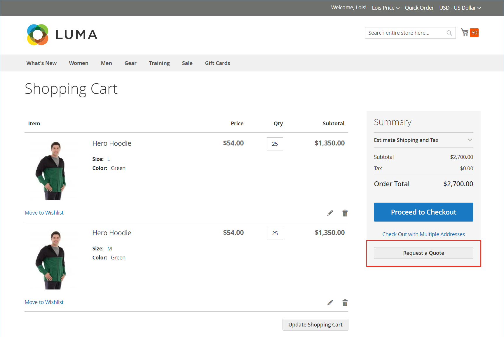

# Solicitud de presupuesto

Si las ofertas están habilitadas en la [configuración de características de ventas](configure-quotes.md), un comprador autorizado de una compañía puede iniciar el proceso de negociación de precios solicitando una oferta de su carro de compras. Si un comprador no está preparado para enviar una oferta para su negociación, puede guardarla como borrador.

>[!NOTE]
>
>Una solicitud de presupuesto no puede incluir códigos de descuento ni tarjetas regalo.

## Experiencia de solicitud de presupuesto de cliente

1. El cliente inicia sesión en su cuenta de usuario como comprador con [permiso](account-company-roles-permissions.md) para solicitar un presupuesto.

1. Agrega los productos que se van a incluir en la cotización al carro de compras.

   >[!TIP]
   > 
   >Los clientes pueden agregar una lista de SKU de productos al carro de compras más rápidamente si usan [Pedido rápido](quick-order.md).

1. Selecciona **[!UICONTROL Request a Quote]**.

   {width="700" zoomable="yes"}

1. En el cuadro **[!UICONTROL Add your comment]**, el cliente escribe una breve nota para describir la solicitud.

1. Escribe un **[!UICONTROL Quote Name]**.

   {width="400" zoomable="yes"}

1. Si es necesario, adjunta un documento o una imagen de apoyo a la cita:

   - Selecciona **[!UICONTROL Attach file]**.
   - Selecciona el archivo de su sistema.

   De manera predeterminada, un [archivo adjunto](configure-quotes.md) puede tener hasta 2 MB, en cualquiera de los siguientes formatos de archivo: DOC, DOCX, XLS, XLSX, PDF, TXT, JPEG o JPG, PNG.

1. Crea y procesa la oferta:

   - Envía la cotización al Vendedor seleccionando **[!UICONTROL Request a Quote]**.
   - Guarda la oferta como borrador al seleccionar **[!UICONTROL Save as Draft]**.

     Si el comprador guarda la oferta como borrador, la oferta estará disponible en [!UICONTROL My Quotes] en estado `Draft`. El vendedor no puede ver los borradores de presupuestos hasta que el comprador los envíe para su revisión.
