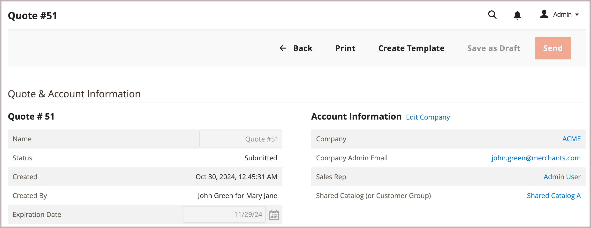

# Creación de una plantilla de presupuesto

<!--This topic is linked to from the Commerce Admin quote templates page. If the URL to this topic changes, make sure to add a redirect to prevent the Admin link from returning a 404 error.-->

Negociar descuentos por volumen para pedidos recurrentes creando una plantilla de oferta a partir de una oferta existente.

{width="700" zoomable="yes"}

Después de crear la plantilla, el vendedor puede configurar opciones de plantilla para definir umbrales de pedidos y cantidades, ajustar descuentos de artículos de línea y ofertas antes de enviarlos al comprador para que inicie el proceso de negociación.

Una vez que el comprador y el vendedor llegan a un acuerdo, el comprador acepta la plantilla de oferta. A continuación, el comprador puede [generar presupuestos vinculados y aprobados de antemano](account-dashboard-my-quote-templates.md) según los términos de la plantilla de presupuesto. Por ejemplo, si una empresa tiene pedidos de MRO (mantenimiento, reparaciones y operaciones) para mantener sus operaciones comerciales, el comprador o el vendedor pueden utilizar una plantilla de oferta para añadir los artículos necesarios, negociar los precios y establecer las condiciones de los pedidos recurrentes mensuales. A continuación, el comprador puede generar ofertas vinculadas y enviar pedidos sin necesidad de una negociación adicional.

Para obtener más información, consulte [Resumen de plantillas de presupuesto](quote-templates-overview.md).
