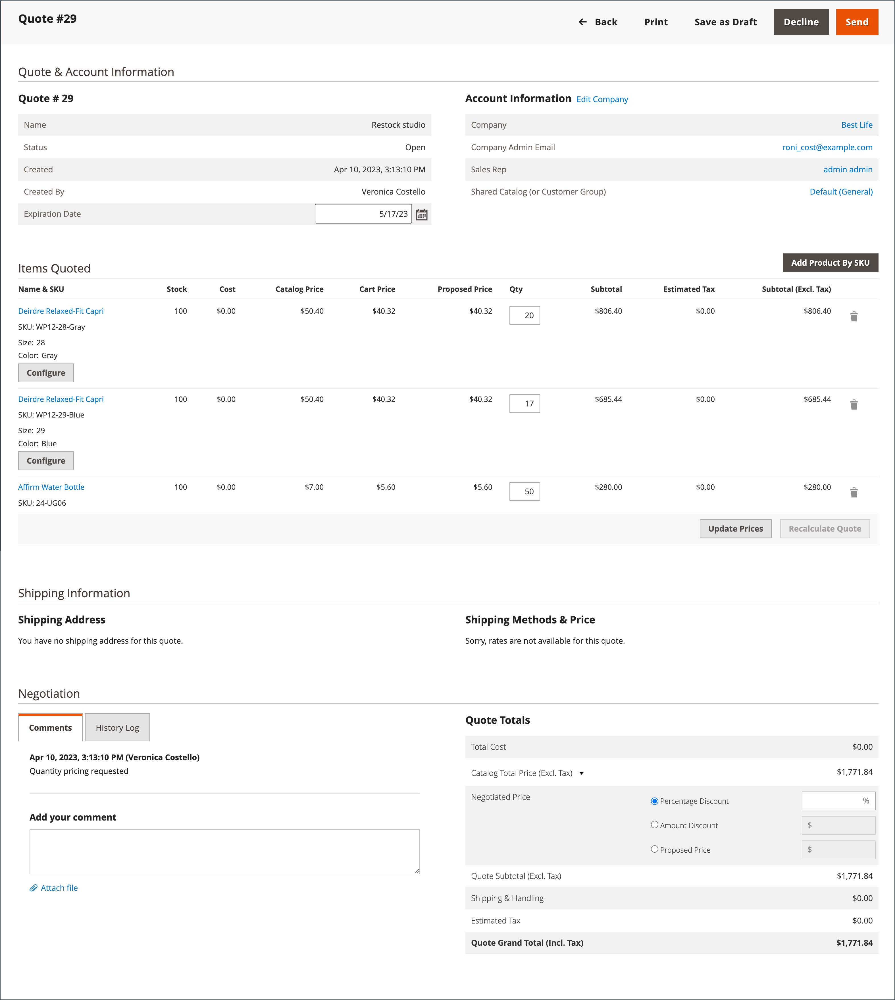

# Comillas negociables

Los compradores y vendedores utilizan las ofertas para gestionar el proceso de negociación de artículos de adición de pedidos, actualización de cantidades, solicitud y aplicación de descuentos, etc., hasta que llegan a un acuerdo. El proceso de negociación de la oferta puede iniciarlo un comprador autorizado de la empresa o un representante de ventas de la empresa.

Las ofertas pueden ser iniciadas por un comprador autorizado de la empresa o un representante de ventas. Una vez creada la oferta, el proceso de negociación comienza cuando el comprador o el vendedor envía la oferta para su revisión. La cuadrícula _Ofertas_ que enumera todas las ofertas recibidas y mantiene un historial de la comunicación entre el comprador y el vendedor. Use los [controles de área de trabajo](../getting-started/admin-workspace.md) estándar para filtrar la lista, cambiar el diseño de la columna, guardar vistas y exportar datos.

- En la tienda, los compradores envían la cotización como una [solicitud para negociar](quote-price-negotiation.md) el precio del carro de compras. Al crear la solicitud de presupuesto, un comprador puede guardarla como borrador o enviarla directamente al vendedor.

- En el Administrador, los representantes de ventas pueden crear presupuestos en nombre del comprador de la empresa. Al crear la oferta, un vendedor puede guardarla como borrador o enviarla directamente al comprador para iniciar el proceso de negociación.

Durante el proceso de negociación, la oferta sólo puede ser actualizada por la persona que revisa y propone las condiciones para una negociación posterior.

## Requisitos previos

Las ofertas negociables solo están disponibles si Adobe Commerce tiene las siguientes opciones de configuración:

- [Se instala la extensión Adobe Commerce B2B](install.md)
- [Funciones B2B configuradas](enable-basic-features.md)
   - Habilitar cuentas de empresa
   - Activar presupuesto B2B

## Flujo de trabajo de oferta

El comprador o el vendedor pueden iniciar las cotizaciones.

**Paso 1: Creación de presupuesto**

- **El comprador solicita un presupuesto** - El comprador [solicita un presupuesto](quote-request.md) del carro de compras. La solicitud aparece en la lista _Mis presupuestos_ del panel de cuentas del comprador y se envía una notificación por correo electrónico al representante de ventas asignado a la cuenta de la compañía. En el Administrador, la solicitud aparece en la cuadrícula _Quotes_, con el estado `New`. El comprador puede modificar una solicitud de presupuesto hasta que el vendedor la abra.

  {width="700" zoomable="yes"}

- **Representante de ventas** — Un representante de ventas puede [crear una cotización](sales-rep-initiates-quote.md) del administrador en nombre de un comprador específico de la compañía. El representante de ventas debe actualizar la oferta para añadir productos y otra información como descuentos y notas al comprador. La representación de ventas puede guardar la oferta como `draft` o enviarla al comprador para que inicie la negociación. En estado de borrador, la oferta solo es visible para el vendedor. Una vez enviado el presupuesto, el estado es `Submitted`. El vendedor no puede modificarla hasta que el comprador la devuelva.

  {width="700" zoomable="yes"}

**Paso 2: revisión y negociación de presupuesto**

**El vendedor ve la solicitud y envía una respuesta**: en el administrador, el vendedor ve la solicitud de presupuesto. El estado de la oferta cambia a `Pending` y el comprador no puede realizar ningún cambio. El [vendedor responde](quote-price-negotiation.md) ofreciendo precios con descuento para los productos de la oferta, introduce un comentario y devuelve la oferta al comprador. Se notifica al comprador y al vendedor por correo electrónico que el vendedor ha respondido.

**El comprador ve el presupuesto del vendedor y envía una respuesta**. El comprador hace clic en el vínculo de la notificación por correo electrónico para abrir el presupuesto o abre el presupuesto desde la página _Mis presupuestos_ del panel de la cuenta. El comprador puede dejar notas al vendedor en el nivel de artículo de línea o de presupuesto y eliminar artículos.

El comprador y el vendedor pueden continuar con el proceso de negociación hasta que se llegue a un acuerdo o hasta que el vendedor rechace la oferta. Si el comprador realiza cambios en la oferta (añadir o eliminar productos o cambiar cantidades de productos), la oferta debe devolverse al vendedor para que la revise.

**Paso 4: el comprador acepta el presupuesto** - El comprador acepta el precio propuesto y continúa con el proceso de pago y envío. No se pueden añadir descuentos adicionales al presupuesto negociado.

## Recursos de rol B2B para presupuestos de tienda

Las opciones de configuración para las comillas se controlan mediante los [recursos de rol](../systems/permissions-user-roles.md#role-resources). Estos recursos de rol deben establecerse para el rol de usuario Administrador que se asigna al administrador del almacén.

Para conceder acceso a las funciones de presupuesto en Admin, vaya a **[!UICONTROL System]** > _[!UICONTROL Permissions]_>**[!UICONTROL User Roles]**, seleccione el rol y vaya a [!UICONTROL Sales] > [!UICONTROL Operations] > [!UICONTROL Quotes] en el árbol_ Recursos de rol _.

## Aplicar una acción

En el Administrador, los administradores y vendedores de B2B pueden administrar presupuestos desde la cuadrícula de presupuestos mediante el menú [!UICONTROL Actions].

{width="700" zoomable="yes"}

1. En la barra lateral _Admin_, vaya a **[!UICONTROL Sales]** > **[!UICONTROL Quotes]**.

1. En la primera columna de la cuadrícula, active la casilla de verificación de cada registro al que desee aplicar la acción.

1. En **[!UICONTROL Actions]**, seleccione la acción que desea aplicar.

### Ver un presupuesto

1. En la columna **[!UICONTROL Actions]** de un registro, haga clic en **[!UICONTROL View]**.

1. Para responder a la solicitud del cliente, siga las instrucciones y comience el proceso de [negociación de precios](quote-price-negotiation.md).

### Ver actividad de presupuesto

Vea la cronología de negociación, la comunicación y otra actividad de oferta de [!UICONTROL Comments] y [!UICONTROL History Log]; la información incluye cambios de estado, actualizaciones de la información de cliente y envío, actualizaciones de artículos y precios y otra información importante.

1. Abra una cotización.

1. Ver comentarios e historial de negociación de presupuesto desplazándose hasta **[!UICONTROL Negotiation]** y seleccionando **[!UICONTROL Comments]** y **[!UICONTROL History Log]**.

   {width="400"}

1. El historial también se rastrea en el nivel de elemento de línea.

   {width="400"}

### Rechazar una solicitud de presupuesto

Solo se pueden rechazar las solicitudes de presupuesto con un estado `Open`.

1. Seleccione cada solicitud de presupuesto abierta que desee rechazar.

1. Establezca el control _[!UICONTROL Actions]_en `Declined`.

1. Cuando se le solicite, introduzca el motivo por el que se rechazó la oferta y haga clic en **[!UICONTROL Confirm]**.

   {width="400"}

## Descripciones de columna

| Columna | Descripción |
|---------------------------------------|------------------------------------------------------------------------------------------------------------------------------------------------------------------------------------------------------------------------------------------------------------------------------------------------------------------------------------------------------------------------------------------------------------------------------------------------------------------------------------------------------------------------------------------------------------------------------------------------------------------------------------------------------------------------------------------------------------------------------------------------------------------------------------------------------------------------------------------------------------------------------------------------------------------------------------------------------------------------------------------------------------------------------------------------------------------------------------------------------------------------------------------------------------------------------------------------------------------------------------------------------------------------------------------------------------------------------------------------------------------------------------------------------------------------------------------------------------------------------------------------------------------------------------------------------------------------------------------------------------------------------------------------------------------------------------------------------------------------------------|
| [!UICONTROL Select] | Para seleccionar las comillas que deben estar sujetas a una acción, seleccione la casilla de verificación o utilice el control de selección en el encabezado de la columna. Opciones: Seleccionar todo/Anular la selección de todo |
| [!UICONTROL ID] | Identificador numérico único que se asigna cuando se envía una solicitud de presupuesto desde el carro de compras de un comprador. Al ver los detalles del presupuesto, el ID aparece en la parte superior de la página, en lugar del nombre del presupuesto. |
| [!UICONTROL Name] | El nombre asignado a una solicitud de presupuesto por el comprador. |
| [!UICONTROL Created Date] | La fecha y la hora en que el comprador envió la solicitud de presupuesto por primera vez. |
| [!UICONTROL Company] | El nombre de la empresa en nombre de la cual un comprador envía una solicitud de presupuesto. |
| [!UICONTROL Submitted By] | El nombre y los apellidos del comprador de la empresa que envía una solicitud de presupuesto. |
| [!UICONTROL Last Updated] | La fecha y hora de la última comunicación entre el comprador y el vendedor en relación con el presupuesto. |
| [!UICONTROL Sales Rep] | El nombre y apellidos del vendedor que administra la cuenta del comprador. |
| [!UICONTROL Quote Total (Base)] | El precio total de los productos que se van a comprar en función de la cotización original. La cantidad total aparece en la moneda base del sitio web y en la moneda de la tienda. |
| [!UICONTROL Quote Total (Negotiated)] | El precio total de los productos que se van a comprar en función de la cotización negociada. El sistema calcula automáticamente este total e incluye cualquier descuento por artículo de línea o presupuesto aplicado por el vendedor. La cantidad total aparece en la moneda base del sitio web y en la moneda de la tienda. |
| [!UICONTROL Status] | Indica el estado actual de una solicitud de presupuesto. El estado de una oferta solo se puede cambiar por acción del comprador o del vendedor. Ver también la configuración de estado de la [cuenta del comprador](account-dashboard-my-quotes.md).<ul><li>**[!UICONTROL New]**: el comprador envió una solicitud de presupuesto, pero el vendedor no la ha visto. El comprador puede actualizar la solicitud hasta que la abra el vendedor.</li><li>**[!UICONTROL Draft]** - El vendedor crea un presupuesto provisional para un comprador. El comprador no puede ver la oferta hasta que el vendedor añade los detalles de la oferta (artículos, cantidad, descuento, etc.) y envía la oferta al comprador.</li> <li>**[!UICONTROL Open]**: el vendedor ha abierto la solicitud y está revisándola y preparando una respuesta. </li><li>**[!UICONTROL Submitted]** - El vendedor envió una respuesta al comprador. El registro de oferta no se puede editar durante el proceso de negociación.</li><li>**[!UICONTROL Client Reviewed]**: el comprador ha visto la respuesta del vendedor y está preparando una respuesta.</li><li>**[!UICONTROL Updated]**: el comprador envió una respuesta, pero el vendedor no la ha visto.</li><li>**[!UICONTROL Ordered]** - El comprador envió el pedido basándose en la oferta negociada.</li><li>**[!UICONTROL Closed]** - El comprador ha cancelado la solicitud de presupuesto.</li><li>**[!UICONTROL Declined]** - El vendedor rechazó la solicitud de presupuesto. Los precios personalizados se eliminan del presupuesto y el registro está bloqueado para futuras ediciones.</li><li>**[!UICONTROL Expired]** - El comprador no respondió a la respuesta del vendedor en el período de tiempo designado y la oferta ya no es válida.</li></ul> |
| [!UICONTROL Actions] | **[!UICONTROL View]** - Abre la solicitud de presupuesto y mantiene un registro de la negociación entre el comprador y el vendedor. |

{style="table-layout:auto"}

## Barra de botones

| Botón | Descripción |
|----------------------------|----------------------------------------------------------------------------------------------------------------------------------------------------------------------------------------------------------------------------------------------------------------------------------------------------------------------------------------------------------------------------------------------------|
| [!UICONTROL Send] | Envía el presupuesto actualizado como respuesta a la pregunta del comprador. Este botón está desactivado si el vendedor está esperando una respuesta del comprador. |
| [!UICONTROL Back] | Vuelve a la página _Comillas_ sin guardar los cambios. |
| [!UICONTROL Create Copy] | [!BADGE Funcionalidades beta de la versión 1.5.0]{type=Informative url=&quot;/help/b2b/release-notes.md&quot; tooltip=&quot;Disponible solo para participantes del programa Beta&quot;} Cree una nueva cotización a partir de la cotización actual copiándola y renombrándola. Cuando se abre la nueva oferta, el nombre predeterminado es `<original quote name> (copy)`. Cambie el nombre editando el valor en el campo [!UICONTROL Name] y guardando la cita como borrador. |
| [!UICONTROL Print] | Envía el presupuesto a una impresora o lo guarda como archivo de PDF. |
| [!UICONTROL Create a copy] | Crea una copia de la oferta denominada `<original quote name> (copy)` y la abre. Cambia el nombre del nuevo presupuesto y actualízalo según sea necesario antes de guardarlo como borrador o enviarlo al comprador. |
| [!UICONTROL Save as Draft] | Guarda los cambios realizados en el presupuesto, pero no lo devuelve al comprador. |
| [!UICONTROL Decline] | Rechaza la solicitud de negociar los precios, ya sea en la investigación inicial o durante las negociaciones en curso. Cuando se rechaza una cotización, el vendedor debe añadir un comentario para explicar la decisión. Cuando se rechaza una oferta, todos los precios negociados se restablecen a los valores originales. Este botón está desactivado mientras el vendedor espera una respuesta del comprador. |

{style="table-layout:auto"}

## Comilla de ejemplo

La siguiente figura muestra un ejemplo de la vista de detalles de comillas en Admin con algunas configuraciones configuradas.

{width="700" zoomable="yes"}

>[!NOTE]
>
>[!BADGE Funciones beta de 1.5.0]{type=Informative url="/help/b2b/release-notes.md" tooltip="Disponible solo para participantes del programa Beta"}
