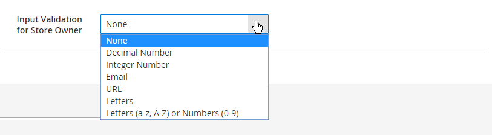

# Crear y eliminar atributos de producto

Puede crear atributos mientras trabaja en un producto o desde la página _[!UICONTROL Product Attributes]_. Los pasos siguientes muestran cómo crear atributos a partir del menú&#x200B;_[!UICONTROL Stores]_.

## Paso 1: Describir las propiedades básicas de los atributos

1. En la barra lateral _Admin_, vaya a **[!UICONTROL Stores]** > _[!UICONTROL Attributes]_>**[!UICONTROL Product]**.

1. Haga clic en **[!UICONTROL Add New Attribute]**.

   {width="600" zoomable="yes"}

1. Para **[!UICONTROL Default Label]**, escriba una etiqueta que identifique el atributo.

1. Establezca **[!UICONTROL Catalog Input Type for Store Owner]** en el tipo de [control de entrada](attributes-input-types.md) que se utilizará para la entrada de datos.

   Si el atributo se usa para un [producto configurable](product-create-configurable.md), elija `Dropdown`. Luego, establezca **[!UICONTROL Required]** en `Yes`.

1. Si desea requerir una selección de opciones antes de que el cliente pueda adquirir el producto, establezca **[!UICONTROL Values Required]** en `Yes`.

1. Para los tipos de entrada [!UICONTROL Dropdown] y [!UICONTROL Multiple Select], haga lo siguiente:

   - En _[!UICONTROL Manage Options]_, haga clic en **[!UICONTROL Add Option]**.

   - Introduzca el primer valor que desee que aparezca en la lista.

     Puede introducir un valor para el administrador y una traducción del valor para cada vista de tienda. Si solo tiene una vista de tienda, puede introducir solo el valor Admin y también se utiliza para la tienda.

   - Haga clic en **[!UICONTROL Add Option]** y repita el paso anterior para cada opción que desee incluir en la lista.

   - Seleccione **[!UICONTROL Is Default]** para usar la opción como valor predeterminado.

   {width="600" zoomable="yes"}

## Paso 2: Describa las propiedades avanzadas (si es necesario)

1. Escriba un **[!UICONTROL Attribute Code]** único en caracteres en minúsculas y sin espacios.

   >[!NOTE]
   >
   >No se recomienda usar el valor `type` en el campo [!UICONTROL Attribute Code]. Esto puede causar errores porque el valor `type` está reservado para el uso del sistema.

   {width="600" zoomable="yes"}

   Las opciones disponibles dependen de la configuración _[!UICONTROL Catalog Input Type for Store Owner]_.

1. Para indicar en qué parte de la [jerarquía de almacén](../getting-started/websites-stores-views.md) se puede usar el atributo, establezca **[!UICONTROL Scope]**.

1. Si desea evitar entradas de valor duplicadas, establezca **[!UICONTROL Unique Value]** en `Yes`.

1. Para los tipos de entrada que son valores especificados, ejecute una prueba de validez de los datos introducidos en un campo de texto estableciendo **[!UICONTROL Input Validation for Store Owner]** en el tipo de datos que debe contener el campo.

   Este campo no está disponible para tipos de entrada con valores seleccionados. La prueba puede validar cualquiera de las siguientes opciones:

   - `Decimal Number`
   - `Integer Number`
   - `Email`
   - `URL`
   - `Letters`
   - `Letters (a-z, A-Z) or Numbers (0-9)`

   {width="400"}

1. Para agregar este atributo a la [lista de productos](products-list.md), establezca las siguientes opciones en `Yes`.

   - **Agregar a opciones de columna** - Incluye el atributo como una columna en la lista _[!UICONTROL Products]_.
   - **Usar en opciones de filtro** - Agrega un control de filtro al encabezado de columna en la lista _[!UICONTROL Products]_.

## Paso 3: introducir la etiqueta de campo

1. En la navegación del lado izquierdo, elija **[!UICONTROL Manage Labels]**.

1. Escriba un(a) **[!UICONTROL Title]** para utilizarlo como etiqueta en el campo.

   Si la tienda está disponible en diferentes idiomas, puede introducir un título traducido para cada vista.

   {width="600" zoomable="yes"}

   >[!NOTE]
   >
   > Si planea utilizar este atributo como faceta en Live Search, debe especificar una etiqueta específica de la tienda. Sin ella, es posible que el nombre del atributo no se muestre correctamente en la página de configuración de faceta. Para actualizar la configuración, edite manualmente la etiqueta con la opción [editar en la lista de facetas de Live Search](https://experienceleague.adobe.com/es/docs/commerce/live-search/live-search-admin/facets/facets-add#step-2-edit-facet-properties-optional) en la _Guía de Live Search_.

## Paso 4: Describir las propiedades de la tienda

1. En la navegación del lado izquierdo, elija **[!UICONTROL Storefront Properties]**.

   {width="600" zoomable="yes"}

   Las opciones disponibles dependen de la configuración _[!UICONTROL Catalog Input Type for Store Owner]_.

1. Si el atributo va a estar disponible para la búsqueda, establezca **[!UICONTROL Use in Search]** en `Yes`.

   - Para controlar dónde aparece el elemento en los resultados de búsqueda, establezca el valor **[!UICONTROL Search Weight]**: 1 (menor peso) en 10 (mayor peso).

   - Establezca **[!UICONTROL Visible in Advanced Search]** según sea necesario. Obtenga más información en [Búsqueda avanzada](search.md#advanced-search).

1. Para incluir el atributo en la comparación de productos, establezca **[!UICONTROL Comparable on Storefront]** en `Yes`.

1. Para los campos desplegable, de selección múltiple y de precio, haga lo siguiente:

   - Para usar el atributo como filtro en la navegación por capas, establezca **[!UICONTROL Use in Layered Navigation]** en `Yes`.

   - Para usar el atributo en la navegación por capas en las páginas de resultados de búsqueda, establezca **[!UICONTROL Use in Search Results Layered Navigation]** en `Yes`.

   - Para **[!UICONTROL Position]**, escriba un número para indicar la posición relativa del atributo en el bloque de navegación por capas.

1. Para usar el atributo en las reglas de precios, establezca **[!UICONTROL Use for Promo Rule Conditions]** en `Yes`.

1. Para permitir que se dé formato al texto con HTML, establezca **[!UICONTROL Allow HTML Tags on Frontend]** en `Yes`.

   Esta configuración hace que el editor de WYSIWYG esté disponible para el campo.

1. Para incluir el atributo en la página de productos, establezca **[!UICONTROL Visible on Catalog Pages on Storefront]** en `Yes`.

1. Complete la siguiente configuración si su temática lo admite:

   - Para incluir el atributo en los listados de productos, establezca **[!UICONTROL Used in Product Listing]** en `Yes`.

   - Para usar el atributo como parámetro de ordenación para las listas de productos, establezca **[!UICONTROL Used for Sorting in Product Listing]** en `Yes`.

1. Una vez finalizado, haga clic en **[!UICONTROL Save Attribute]**.

## Paso 5: Asignar el atributo creado al conjunto de atributos

Para que un atributo sea visible en la página de creación del producto, agréguelo a un conjunto de atributos específico.

1. Después de completar los pasos anteriores, vaya a **[!UICONTROL Stores]** > _[!UICONTROL Attributes]_>**[!UICONTROL Attribute Set]**.

1. Seleccione el conjunto de atributos que necesite en la lista y ábralo en modo de edición.

1. Arrastre el atributo creado de la lista **[!UICONTROL Unassigned Attributes]** a la carpeta correspondiente de la columna **Grupos**.

1. Una vez finalizado, haga clic en **[!UICONTROL Save]**.

## Atributos para productos configurables

Cualquier atributo que se use como lista desplegable de opciones para un [producto configurable](product-create-configurable.md) debe tener las siguientes propiedades:

| Propiedad | Valor |
|----------|------ |
| Tipo de entrada de catálogo del propietario de la tienda | Desplegable |
| Ámbito | Global |

{style="table-layout:auto"}

## Eliminación de un atributo

Cuando se elimina un atributo, se elimina de cualquier producto relacionado y conjunto de atributos. Los atributos del sistema forman parte de la funcionalidad principal de su tienda y no se pueden eliminar.

Antes de eliminar un atributo, asegúrese de que ningún producto del catálogo lo utilice actualmente. Una manera fácil de determinar si un atributo está en uso es usar la herramienta [Exportar](../systems/data-export.md) para comprobar la lista de Atributos de entidad del producto. Si la lista no incluye el atributo, ningún producto del catálogo lo utilizará.

**_Para eliminar un atributo:_**

1. En la barra lateral _Admin_, vaya a **[!UICONTROL Stores]** > _[!UICONTROL Attributes]_>**[!UICONTROL Product]**.

1. Busque el atributo en la lista y ábralo en modo de edición.

1. Haga clic en **[!UICONTROL Delete Attribute]**.

   {width="600" zoomable="yes"}

1. Cuando se le pida que confirme, haga clic en **[!UICONTROL OK]**.

