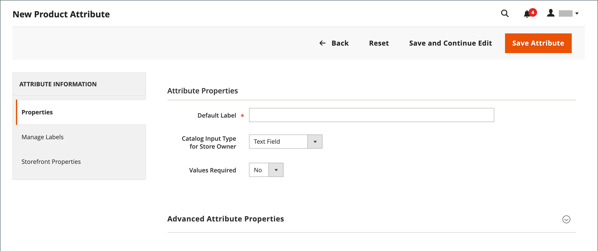

# Crear y eliminar atributos de producto

Puede crear atributos mientras trabaja en un producto o desde el _[!UICONTROL Product Attributes]_página. Los pasos siguientes muestran cómo crear atributos a partir de_[!UICONTROL Stores]_ menú.

## Paso 1: Describir las propiedades básicas de los atributos

1. En el _Administrador_ barra lateral, vaya a **[!UICONTROL Stores]** > _[!UICONTROL Attributes]_>**[!UICONTROL Product]**.

1. Haga clic **[!UICONTROL Add New Attribute]**.

   {width="600" zoomable="yes"}

1. Para **[!UICONTROL Default Label]**, introduzca una etiqueta que identifique el atributo.

1. Para determinar el tipo de control de entrada que se utiliza para la entrada de datos, establezca **[!UICONTROL Catalog Input Type for Store Owner]** a uno de los siguientes:

   | Propiedad | Descripción |
   |--- |--- |
   | `Text Field` | Campo de entrada de una sola línea para texto. |
   | `Text Area` | Campo de entrada de varias líneas para introducir párrafos de texto, como una descripción del producto. Puede utilizar el Editor WYSIWYG para dar formato al texto con etiquetas de HTML o introducirlas directamente en el texto. |
   | `Text Editor` | Un editor de texto que funcione completamente en la ubicación del atributo. |
   | Fecha | Muestra un valor de fecha en [formato preferido](attributes-input-types.md#date-and-time-options) y [zona horaria](../getting-started/store-details.md#locale-options). Los valores de fecha pueden seleccionarse de una lista o un calendario (  ).   **_Nota:_**Según la configuración del sistema,_Administrador _los usuarios pueden introducir fechas directamente en un campo o seleccionar una fecha del calendario o la lista. Para obtener información sobre cómo especificar valores de fecha y hora, consulte [Opciones de fecha y hora](attributes-input-types.md#date-and-time-options). |
   | `Yes/No` | Muestra una lista desplegable con opciones predefinidas de `Yes` y `No`. |
   | `Dropdown` | Muestra una lista desplegable de valores que solo acepta una selección. El tipo de entrada desplegable es un componente clave de [productos configurables](product-create-configurable.md). |
   | `Multiple Select` | Muestra una lista desplegable de valores que acepta varias selecciones. |
   | `Price` | Este tipo de entrada se utiliza para crear campos de precio que se agregan a los atributos predefinidos: Precio, Precio especial, Precio de nivel y Coste. La moneda utilizada viene determinada por la configuración del sistema. |
   | `Media Image` | Asocia una imagen adicional a un producto, como un logotipo de producto, instrucciones de cuidado o ingredientes de una etiqueta de alimentos. Cuando se agrega un atributo de imagen multimedia al conjunto de atributos de un producto, se convierte en un tipo de imagen adicional, junto con Base, Pequeño y Miniatura. El atributo de imagen de medios se puede excluir del [explorador de medios de tienda](catalog-images-video.md#storefront-media-browser). |
   | `Fixed Product Tax` | Le permite definir [Tasas de FTP](../stores-purchase/fixed-product-tax.md) en función de los requisitos de su configuración regional. |
   | `Visual Swatch` | Muestra una muestra que muestra el color, la textura o el motivo de un producto configurable. A [muestra visual](swatches.md) se puede rellenar con un valor de color hexadecimal o mostrar una imagen cargada que represente el color, el material, la textura o el motivo de la opción. |
   | `Text Swatch` | Representación basada en texto de una opción de producto configurable que se utiliza frecuentemente para el tamaño. [Muestras de texto](swatches.md#text-based-swatches) también puede incluir valores de color hexadecimales. |
   | `Page Builder` | Un sistema que funciona plenamente [Page Builder](../page-builder/introduction.md) workspace en la ubicación del atributo que facilita la adición de contenido atractivo a la página del producto. |

   {style="table-layout:auto"}

1. Si desea requerir una selección de opciones antes de que el cliente pueda adquirir el producto, establezca **[!UICONTROL Values Required]** hasta `Yes`.

1. Para [!UICONTROL Dropdown] y [!UICONTROL Multiple Select] tipos de entrada, haga lo siguiente:

   - En _[!UICONTROL Manage Options]_, haga clic en **[!UICONTROL Add Option]**.

   - Introduzca el primer valor que desee que aparezca en la lista.

     Puede introducir un valor para el administrador y una traducción del valor para cada vista de tienda. Si solo tiene una vista de tienda, puede introducir solo el valor Admin y también se utiliza para la tienda.

   - Clic **[!UICONTROL Add Option]** y repita el paso anterior para cada opción que desee incluir en la lista.

   - Seleccionar **[!UICONTROL Is Default]** para utilizar la opción como valor predeterminado.

   {width="600" zoomable="yes"}

## Paso 2: Describa las propiedades avanzadas (si es necesario)

1. Introduzca un único **[!UICONTROL Attribute Code]** en minúsculas y sin espacios.

   {width="600" zoomable="yes"}

   Las opciones disponibles dependen de la variable _[!UICONTROL Catalog Input Type for Store Owner]_configuración.

1. Establecer **[!UICONTROL Scope]** para indicar en qué parte de su [jerarquía de tienda](../getting-started/websites-stores-views.md) que el atributo se puede utilizar.

1. Si desea evitar cualquier entrada de valor duplicada, establezca **[!UICONTROL Unique Value]** hasta `Yes`.

1. Para los tipos de entrada que son valores introducidos, ejecute una prueba de validez de los datos introducidos en un campo de texto configurando **[!UICONTROL Input Validation for Store Owner]** al tipo de datos que debe contener el campo.

   Este campo no está disponible para tipos de entrada con valores seleccionados. La prueba puede validar cualquiera de las siguientes opciones:

   - `Decimal Number`
   - `Integer Number`
   - `Email`
   - `URL`
   - `Letters`
   - `Letters (a-z, A-Z) or Numbers (0-9)`

   {width="400"}

1. Para agregar este atributo a [Lista de productos](products-list.md), establezca las siguientes opciones en `Yes`.

   - **Agregar a opciones de columna** : incluye el atributo como una columna en la variable _[!UICONTROL Products]_lista.
   - **Uso en opciones de filtro** - Agrega un control de filtro al encabezado de columna en la variable _[!UICONTROL Products]_lista.

## Paso 3: introducir la etiqueta de campo

1. En el panel de navegación del lado izquierdo, seleccione **[!UICONTROL Manage Labels]**.

1. Introduzca una **[!UICONTROL Title]** se utilizará como etiqueta para el campo.

   Si la tienda está disponible en diferentes idiomas, puede introducir un título traducido para cada vista.

   {width="600" zoomable="yes"}

## Paso 4: Describir las propiedades de la tienda

1. En el panel de navegación del lado izquierdo, seleccione **[!UICONTROL Storefront Properties]**.

   {width="600" zoomable="yes"}

   Las opciones disponibles dependen de la variable _[!UICONTROL Catalog Input Type for Store Owner]_configuración.

1. Si el atributo va a estar disponible para la búsqueda, establezca **[!UICONTROL Use in Search]** hasta `Yes`.

   - Configure las variables **[!UICONTROL Search Weight]** valor para controlar dónde aparece el elemento en los resultados de búsqueda: 1 (menor peso) a 10 (mayor peso).

   - Configure las variables **[!UICONTROL Visible in Advanced Search]** según sea necesario. Obtenga más información en [Búsqueda avanzada](search.md#advanced-search).

1. Para incluir el atributo en la comparación de productos, establezca **[!UICONTROL Comparable on Storefront]** hasta `Yes`.

1. Para los campos desplegable, de selección múltiple y de precio, haga lo siguiente:

   - Para utilizar el atributo como filtro en la navegación por capas, establezca **[!UICONTROL Use in Layered Navigation]** hasta `Yes`.

   - Para utilizar el atributo en la navegación por capas en las páginas de resultados de búsqueda, establezca **[!UICONTROL Use in Search Results Layered Navigation]** hasta `Yes`.

   - Para **[!UICONTROL Position]**, introduzca un número para indicar la posición relativa del atributo en el bloque de navegación por capas.

1. Para utilizar el atributo en reglas de precios, establezca **[!UICONTROL Use for Promo Rule Conditions]** hasta `Yes`.

1. Para permitir que el texto tenga formato de HTML, establezca **[!UICONTROL Allow HTML Tags on Frontend]** hasta `Yes`.

   Esta configuración hace que el editor WYSIWYG esté disponible para el campo.

1. Para incluir el atributo en la página del producto, defina **[!UICONTROL Visible on Catalog Pages on Storefront]** hasta `Yes`.

1. Complete la siguiente configuración si su temática lo admite:

   - Para incluir el atributo en las listas de productos, defina **[!UICONTROL Used in Product Listing]** hasta `Yes`.

   - Para utilizar el atributo como parámetro de ordenación para las listas de productos, establezca **[!UICONTROL Used for Sorting in Product Listing]** hasta `Yes`.

1. Cuando termine, haga clic en **[!UICONTROL Save Attribute]**.

## Paso 5: Asignar el atributo creado al conjunto de atributos

Para que un atributo sea visible en la página de creación del producto, agréguelo a un conjunto de atributos específico.

1. Después de completar los pasos anteriores, vaya a **[!UICONTROL Stores]** > _[!UICONTROL Attributes]_>**[!UICONTROL Attribute Set]**.

1. Seleccione el conjunto de atributos que necesite en la lista y ábralo en modo de edición.

1. Arrastre el atributo creado desde el **[!UICONTROL Unassigned Attributes]** a la carpeta adecuada en la **Grupos** columna.

1. Cuando termine, haga clic en **[!UICONTROL Save]**.

## Atributos para productos configurables

Cualquier atributo que se utilice como lista desplegable de opciones para una [producto configurable](product-create-configurable.md) debe tener las siguientes propiedades:

| Propiedad | Valor |
|----------|------ |
| Tipo de entrada de catálogo del propietario de la tienda | Desplegable |
| Ámbito | Global |

{style="table-layout:auto"}

## Eliminación de un atributo

Cuando se elimina un atributo, se elimina de cualquier producto relacionado y conjunto de atributos. Los atributos del sistema forman parte de la funcionalidad principal de su tienda y no se pueden eliminar.

Antes de eliminar un atributo, asegúrese de que ningún producto del catálogo lo esté utilizando en ese momento. Una forma sencilla de determinar si un atributo está en uso es utilizar [Exportar](../systems/data-export.md) para comprobar la lista de Atributos de entidad del producto. Si el atributo no se incluye en la lista, ningún producto del catálogo lo utiliza.

**_Para eliminar un atributo:_**

1. En el _Administrador_ barra lateral, vaya a **[!UICONTROL Stores]** > _[!UICONTROL Attributes]_>**[!UICONTROL Product]**.

1. Busque el atributo en la lista y ábralo en modo de edición.

1. Haga clic **[!UICONTROL Delete Attribute]**.

   {width="600" zoomable="yes"}

1. Cuando se le pida que confirme, haga clic en **[!UICONTROL OK]**.
