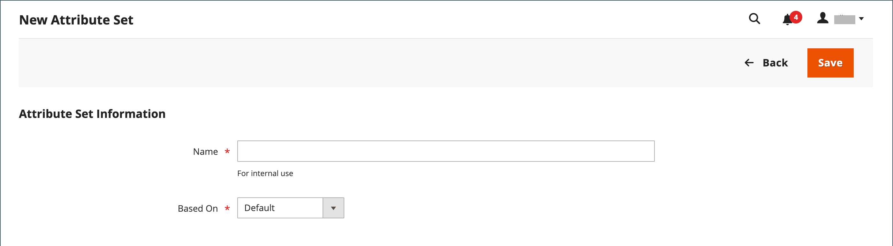

# Conjuntos de atributos

Uno de los primeros pasos al crear un producto es elegir el conjunto de atributos que se utiliza como plantilla para el registro de producto. El conjunto de atributos determina los campos disponibles durante la entrada de datos y los valores que aparecen al cliente.

Los atributos están organizados en grupos que determinan dónde aparecen en el registro del producto. Su tienda incluye un conjunto de atributos inicial (denominado _default_) que incluye un conjunto de atributos de uso común. Si desea agregar solo unos pocos atributos, puede agregarlos a este conjunto de atributos predeterminado. Si vende productos que requieren tipos de información específicos, sería mejor crear un conjunto de atributos específico que incluya los atributos específicos necesarios para el producto.

{width="700" zoomable="yes"}

## Crear un conjunto de atributos

1. En la barra lateral _Admin_, vaya a **[!UICONTROL Stores]** > _[!UICONTROL Attributes]_>**[!UICONTROL Attribute Set]**.

1. Haga clic en **[!UICONTROL Add New Set]**.

   {width="600" zoomable="yes"}

1. Escriba **[!UICONTROL Name]** para el conjunto de atributos.

1. Establezca **[!UICONTROL Based On]** en un conjunto de atributos existente para utilizarlo como plantilla.

1. Haga clic en **[!UICONTROL Save]**.

   La página siguiente muestra lo siguiente:

   - La columna de la izquierda muestra el nombre del conjunto de atributos. El nombre es para referencia interna y se puede cambiar según sea necesario.
   - El centro de la página muestra la selección actual de grupos de atributos.
   - La columna de la derecha muestra la selección de atributos que no están asignados actualmente al conjunto de atributos.

1. Para agregar un atributo al conjunto, arrástrelo desde la lista **[!UICONTROL Unassigned Attributes]** a la carpeta correspondiente de la columna **[!UICONTROL Groups]**. Para quitar un atributo del conjunto, arrástrelo a la lista **[!UICONTROL Unassigned Attributes]**.

   >[!NOTE]
   >
   >Los atributos del sistema están marcados con un punto y no se pueden quitar de la lista _[!UICONTROL Groups]_. Sin embargo, se pueden arrastrar a otro grupo del conjunto de atributos.

1. Una vez finalizado, haga clic en **[!UICONTROL Save]**.

{width="600" zoomable="yes"}

## Creación de un grupo de atributos

1. En la columna _[!UICONTROL Groups]_&#x200B;del conjunto de atributos, haga clic en **[!UICONTROL Add New]**.

1. Escriba un **[!UICONTROL Name]** para el nuevo grupo y haga clic en **[!UICONTROL OK]**.

1. Realice una de las siguientes acciones:

   - Arrastre **[!UICONTROL Unassigned Attributes]** al nuevo grupo.
   - Arrastre atributos de cualquier otro grupo al nuevo grupo.
   - Arrastre atributos innecesarios a **[!UICONTROL Unassigned Attributes]**.

   El nuevo grupo se convierte en una sección de atributos de cualquier producto basada en el conjunto de atributos.

## Eliminar un conjunto de atributos

1. En la barra lateral _Admin_, vaya a **[!UICONTROL Stores]** > _[!UICONTROL Attributes]_>**[!UICONTROL Attribute Set]**.

1. Seleccione el conjunto de atributos en la lista y abra en modo de edición.

1. Haga clic en **[!UICONTROL Delete]**.

1. Cuando se le pida que confirme, haga clic en **[!UICONTROL OK]**.
