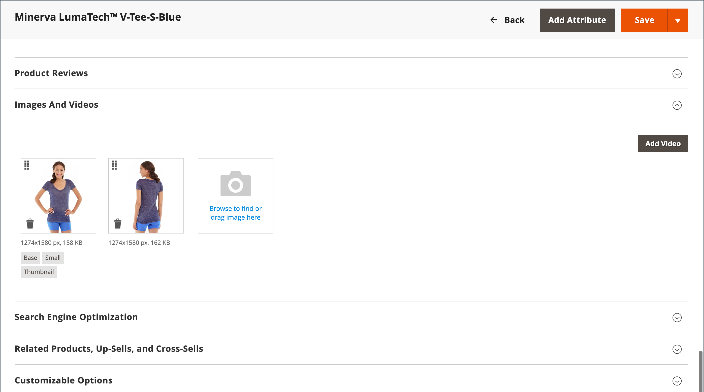

# Imágenes y vídeo de catálogo

El uso de imágenes de alta calidad de proporción constante le da a su catálogo un aspecto profesional con atractivo comercial. Si tiene un catálogo grande con varias imágenes por producto, puede tener fácilmente cientos, si no miles, de imágenes de producto para administrar. Antes de empezar, establezca una convención de nombres para los archivos de imagen y organícelos para que pueda encontrar los originales si los necesita.

{width="600" zoomable="yes"}

Una sola imagen de producto se procesa en diferentes tamaños en todo el catálogo. El tamaño de visualización del contenedor de imágenes en la página se define en la hoja de estilo de la temática. Sin embargo, el lugar donde aparece la imagen en la tienda viene determinado por la función asignada a la imagen. La imagen del producto principal o la imagen _base_ debe ser lo suficientemente grande como para producir el aumento necesario para el zoom. Además de la imagen principal, puede aparecer una versión más pequeña de la misma imagen en las listas de productos o como una miniatura en el carro de compras. Puede cargar una imagen en el tamaño más grande que se necesite o usar una imagen de [Adobe Stock](../content-design/adobe-stock.md), y dejar que Commerce procese los tamaños necesarios para cada uso. Se puede utilizar la misma imagen para todos los roles o se puede asignar una imagen diferente a cada rol. De forma predeterminada, la primera imagen que se carga se asigna a las tres funciones.

## Explorador de medios de Storefront

El navegador de medios de la página de producto muestra varias imágenes, vídeos o muestras relacionados con el producto. Cada miniatura puede mostrar una vista o variación diferente del producto. El comprador puede hacer clic en una miniatura para navegar por los recursos de medios. Aunque la posición del navegador de medios varía según la temática, la posición predeterminada está justo debajo de la imagen principal de la página del producto. Para ver los controles de accesibilidad, consulte [Accesibilidad de navegación](../getting-started/navigation-accessibility.md).

{width="700" zoomable="yes"}

### Zoom de imagen

Si la [imagen base](product-image.md) es lo suficientemente grande como para crear el efecto de zoom, los clientes podrán ver una parte ampliada de la imagen al pasar el ratón por encima. Cuando se activa el zoom, los clientes pueden hacer clic en la imagen principal y mover el cursor para ampliar diferentes partes de la imagen. La selección ampliada aparece a la derecha de la imagen.

{width="700" zoomable="yes"}

### Cajas de luz y controles deslizantes

Existen muchas cajas de luz y controles deslizantes de terceros que puede utilizar para mejorar la presentación de las imágenes de sus productos. Busque extensiones en [Commerce Marketplace](../getting-started/commerce-marketplace.md).

## Solución de problemas de recursos

Para obtener ayuda sobre la resolución de problemas de imagen y vídeo, consulte los siguientes artículos de la Base de conocimiento de asistencia de Commerce:

- [Las imágenes de producto no se muestran a pesar de las funciones de imagen de edición de producto](https://experienceleague.adobe.com/docs/commerce-knowledge-base/kb/troubleshooting/storefront/product-images-do-not-display-despite-product-edit-image-roles.html)
- [Almacenar imágenes que no se muestran después de la implementación](https://experienceleague.adobe.com/docs/commerce-knowledge-base/kb/troubleshooting/storefront/store-images-not-displayed-after-deployment.html)
