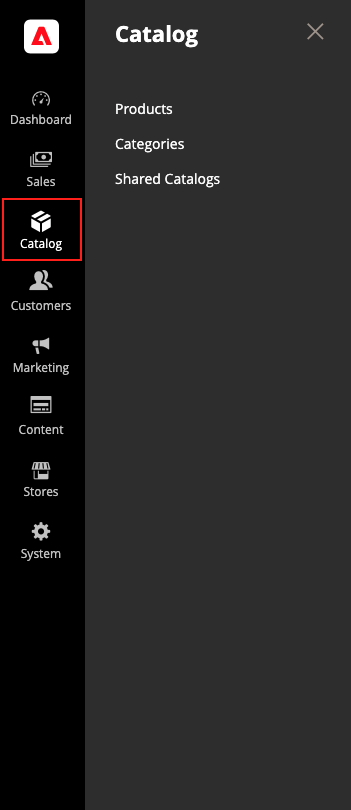

# Menú [!UICONTROL Catalog]

El menú [!UICONTROL Catalog] proporciona fácil acceso a las herramientas de creación de productos, categoría y administración de inventario, así como a los catálogos compartidos para precios personalizados en [tiendas B2B](https://experienceleague.adobe.com/docs/commerce-admin/b2b/introduction.html).

>[!BEGINTABS]

>[!TAB Adobe Commerce]

[!BADGE Solo PaaS]{type=Informative url="https://experienceleague.adobe.com/en/docs/commerce/user-guides/product-solutions" tooltip="Se aplica solo a proyectos de Adobe Commerce en la nube (infraestructura PaaS administrada por Adobe) y a proyectos locales."}

{width="300" zoomable="yes"}

>[!TAB Adobe Commerce as a Cloud Service]

[!BADGE Solo SaaS]{type=Positive url="https://experienceleague.adobe.com/en/docs/commerce/user-guides/product-solutions" tooltip="Solo se aplica a los proyectos de Adobe Commerce as a Cloud Service y Adobe Commerce Optimizer (infraestructura de SaaS administrada por Adobe)."}

{width="300" zoomable="yes"}

>[!ENDTABS]

En la barra lateral _Admin_, haga clic en **[!UICONTROL Catalog]**.

## [!UICONTROL Products]

Crea [productos](products-list.md) de todos los tipos y administra tu inventario.

{width="700" zoomable="yes"}

## [!UICONTROL Categories]

Cree la estructura [category](categories.md) que es la base de la navegación de su tienda.

{width="700" zoomable="yes"}

## [!UICONTROL Shared Catalogs]

En tiendas con Adobe Commerce B2B instalado y habilitado, [catálogos compartidos](https://experienceleague.adobe.com/docs/commerce-admin/b2b/shared-catalogs/catalog-shared.html) te permiten poner precios personalizados a disposición de diferentes empresas.

{width="700" zoomable="yes"}
