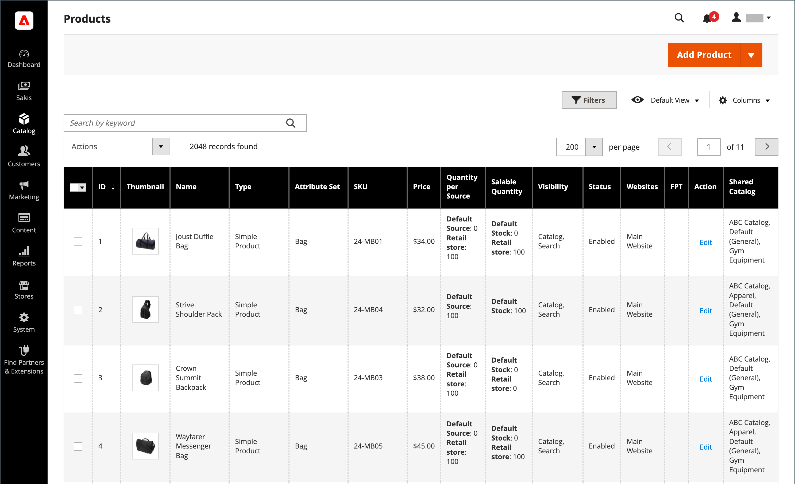

# [!UICONTROL Catalog] menú

El [!UICONTROL Catalog] proporciona un fácil acceso a las herramientas de creación de productos, categoría y administración de inventarios, así como a los catálogos compartidos para precios personalizados en [Tiendas B2B](https://experienceleague.adobe.com/docs/commerce-admin/b2b/introduction.html).

{width="300" zoomable="yes"}

En el _Administrador_ barra lateral, haga clic en **[!UICONTROL Catalog]**.

## [!UICONTROL Products]

Crear [products](products-list.md) de cada tipo y gestione su inventario.

{width="700" zoomable="yes"}

## [!UICONTROL Categories]

Cree el [categoría](categories.md) estructura que es la base de la navegación de su tienda.

{width="700" zoomable="yes"}

## [!UICONTROL Shared Catalogs]

En tiendas con Adobe Commerce B2B instalado y activado, [catálogos compartidos](https://experienceleague.adobe.com/docs/commerce-admin/b2b/shared-catalogs/catalog-shared.html) le permite poner precios personalizados a disposición de distintas empresas.

{width="700" zoomable="yes"}
