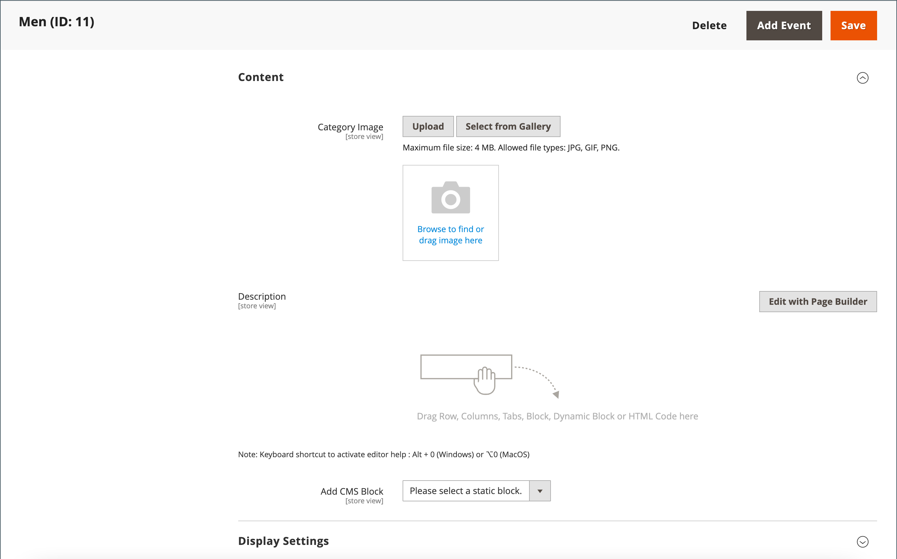

# Categorías: configuración de contenido

La configuración de _[!UICONTROL Content]_&#x200B;determina que cualquier contenido adicional aparece en la página de categoría. Además de la lista de productos de categoría, la página puede incluir una imagen, una descripción y un bloque de CMS. Puede usar las herramientas de contenido [[!DNL Page Builder]](../page-builder/introduction.md) para definir la descripción de la categoría.

## Agregar la descripción de categoría en [!DNL Page Builder]

1. Abra la categoría en modo de edición.

1. Desplácese hacia abajo y expanda  en la sección **[!UICONTROL Content]**.

   {width="600" zoomable="yes"}

1. En la parte superior derecha del área **[!UICONTROL Description]**, haga clic en **[!UICONTROL Edit with Page Builder]**.

1. Use las herramientas de contenido de [[!DNL Page Builder]](../page-builder/introduction.md) para [editar cualquier texto existente](../page-builder/text.md) y agregar otro contenido (si es necesario).

## Vista previa de [!DNL Page Builder]

Al expandir la sección _Contenido_ para una categoría existente en la que hay contenido creado con [!DNL Page Builder], se muestra una vista previa del contenido de **[!UICONTROL Description]** tal como aparecería en la página de la categoría. Al hacer clic en el área de contenido, se abre el área de trabajo [!DNL Page Builder], donde puede realizar las actualizaciones que sean necesarias.

{width="500" zoomable="yes"}

Esta vista previa del contenido está habilitada para los formularios de productos y categorías de forma predeterminada. Si el rendimiento se ve afectado debido a la carga de la vista previa, puede deshabilitar la vista previa en la configuración de [Administración de contenido](../configuration-reference/general/content-management.md#advanced-content-tools).

## Añada la descripción de la categoría en el editor

Introduzca solo caracteres ASCII sin formato en el cuadro de texto. Si pega texto desde un procesador de texto, guárdelo primero como un archivo .TXT sin formato para eliminar los caracteres de control invisibles.

Para obtener más información, consulte [Editor de WYSIWYG](../content-design/editor.md).

1. Abra la categoría en modo de edición.

1. Desplácese hacia abajo y expanda  en la sección **[!UICONTROL Content]**.

   {width="500" zoomable="yes"}

1. Escriba la categoría **[!UICONTROL Description]** y use la [barra de herramientas del editor](../content-design/editor.md) para aplicar formato según sea necesario.

   Puede arrastrar la esquina inferior derecha para cambiar el alto del cuadro de texto.

## Añadir un bloque de CMS a la página de categoría

1. En la barra lateral _Admin_, vaya a **[!UICONTROL Catalog]** > **[!UICONTROL Categories]**.

1. En el árbol de categorías, seleccione la categoría que desee editar.

1. Expanda  en la sección **[!UICONTROL Content]**.

1. Para **[!UICONTROL Add the CMS block]**, seleccione el bloque que desee agregar.

1. Expanda  en la sección **[!UICONTROL Display Settings]**.

1. Establezca **[!UICONTROL Display Mode]** en una de las siguientes opciones:

   - `Static block only`
   - `Static block and products`

1. Una vez finalizado, haga clic en **[!UICONTROL Save]** y revise la visualización del bloque en la tienda (requiere la actualización de la caché).

## Referencia de configuración de contenido

| Configuración | [Ámbito](../getting-started/websites-stores-views.md#scope-settings) | Descripción |
|--- |--- |--- |
| [!UICONTROL Category Image] | Vista de tienda | Especifica una imagen para la parte superior de la página de categoría. Métodos:   **[!UICONTROL Upload]**: carga un archivo de imagen desde el equipo local a la galería y lo utiliza como imagen de categoría.  **[!UICONTROL Select from Gallery]**: le solicita que elija una imagen existente de la galería.   : arrastre un archivo de imagen al mosaico de la cámara o busque la imagen y selecciónela en el sistema de archivos local. |
| [!UICONTROL Description] | Vista de tienda | Especifica una descripción que aparece en la página de categoría.   **[!UICONTROL Edit with Page Builder]**: abre el [[!DNL Page Builder] espacio de trabajo](../page-builder/workspace.md), donde puede editar la descripción.  **[!UICONTROL Show / Hide Editor]**: cambia la visualización entre el editor de WYSIWYG y los modos de HTML. |
| [!UICONTROL Add CMS Block] | Vista de tienda | Agrega un [bloque de CMS](../content-design/blocks.md) existente a la página de categoría. |

{style="table-layout:auto"}
