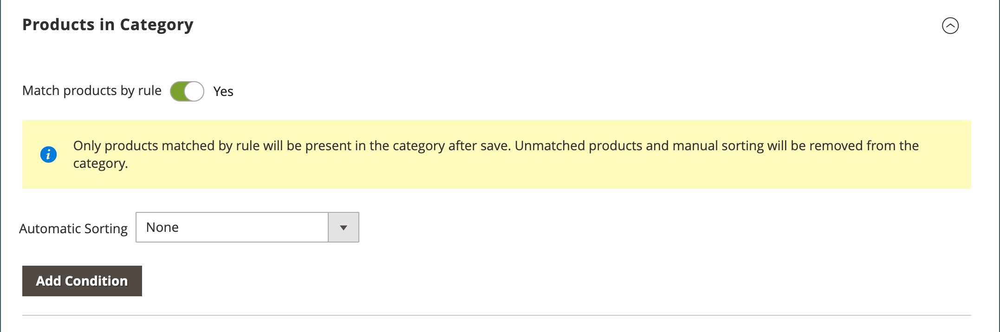

# Asignaciones de productos de categoría

Para una categoría, utilice la sección _[!UICONTROL Products in Category]_para revisar los productos que están asignados actualmente a la categoría. Los filtros de búsqueda situados en la parte superior de cada columna se utilizan para añadir y eliminar productos de la categoría. También puede usar [reglas de categoría](../merchandising-promotions/category-product-rules.md) ( solo  Adobe Commerce) para cambiar dinámicamente la selección del producto cuando se cumpla un conjunto de condiciones. Para obtener más información, consulte [Visual Merchandiser](../merchandising-promotions/visual-merchandiser.md)).

>[!TIP]
>
>Durante la configuración de la regla de categoría, los productos son _clasificados_, _coincidentes_, _asignados_ y _sin asignar_ según esa regla **_solo_** cuando se guarde esta categoría. Para asegurarse de que se asigna un nuevo producto según la regla cuando lo agrega al catálogo, **debe volver a guardar cada categoría** que se haya establecido para que coincida con los productos por regla. Además, si algún estado de stock de producto se cambia a `In Stock` o `Out of Stock` y los productos de la categoría están _ordenados_ según la regla **Clasificación automática**, debe hacer clic en **[!UICONTROL Save Category]**.

{width="600" zoomable="yes"}

>[!NOTE]
>
>La columna _Stock_ muestra la cantidad de productos disponibles solo para _**el ámbito de categoría seleccionado**_. Cuando se administran varios inventarios de existencias para los productos, debe cambiar entre los ámbitos correspondientes para mostrar otros valores de columna de _Stock_ en la cuadrícula de _Productos de categoría_.

## Aplicar una regla de categoría

{{ee-feature}}

1. Establezca **[!UICONTROL Match products by rule]** en `Yes`.

   Aparecerán las opciones de ordenación y condición automáticas.

   {width="600" zoomable="yes"}

1. Establecer el orden **[!UICONTROL Automatic Sorting]**.

   Esta clasificación automática se basa en las condiciones actuales.

   - `Stock level` - Mover al principio o al final.
   - `Special price` - Mover al principio o al final.
   - `New Products`: enumere primero los productos más recientes.
   - `Color` - Ordenar alfabéticamente por color.
   - `Name` - Ordenar en orden ascendente o descendente por Nombre.
   - `SKU` - Ordenar en orden ascendente o descendente por SKU
   - `Price` - Ordenar en orden ascendente o descendente por Precio.

1. Haga clic en **[!UICONTROL Add Condition]** y haga lo siguiente:

   - Elija **[!UICONTROL Attribute]** que es la base de la condición.
   - Elija el **[!UICONTROL Operator]** necesario para formar la expresión.
   - Escriba el(la) **[!UICONTROL Value]** con el que desea establecer una coincidencia.

   {width="600" zoomable="yes"}

   Repita este proceso para cada atributo que desee utilizar para describir las condiciones que deben cumplirse. Por ejemplo, para hacer coincidir productos creados hace entre 7 y 30 días, haga lo siguiente:

   - Establezca **[!UICONTROL Date Created]** en `Less than 30`.
   - Establezca **[!UICONTROL Logic]** en `AND`.
   - Establezca **[!UICONTROL Date Modified]** en `Greater than 7`.

1. Una vez finalizado, haga clic en **[!UICONTROL Save Category]**.

### Opciones de página

| Opción | Descripción |
|--- |--- |
| [!UICONTROL Match products by rule] | Determina si una regla de categoría genera dinámicamente la lista de productos de la categoría. Opciones: `Yes` / `No` |
| [!UICONTROL Automatic Sorting] | Aplica automáticamente un orden de clasificación a la lista de productos de categoría. Opciones:  `None` `Move low stock to top` `Move low stock to bottom` `Special price to top` `Special price to bottom` `Newest products first` `Sort by color` `Name: A - Z` `Name: Z - A` `SKU: Ascending` `SKU: Descending` `Price: High to Low` `Price: Low to High` |
| [!UICONTROL Add Condition] | Agrega otra condición a la regla. |

{style="table-layout:auto"}

### Condiciones de página

| Opción | Descripción |
|--- |--- |
| [!UICONTROL Attribute] | Determina el atributo que se utiliza como base de la condición. Opciones:  **[!UICONTROL Clone Category ID(s)]**: clona de forma dinámica productos, sin orden ni clasificación, de varias categorías según el identificador de categoría. **[!UICONTROL Color]**: incluye productos basados en el color.  **[!UICONTROL Date Created (days ago)]**: incluye productos en función del número de días transcurridos desde que se agregaron al catálogo. **[!UICONTROL Date Modified (days ago)]**: incluye productos en función del número de días transcurridos desde la última modificación de los productos.  **[!UICONTROL Name]**: incluye productos basados en el nombre del producto. **[!UICONTROL Price]** - Incluye productos según el precio.  **[!UICONTROL Quantity]**- Incluye productos en función de la cantidad en stock. ** SKU **: incluye productos basados en SKU. |
| [!UICONTROL Operator] | Especifica el operador que se aplica al valor del atributo para cumplir la condición. A menos que se especifique un operador, `Equal` se usa como valor predeterminado. Opciones: `Equal` / `Not equal` / `Greater than` / `Greater than or equal to` / `Less than` / `Less than or equal to` / `Contains` |
| [!UICONTROL Value] | Especifica el valor que debe tener el atributo para cumplir la condición. |
| [!UICONTROL Logic] | Se utiliza para definir varias condiciones y solo aparece cuando se agrega otra condición. Opciones: `OR` / `AND` |

{style="table-layout:auto"}

>[!NOTE]
>
>La cantidad de un producto configurable con opciones secundarias se calcula combinando todas las cantidades de productos secundarias. Considere un ejemplo de un producto configurable _Tanque de fitness de resistencia_ con opciones de color morado, rojo y amarillo y diferentes cantidades de cada uno. En esta situación, la cantidad del producto principal es la cantidad combinada de los productos secundarios de color morado, rojo y amarillo.

## Controles

## Controles de página

{{ee-feature}}

| Control | Descripción |
|----------|--------------|
|  | Ver como lista |
|  | Ver como mosaicos |
|  | Coincidencia por regla: no |
|  | Coincidencia por regla: sí |
|  | El control de arrastrar y soltar le permite capturar un producto y moverlo a otra posición en la página actual de la cuadrícula. Para obtener más información, consulte [Visual Merchandiser](../merchandising-promotions/visual-merchandiser.md). |
|  | Determina la posición del producto en la lista. |

{style="table-layout:auto"}

## Controles de página

{{ce-feature}}

| Control | Descripción |
|----------|--------------|
|  | Utilice la casilla de verificación situada en el encabezado de la primera columna para seleccionar todos los productos o borrar todas las selecciones. El control de la primera fila determina el tipo de búsqueda y se puede establecer para incluir cualquier registro, o incluir sólo los registros asignados o no asignados a la categoría. La casilla de verificación de la primera columna de cada fila identifica los productos que se van a agregar a la categoría. Opciones: `Yes` / `No` / `Any` |
| [!UICONTROL Search Filters] | Los controles de filtro situados en la parte superior de cada columna se pueden utilizar para introducir valores específicos que desee incluir u omitir de la lista, en función de la configuración Seleccionar todo. |
| [!UICONTROL Reset Filter] | Borra todos los filtros de búsqueda. |
| [!UICONTROL Search] | Busca en el catálogo en función de los criterios de filtro y muestra el resultado. |

{style="table-layout:auto"}
