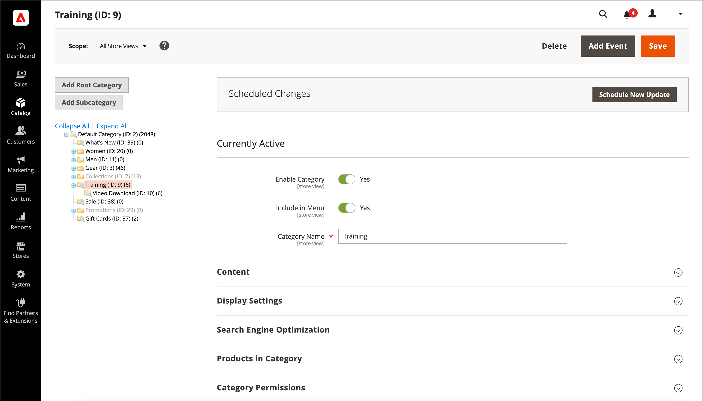

# Resumen de categorías

Antes de añadir productos al catálogo, debe establecer la estructura básica de categorías del catálogo. Los productos se pueden asignar a cero o más categorías. Normalmente, las categorías se crean por adelantado, antes de que los productos se añadan al catálogo. Sin embargo, también puede agregar categorías _sobre la marcha_ al crear un producto. La estructura de categorías del catálogo se refleja en el menú principal o en la [navegación superior](navigation-top.md) de la tienda.

{width="700" zoomable="yes"}

| Control | Descripción |
|--- |--- |
| **[!UICONTROL Add Root Category]** | Crea una categoría raíz. |
| **[!UICONTROL Add Subcategory]** | Agrega una subcategoría debajo de la categoría o subcategoría actual. |
| **[!UICONTROL Collapse All]** / **[!UICONTROL Expand All]** | Contrae o expande el árbol de categorías. |
| **[!UICONTROL Delete]** | Quita la categoría o subcategoría actual del árbol. |
| **[!UICONTROL Save]** | Guarda los cambios realizados en la categoría. |

{style="table-layout:auto"}

>[!NOTE]
>
>Los administradores restringidos no tienen acceso a las categorías raíz y no pueden crear subcategorías, a menos que tengan acceso a todos los sitios web.

## Solución de problemas de recursos

Para obtener ayuda sobre la resolución de problemas de categorías, consulte los siguientes artículos de la Base de conocimiento de asistencia de Commerce:

- [Los cambios en las categorías no se guardan](https://experienceleague.adobe.com/docs/commerce-knowledge-base/kb/troubleshooting/miscellaneous/changes-to-categories-are-not-being-saved.html)
- [El menú principal (Categorías) no se muestra en las subpáginas que tengan activada la opción Rápidamente](https://experienceleague.adobe.com/docs/commerce-knowledge-base/kb/troubleshooting/miscellaneous/main-menu-categories-not-displayed-on-subpages-with-fastly-enabled.html)
