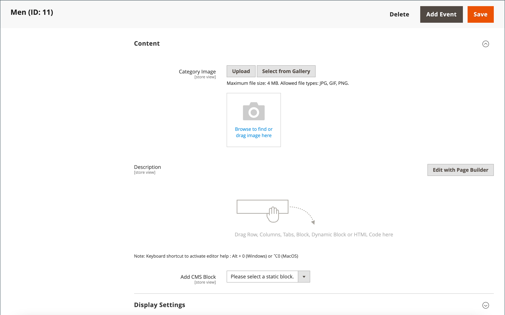

# Creación de categorías

La estructura de categorías del catálogo es similar a un árbol invertido, con la raíz en la parte superior. Cada sección del árbol se puede expandir y contraer. Las categorías deshabilitadas u ocultas aparecen atenuadas. Las categorías del primer nivel (debajo de [root](category-root.md)) suelen aparecer como opciones en el [menú principal](navigation-top.md). Puede crear tantas subcategorías adicionales como sea necesario, según la profundidad de menú máxima establecida en la configuración. Las categorías se pueden arrastrar y soltar en otras ubicaciones del árbol. El número de ID de categoría aparece entre paréntesis después del nombre de la categoría en la parte superior de la página.

Para un sitio web con varias [tiendas](../stores-purchase/stores.md#add-stores), puede crear una categoría raíz diferente para cada tienda que defina el conjunto de categorías que se usa para la [navegación superior](navigation-top.md).

{width="700" zoomable="yes"}

## Prácticas recomendadas

Siga estas prácticas recomendadas cuando planifique y cree categorías.

### Estructura de categoría

La estructura de las categorías del menú principal puede afectar a la experiencia del cliente y al rendimiento. Como práctica recomendada, debe identificar una categoría de nivel superior global y evitar que otras categorías tengan el mismo nombre. Por ejemplo, en lugar de tener varias categorías para &quot;Niños&quot; organizadas en diferentes departamentos, como `Clothing/Kids`, `Shoes/Kids`, `Accessories/Kids`. Puede ser más eficiente crear la categoría principal de nivel superior `Kids` y, a continuación, crear subcategorías según sea necesario a continuación. Sea coherente con la estructura de categorías y utilice el mismo método para todos los tipos de productos del catálogo.

### Reglas empresariales y automatización

Tenga en cuenta la estructura de categorías y los valores de atributo disponibles cuando utilice la lógica empresarial para mostrar elementos similares en una página del catálogo o para configurar una promoción personalizada, un proceso automatizado o criterios de búsqueda. Por ejemplo, si especifica &quot;grupo&quot; como categoría principal, los resultados pueden incluir productos mixtos que no sean apropiados para el sexo y la edad. Sin embargo, si coincide con una subcategoría específica de polos, los resultados son más estrechos y es probable que atraigan a un cliente específico. Los resultados pueden ser aún más específicos cuando se combinan con otros valores de atributo dirigidos a un cliente específico. Tenga en cuenta el número de productos que deben filtrarse y recuperarse al hacer referencia a una ruta de categoría específica. La diferencia en los resultados puede ser dramática. Tenga en cuenta los diferentes resultados devueltos por las siguientes rutas de categoría:

- `[Category:  All Products/Shirts/Father's Day/Polos/Sale]`
- `[Category Path: Men/Shirts/Polos]`
- `[Child Category: Polos]`

Es importante definir claramente las relaciones categóricas, como:

- categoría principal
- subcategoría
- ruta de categoría

Defina también cualquier palabra clave y atributo asociado, como:

- disponibilidad
- precio venta
- marca
- talla
- color

## Paso 1: Crear una categoría

1. En la barra lateral _Admin_, vaya a **[!UICONTROL Catalog]** > **[!UICONTROL Categories]**.

1. Establezca **[!UICONTROL Store View]** para determinar dónde estará disponible la nueva categoría.

1. En el árbol de categorías, seleccione la categoría principal de la nueva categoría.

   El nivel principal está un nivel por encima de la nueva categoría.

   Si está empezando desde el principio sin datos, es posible que sólo haya dos categorías en la lista: _Categoría predeterminada_, que es la raíz, y _Categoría de ejemplo_

1. Haga clic en **[!UICONTROL Add Subcategory]**.

## Paso 2: Completar la información básica

1. Si desea que la categoría esté disponible inmediatamente en el almacén, establezca **[!UICONTROL Enable Category]** en `Yes`.

1. Para incluir la categoría en la [navegación superior](navigation-top.md), establezca **[!UICONTROL Include in Menu]** en `Yes`.

1. Escriba **[!UICONTROL Category Name]**.

   {width="500" zoomable="yes"}

1. haga clic en **[!UICONTROL Save]** y continúe.

## Paso 3: Completar el contenido de la categoría

1. Expanda  en la sección **[!UICONTROL Content]**.

   {width="600" zoomable="yes"}

1. Para mostrar un(a) **[!UICONTROL Category Image]** en la parte superior de la página, puedes cargar tu propia imagen o usar una imagen que exista en [Almacenamiento de medios](../content-design/media-storage.md).

   - Para cargar su propia imagen, haga clic en **[!UICONTROL Upload]** y elija la imagen que desea que represente la categoría.

   - Para usar imágenes de Media Storage, haga clic en **[!UICONTROL Select from Gallery]** y seleccione la imagen que desea que represente la categoría.

   Dentro de la Galería multimedia, también puedes usar la [Integración de Adobe Stock](../content-design/adobe-stock.md) para encontrar una imagen adecuada haciendo clic en **[!UICONTROL Search Adobe Stock]**.

   >[!NOTE]
   >
   > Si tiene AEM Assets habilitados, consulte [Administrar categorías](../content-design/aem-assets-manage.md) para obtener más información.

1. Para **[!UICONTROL Description]**, escriba el texto u otro contenido que desee que aparezca en la página de aterrizaje de categoría.

   Para obtener más información, consulte [Contenido de categoría](categories-content-settings.md).

1. Para incluir un bloque de contenido en la página de aterrizaje de categoría, elija el(la) **[!UICONTROL CMS Block]** que desea que aparezca.

1. Haga clic en **[!UICONTROL Save]** y continúe.

## Paso 4: Completar la configuración de visualización

1. Expanda  en la sección **[!UICONTROL Display Setting]**.

   {width="600" zoomable="yes"}

   Para obtener más información acerca de estas opciones, consulte [Configuración de pantalla](categories-display-settings.md).

1. Establezca **[!UICONTROL Display Mode]** en una de las siguientes opciones:

   - `Products Only`
   - `Static Block Only`
   - `Static Block and Products`

1. Si desea que la página de categoría incluya la sección _`Filter by Attribute`_de navegación por capas, establezca **[!UICONTROL Anchor]**&#x200B;en `Yes`.

1. Para las opciones **[!UICONTROL Available Product Listing Sort By]**, seleccione uno o más de los valores disponibles para que los clientes ordenen la lista. Esta configuración no se aplica al [!DNL Live Search] [widget de página de lista de productos](https://experienceleague.adobe.com/en/docs/commerce/live-search/live-search-storefront/plp-styling).

   De forma predeterminada, se incluyen todos los valores disponibles. Anule la selección de la casilla de verificación **[!UICONTROL Use All]** para cambiar las selecciones. Por ejemplo, los valores pueden incluir:

   - `Position`
   - `Product Name`
   - `Price`

1. Para establecer el criterio de ordenación predeterminado de la categoría, elija el valor **[!UICONTROL Default Product Listing Sort By]**. Esta configuración no se aplica al [!DNL Live Search] [widget de página de lista de productos](https://experienceleague.adobe.com/en/docs/commerce/live-search/live-search-storefront/plp-styling).

1. Para cambiar la configuración predeterminada de la navegación por capas [price step](navigation-layered.md#configure-price-navigation), haga lo siguiente:

   - Anule la selección de la casilla **[!UICONTROL Use Config Settings]**.

   - Introduzca el valor que se utilizará como paso de precio incremental para la navegación por capas.

1. Haga clic en **[!UICONTROL Save]** y continúe.

## Paso 5: Completar la configuración de optimización del motor de búsqueda

1. Expanda  en la sección **[!UICONTROL Search Engine Optimization Settings]**.

   {width="600" zoomable="yes"}

   Para obtener más información acerca de estas opciones, consulte [Optimización de motores de búsqueda](categories-search-engine-optimization.md).

1. Complete los [metadatos](../merchandising-promotions/meta-data.md) siguientes para la categoría:

   - [!UICONTROL Meta Title]
   - [!UICONTROL Meta Keywords]
   - [!UICONTROL Meta Description]

1. Haga clic en **[!UICONTROL Save]** y continúe.

## Paso 6: Elija los productos en la categoría

1. Expanda  en la sección **[!UICONTROL Products in Category]**.

   {width="600" zoomable="yes"}

   Para obtener más información acerca de estas opciones, vea [Productos en la categoría](categories-product-assignments.md).

1. Si es necesario, use los [filtros](../getting-started/admin-grid-controls.md) para encontrar los productos.

   Para mostrar todos los registros que aún no están incluidos en la categoría, establezca el selector de registros de la primera columna en `No` y haga clic en **[!UICONTROL Search]**.

1. En la primera columna, seleccione la casilla de verificación de cada producto que desee incluir en la categoría.

1. Haga clic en **[!UICONTROL Save]** y continúe.

## Paso 7: Establecer los permisos de la categoría

{{ee-feature}}

1. Expanda  en la sección **[!UICONTROL Category Permissions]**.

1. Para una instalación de varios sitios, elija **[!UICONTROL Website]** donde se aplican los permisos de categoría.

1. Elija **[!UICONTROL Customer Group]** donde se aplican los permisos de categoría.

    ([Adobe Commerce B2B](../b2b/introduction.md) solamente) Si es necesario, puede elegir un **[!UICONTROL Shared Catalog]** en su lugar.

1. Establezca los siguientes permisos según sea necesario:

   - [!UICONTROL Browsing Category]
   - [!UICONTROL Display Product Prices]
   - [!UICONTROL Add to Cart]

1. Para agregar otra regla de permiso, haga clic en **[!UICONTROL New Permission]** y repita el proceso.

   {width="600" zoomable="yes"}

## Paso 8: Completar la configuración de diseño

1. Expanda  en la sección **[!UICONTROL Design]**.

1. Ajuste la configuración de diseño según sea necesario:

   - ([Adobe Commerce B2B](../b2b/introduction.md) solamente) Para aplicar la configuración de diseño de categoría principal a esta categoría, establezca **[!UICONTROL Use Parent Category Settings]** en `Yes`.

   - Para cambiar el diseño de las páginas de categoría, elija el(la) **[!UICONTROL Theme]** que desee aplicar.

   - Para cambiar el diseño de columna de las páginas de categoría, elija el(la) **[!UICONTROL Layout]** que desee aplicar.

   - Para escribir código personalizado, escriba código XML válido en el cuadro **[!UICONTROL Layout Update XML]**.

   - Para usar el mismo diseño para las páginas de productos, establezca **[!UICONTROL Apply Design to Products]** en `Yes`.

   {width="600" zoomable="yes"}

1.  (solo Magento Open Source) Para programar la actualización de diseño para un período de tiempo específico, haga lo siguiente:

   - Expanda la sección _[!UICONTROL Schedule Design Update]_.

   - Use el calendario () para elegir las fechas de Programar actualización **[!UICONTROL from]** y **[!UICONTROL to]**.

   {width="600" zoomable="yes"}

1. Una vez finalizado, haga clic en **[!UICONTROL Save]**.
