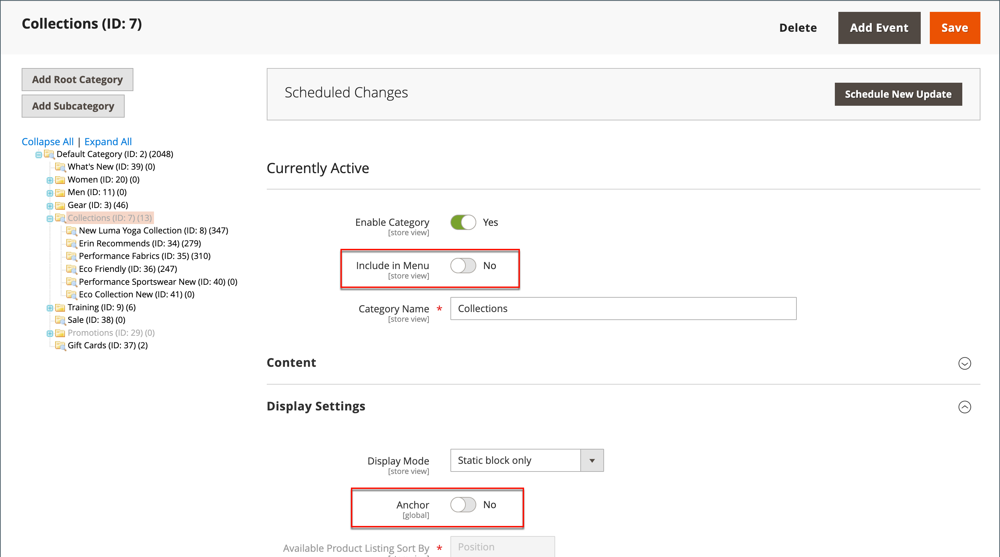

# Categorías ocultas

Hay muchas maneras de usar categorías ocultas. Es posible que desee crear niveles de categoría adicionales para sus propios propósitos internos, pero mostrar únicamente las categorías de nivel superior a sus clientes. O bien, puede que desee vincular una categoría que no esté incluida en el menú de navegación.

## Crear categorías ocultas

1. En la barra lateral _Admin_, vaya a **[!UICONTROL Catalog]** > **[!UICONTROL Categories]**.

1. En el árbol de categorías, seleccione la categoría que desee ocultar y haga lo siguiente:

   - Establezca **[!UICONTROL Is Active]** en `Yes`.
   - Establezca **[!UICONTROL Include in Menu]** en `No`.

1. En la sección **[!UICONTROL Display Settings]**, establezca **[!UICONTROL Anchor]** en `No`.

   {width="600" zoomable="yes"}

   La categoría oculta está activa, pero no aparece en el menú superior ni en la navegación por capas.

1. Complete la siguiente configuración para cada subcategoría oculta con el fin de crear subcategorías:

   >[!NOTE]
   >
   >Aunque la categoría está oculta, puede crear subcategorías debajo de ella y activarlas.

   - Establezca **[!UICONTROL Enable Category]** en `Yes`.
   - En la sección **[!UICONTROL Display Settings]**, establezca **[!UICONTROL Anchor]** en `Yes`.

   Como categorías activas, ahora puedes enlazarlas desde otros lugares de tu tienda, pero no aparecen en el menú.

1. Una vez finalizado, haga clic en **[!UICONTROL Save]**.
