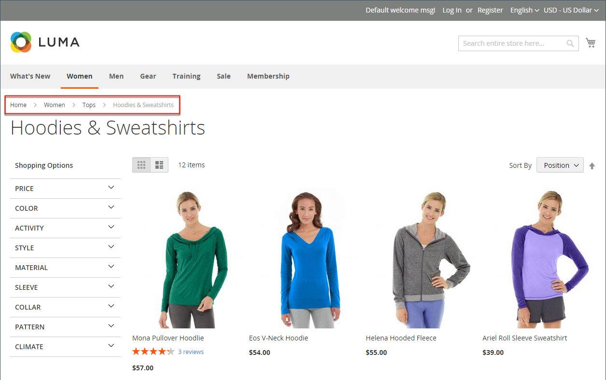

# Rutas de ruta

Una ruta de exploración _es un conjunto de vínculos que muestran al cliente dónde se encuentra en relación con otras páginas de la tienda._ Pueden hacer clic en cualquier vínculo de la ruta de exploración para volver a la página anterior.

La ruta de exploración se puede configurar para que aparezca en las páginas de contenido y en las páginas de catálogo. El formato y la posición de la ruta de exploración varían según el tema, pero normalmente se encuentra justo debajo del encabezado. De forma predeterminada, la ruta de exploración aparece en las páginas de CMS.

{width="700" zoomable="yes"}

## Tipos generales de migas de pan

Las rutas de exploración se pueden dividir en tres tipos principales, que difieren en su propósito. A continuación se describen la esencia y los principios fundamentales de la aplicación de cada tipo de migas de pan.

### Rutas de exploración basadas en jerarquía

Este tipo de ruta de exploración se basa en la jerarquía de categorías configurada en el sitio. Las cadenas presentadas indican al usuario en qué parte de la estructura se encuentran. En este caso, cada vínculo de texto está destinado a una página que está un nivel por encima de la anterior.

Ejemplo: `Men > Tops > Hoodies & Sweatshirts`

La ventaja de este tipo es que los usuarios pueden ver fácilmente en qué nivel de categoría se encuentran y tienen fácil acceso a la navegación entre páginas del catálogo.

### Rutas de exploración basadas en historial

La navegación basada en el historial (o en la ruta) es similar al botón Atrás de un explorador. Este tipo de navegación permite a los usuarios volver rápidamente a las páginas anteriores que han visitado sin realizar cambios.

La ventaja de este tipo es que es más útil cuando los clientes desean volver a una página anterior después de seleccionar varios filtros en una página de categoría.

Ejemplo: `Home > What's New > Gear > Bags`

### Rutas de exploración basadas en atributos

Este tipo de ruta de exploración muestra los atributos seleccionados en la página de categoría. La principal diferencia con respecto a los otros tipos es que las rutas de exploración basadas en atributos representan los filtros y las opciones que el cliente ha seleccionado en la capa de navegación para determinados productos (como precio, calidad y color).

Ejemplo: `Home > Suits > All Suits > Refined by > Slim Fit`

## Agregar o quitar las rutas de exploración de las páginas de CMS

1. En la barra lateral _Admin_, vaya a **[!UICONTROL Stores]** > _[!UICONTROL Settings]_>**[!UICONTROL Configuration]**.

1. En el panel izquierdo bajo _[!UICONTROL General]_, elija **[!UICONTROL Web]**.

   {width="600" zoomable="yes"}

1. Expanda la sección _[!UICONTROL Default Pages]_.

1. Anule la selección de la casilla **[!UICONTROL Use system value]**.

1. Establezca **[!UICONTROL Show Breadcrumbs for CMS Pages]** en `No` o `Yes`.

1. Una vez finalizado, haga clic en **[!UICONTROL Save Config]**.

>[!NOTE]
>
>La categoría principal no se muestra en la ruta de exploración, en la página de categoría secundaria, cuando tiene la configuración de `Browsing Category`= `Deny` [permiso de categoría](category-permissions.md).
