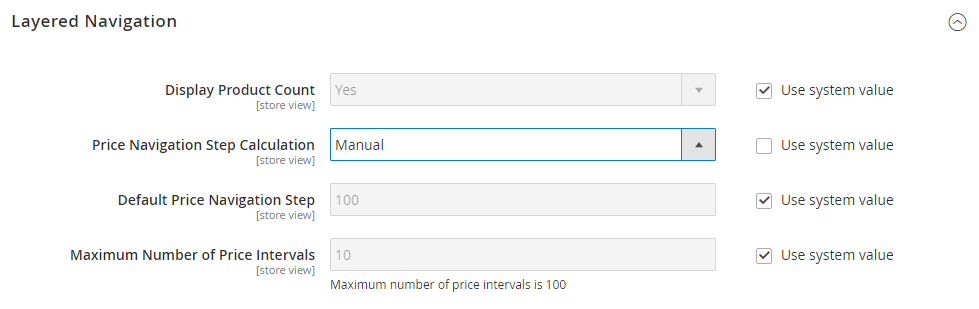

# Navegación por capas

>[!NOTE]
>
>La navegación por capas estándar descrita en esta sección difiere de la navegación filtrada por Live Search con [facetas](https://experienceleague.adobe.com/docs/commerce/live-search/live-search-admin/facets/facets.html).

La navegación por capas facilita la búsqueda de productos en función de la categoría, el intervalo de precios o cualquier otro atributo disponible. La navegación por capas suele aparecer en la columna izquierda de los resultados de búsqueda y las páginas de categoría y, a veces, en la página de inicio. La navegación estándar incluye una lista de categorías y un rango de precios de _Comprar por_. Puede configurar la visualización de la navegación por capas, incluido el recuento de productos y el intervalo de precios.

{width="700" zoomable="yes"}

## Atributos filtrables

>[!NOTE]
>
>Los requisitos de atributos filtrables que se describen en este tema difieren para [Live Search](https://experienceleague.adobe.com/docs/commerce/live-search/overview.html). Para obtener más información, consulte [Facetas](https://experienceleague.adobe.com/docs/commerce/live-search/live-search-admin/facets/facets.html).

La navegación por capas se puede utilizar para buscar productos por categoría o por atributo. Por ejemplo, cuando un comprador elige la categoría Hombres/Pantalones cortos de la barra de navegación superior, los resultados iniciales incluyen todos los productos de la categoría. La lista se puede filtrar aún más eligiendo un estilo, un clima, un color, un material, un patrón o un precio específicos, o una combinación de valores. Los atributos filtrables aparecen en una sección en expansión que enumera cada valor de atributo. Como opción, la lista de productos con resultados coincidentes se puede configurar para incluir productos con o sin coincidencia.

Las propiedades del atributo, combinadas con el tipo de entrada del producto, determinan qué atributos se pueden utilizar para la navegación por capas. La navegación por capas solo está disponible para [_anclaje_](categories-display-settings.md) categorías, pero también se puede agregar a las páginas de resultados de búsqueda. El tipo de entrada de catálogo **para el propietario de tienda** de cada atributo debe establecerse en `Yes/No`, `Dropdown`, `Multiple Select` o `Price`. Para que los atributos se puedan filtrar, la propiedad **Usar en navegación por capas** de cada uno debe establecerse en `Filterable (with results)` o `Filterable (no results)`.

_Ejemplo: atributos filtrables con resultados_

{width="700" zoomable="yes"}

_Ejemplo: valores de muestra filtrables mostrados sin resultado_

{width="700" zoomable="yes"}

Las siguientes instrucciones muestran cómo configurar la navegación básica por capas con atributos que se pueden filtrar. Para obtener información sobre la navegación por niveles avanzada con pasos de precio, consulte [Navegación por precios](navigation-layered.md#configure-price-navigation).

## Paso 1: Configurar las propiedades del atributo

1. En la barra lateral _Admin_, vaya a **[!UICONTROL Stores]** > _[!UICONTROL Attributes]_>**[!UICONTROL Product]**.

1. Examine o utilice la búsqueda filtrada para buscar un atributo en la lista y abrirlo en modo de edición.

   {width="700" zoomable="yes"}

1. En el panel izquierdo, elija **[!UICONTROL Storefront Properties]** y establezca **[!UICONTROL Use In Layered Navigation]** en una de las siguientes opciones:

   - `Filterable (with results)`: la navegación por capas incluye solo los filtros para los que se pueden encontrar productos coincidentes. Cualquier valor de atributo que ya se aplique a todos los productos mostrados en la lista debe aparecer como filtro disponible. Los valores de atributo con un recuento de cero (0) coincidencias de producto se omiten de la lista de filtros disponibles. La lista filtrada incluye solo los productos que coinciden con el filtro. La lista de productos se actualiza únicamente si los filtros seleccionados cambian lo que se muestra.

   - `Filterable (no results)`: la navegación por capas incluye filtros para todos los valores de atributo disponibles y sus recuentos de productos, incluidos los productos con cero (0) coincidencias de productos. Si el valor del atributo es una muestra, el valor aparece como un filtro, pero se tachará. Esta opción no admite el filtrado por niveles de precio y no afecta a los filtros de precio.

1. Establezca **[!UICONTROL Use In Search Results Layered Navigation]** en `Yes`.

   {width="600" zoomable="yes"}

1. Repita estos pasos para cada atributo que desee incluir en la navegación por capas.

>[!NOTE]
>
>Cuando la configuración de _[!UICONTROL Use in Search]_está establecida en `No`, no se muestra la configuración de_[!UICONTROL Use in Search Results Layered Navigation]_ y no se usa el atributo de producto en la búsqueda con ningún valor de configuración de [!UICONTROL Use in Layered Navigation].

>[!NOTE]
>
>El campo [!UICONTROL Position] está atenuado de forma predeterminada, por lo que debe guardar el atributo para poder modificar esta configuración.

## Paso 2: Hacer de la categoría un anclaje

1. En la barra lateral _Admin_, vaya a **[!UICONTROL Catalog]** > **[!UICONTROL Categories]**.

1. En el árbol de categorías, seleccione la categoría en la que desea utilizar la navegación por capas.

1. Expanda  en la sección **[!UICONTROL Display Settings]** y establezca **[!UICONTROL Anchor]** en `Yes`.

   {width="600" zoomable="yes"}

1. Haga clic en **[!UICONTROL Save]**.

## Paso 3: Prueba de los resultados

Para probar la configuración, visite su tienda y vaya a la categoría desde el menú principal. La selección de atributos filtrables aparece en la navegación por capas de la página de categoría.

Busque, filtre y revise los productos mostrados.

## Eliminación de valores de atributos filtrables de la navegación por capas

La navegación por capas incluye filtros para todos los valores de atributos disponibles y sus recuentos de productos, incluidos los productos con cero (0) coincidencias de productos (como se muestra en la siguiente imagen).

{width="700" zoomable="yes"}

Este resultado puede dificultar que los clientes seleccionen un producto preferido y no es necesario mostrar valores de atributo con 0 productos en el front-end.

Puede seguir los siguientes pasos para eliminar de la navegación por capas los valores de atributos que se pueden filtrar con 0 productos:

1. En la barra lateral _Admin_, vaya a **[!UICONTROL Stores]** > _[!UICONTROL Attributes]_>**[!UICONTROL Product]**.

1. Examine o utilice la búsqueda filtrada para buscar un atributo en la lista y abrirlo en modo de edición.

1. En _[!UICONTROL Attribute Information]_, haga clic en **[!UICONTROL Storefront Properties]**.

1. Para **[!UICONTROL Layered Navigation]**, elija `Filterable (with results)`.

   {width="600" zoomable="yes"}

1. Haga clic en **[!UICONTROL Save Attribute]**.

## Navegación de precios

>[!NOTE]
>
>La configuración de navegación de precios descrita en este tema difiere para [Live Search](https://experienceleague.adobe.com/docs/commerce/live-search/overview.html).

La navegación de precios se puede utilizar para distribuir productos por rango de precios en la navegación por capas. También puede dividir cada intervalo en intervalos. Existen varias formas de calcular la navegación de precios:

- Automático (Igualar intervalos de precios)
- Automático (ecualizar recuentos de productos)
- Manual

Con los dos primeros métodos, los pasos de navegación se calculan automáticamente. El método manual permite especificar un límite de división para los intervalos de precio. El siguiente ejemplo muestra la diferencia entre los pasos de navegación de precios de 10 y 100.

La división iterativa proporciona la mejor distribución de productos entre rangos de precios. Con la división iterativa, después de elegir el rango de 0,00 a 99 dólares, el cliente puede explorar en profundidad varios subrangos de precios. La división del intervalo de precios se detiene cuando el número de productos alcanza el umbral establecido por el límite de división de intervalo.

## Ejemplo: Pasos de navegación de precios

| Paso de precio por 10 | Paso de precio por 100 |
|----------|--------|
| $20.00 - $29.99 (1) | $0.00 - $99.99 (4) |
| 30,00 $ - 39,99 $ (2) | DE 100 A 199,99 $ (5) |
| $70.00 - $79.99 (1) | $400.00 - $499.99 (2) |
| 100,00 $ - 109,99 $ (1) | $700.00 y superior (1) |
| 120,00 $ - 129,99 $ (2) |   |
| 150,00 $ - 159,99 $ (1) |   |
| 180,00 $ - 189,99 $ (1) |   |
| $420.00 - $429.99 (1) |   |
| $440.00 - $449.99 (1) |   |
| $710.00 y superior (1) |   |

{style="table-layout:auto"}

## Configuración de la navegación de precios

>[!IMPORTANT]
>
>Para mostrar correctamente los productos y sus precios según los _filtros de precio_ en la navegación por capas, asegúrese de que la configuración del precio que se muestra en la [configuración de impuestos sobre ventas](../configuration-reference/sales/tax.md) tenga el mismo valor (`Excluding Tax` **o** `Including Tax`). Para _[!UICONTROL Calculation Settings]_, compruebe el valor **[!UICONTROL Catalog Prices]**. Y para_[!UICONTROL Price Display Settings]_, compruebe el valor **[!UICONTROL Display Product Prices in Catalog]**. Si estos tienen valores diferentes, es posible que los filtros de precio de la navegación por capas no filtren y ordenen correctamente los productos por precio.

1. En la barra lateral _Admin_, vaya a **[!UICONTROL Stores]** > _[!UICONTROL Settings]_>**[!UICONTROL Configuration]**.

1. En el panel izquierdo, expanda **[!UICONTROL Catalog]** y elija **[!UICONTROL Catalog]** debajo.

1. Expanda  en la sección _Navegación por capas_.

   De manera predeterminada, **[!UICONTROL Display Product Count]** está establecido en `Yes`. Si es necesario, anule la selección de la casilla de verificación **[!UICONTROL Use system value]** para cambiar esta configuración.

   {width="600" zoomable="yes"}

   Para obtener una lista detallada de estas opciones de configuración, consulte [Navegación por capas](../configuration-reference/catalog/catalog.md#layered-navigation) en la _Referencia de configuración_.

1. Establezca **[!UICONTROL Price Navigation Steps Calculation]** para uno de los métodos de las secciones siguientes.

1. Una vez finalizado, haga clic en **[!UICONTROL Save Config]**.

### Método 1: Automático (igualar intervalos de precios)

Deje **[!UICONTROL Price Navigation Steps Calculation]** establecido en `Automatic (Equalize Price Ranges)` (predeterminado). Esta configuración utiliza el algoritmo estándar para la navegación de precios.

### Método 2: automático (igualar los recuentos de productos)

>[!TIP]
>
>Si es necesario, anule primero la selección de la casilla de verificación **[!UICONTROL Use system value]** para cambiar esta configuración.

1. Establezca **[!UICONTROL Price Navigation Steps Calculation]** en `Automatic (equalize product counts)`.

1. Para mostrar un solo precio cuando hay varios productos con el mismo precio, establezca **[!UICONTROL Display Price Interval as One Price]** en `Yes`.

1. Para **[!UICONTROL Interval Division Limit]**, introduzca el umbral para el número de productos dentro de un rango de precios.

   El rango no se puede dividir más allá de este límite. El valor predeterminado es `9`.

   {width="600" zoomable="yes"}

### Método 3: manual

>[!NOTE]
>
>Si es necesario, anule primero la selección de la casilla de verificación **[!UICONTROL Use system value]** para cambiar esta configuración.

1. Establezca **[!UICONTROL Price Navigation Steps Calculation]** en `Manual`.

1. Escriba un valor que determine **[!UICONTROL Default Price Navigation Step]**.

1. Escriba el **[!UICONTROL Maximum Number of Price Intervals]** permitido, hasta `100`.

   {width="600" zoomable="yes"}

## Configuración de la navegación por capas

>[!NOTE]
>
>La configuración estándar descrita en esta página difiere para [Live Search](https://experienceleague.adobe.com/docs/commerce/live-search/overview.html).

La configuración de navegación por capas determina si aparece un recuento de productos entre paréntesis después de cada atributo y el tamaño del cálculo del paso que se utiliza en la navegación de precios.

1. En la barra lateral _Admin_, vaya a **[!UICONTROL Stores]** > _[!UICONTROL Settings]_>**[!UICONTROL Configuration]**.

1. En el panel izquierdo, expanda la sección _[!UICONTROL Catalog]_y elija **[!UICONTROL Catalog]**debajo.

1. Expanda la sección _[!UICONTROL Layered Navigation]_.

   >[!NOTE]
   >
   >Si es necesario, anule primero la selección de la casilla de verificación **[!UICONTROL Use system value]** para cambiar esta configuración.

1. Para mostrar el número de productos encontrados para cada atributo, establezca **[!UICONTROL Display Product Count]** en `Yes`.

1. Establezca **[!UICONTROL Price Navigation Step Calculation]** en `Automatic (equalize price ranges)`.

1. Una vez finalizado, haga clic en **[!UICONTROL Save Config]**.
