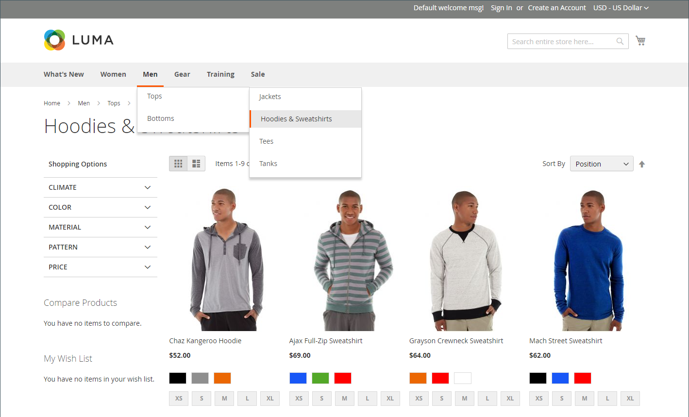

# Navegación por catálogo

El término _navegación_ se refiere a los métodos que los compradores usan para pasar de página en página en toda la tienda. El menú principal, o navegación superior, de su tienda es en realidad una lista de enlaces de categoría y proporciona un acceso fácil a los productos en su catálogo. También hay categorías en la ruta de exploración que aparece en la parte superior de la mayoría de las páginas y en la navegación por capas que aparece a la izquierda de algunas páginas de dos o tres columnas. Para obtener más información acerca de las opciones de presentación de categorías, vea [Configuración de presentación](categories-display-settings.md).

Para que un producto sea visible en tu tienda, debe estar asignado al menos a una categoría (ver [Establecer la navegación superior](navigation-top.md)). Cada categoría puede tener una página de aterrizaje dedicada con una imagen, un bloque estático, una descripción y una lista de productos en la categoría. También puede crear diseños especiales para páginas de categoría que estén activas solo durante un período de tiempo específico, como un día festivo o una promoción.

{width="700" zoomable="yes"}
