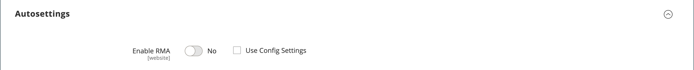

# Configuración del producto - [!UICONTROL Autosettings]

{{ee-feature}}

El _[!UICONTROL Autosettings]_incluye cualquier atributo que sea una dependencia para otras operaciones. Puede aplicar el valor predeterminado [Configuración de RMA](../stores-purchase/rma-configure.md) configurar en el producto o anularlo, según sea necesario.

{width="600" zoomable="yes"}
