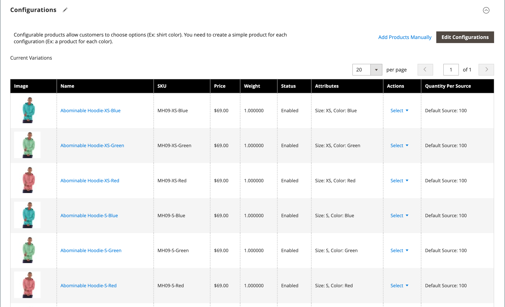

# Configuración del producto - [!UICONTROL Configurations]

La sección _[!UICONTROL Configurations]_&#x200B;enumera cualquier variación existente del producto y se puede utilizar para generar variaciones que se utilizarán con el tipo de producto Configurable. Para obtener más información, consulte [Producto configurable](product-create-configurable.md).

{width="600" zoomable="yes"}

{width="600" zoomable="yes"}

## Referencia de campo

| Campo | Descripción |
|--- |--- |
| [!UICONTROL Image] | Imagen del producto |
| [!UICONTROL Name] | El nombre único de un producto |
| [!UICONTROL SKU] | Basado en el nombre del producto |
| [!UICONTROL Price] | Precio del producto |
| [!UICONTROL Quantity] | Cantidades de existencias disponibles para cada producto |
| [!UICONTROL Weight] | El peso del producto |
| [!UICONTROL Status] | Estado del producto **[!UICONTROL Enabled]** / **[!UICONTROL Disabled]** |
| [!UICONTROL Attributes] | Un conjunto de atributos que se utilizan para describir un producto |
| [!UICONTROL Actions] | Muestra todas las acciones que se pueden aplicar a los productos seleccionados. Acciones:  **[!UICONTROL Choose a different Product]**: quita y reemplaza el producto actual con la nueva selección.  **[!UICONTROL Disable Product]** / **[!UICONTROL Enable Product]**: deshabilita o habilita el producto seleccionado.  **[!UICONTROL Remove Product]** - Quita el producto seleccionado de la configuración actual. |

{style="table-layout:auto"}
