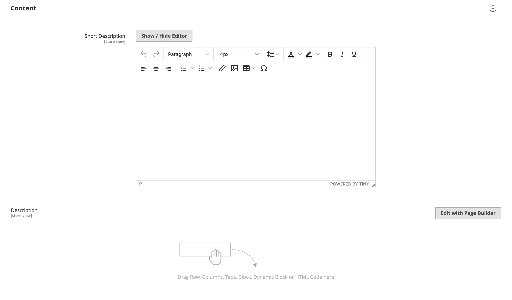

# Configuración del producto - [!UICONTROL Content]

El _[!UICONTROL Content]_se utiliza para introducir y editar la descripción principal del producto que aparece en la página del producto. La descripción breve puede utilizarse en la mayoría de las fuentes RSS y también puede aparecer en las listas de catálogos, en función de [tema](../content-design/themes.md).

## Añada la descripción del producto en [!DNL Page Builder]

1. Abra el producto en modo de edición.

1. Desplazarse hacia abajo y expandir  el **[!UICONTROL Content]** sección.

   {width="600" zoomable="yes"}

1. Introduzca una **[!UICONTROL Short Description]** del producto y utilice el [barra del editor](../content-design/editor.md) para formatear según sea necesario.

1. En el **[!UICONTROL Description]** etiqueta, haga clic en **[!UICONTROL Edit with Page Builder]**.

1. Utilice el [[!DNL Page Builder]](../page-builder/introduction.md) herramientas de contenido para [editar el texto existente](../page-builder/text.md) y agregue otro contenido (si es necesario).

## [!DNL Page Builder] previsualización

Cuando expanda el _[!UICONTROL Content]_para un producto existente con contenido creado con [!DNL Page Builder], muestra una previsualización del **[!UICONTROL Description]**contenido tal como aparecería en la página del producto. Abra el [!DNL Page Builder] espacio de trabajo, donde puede realizar las actualizaciones necesarias haciendo clic en **[!UICONTROL Edit with Page Builder]**.

{width="600" zoomable="yes"}

Esta vista previa del contenido está habilitada para los formularios de productos y categorías de forma predeterminada. Si el rendimiento se ve afectado debido a la carga de la vista previa, puede deshabilitar la vista previa en el [Configuración de administración de contenido](../configuration-reference/general/content-management.md#advanced-content-tools) configuración.

## Añada la descripción del producto en el editor

If [!DNL Page Builder] está desactivado para su tienda, utilice el editor de texto para añadir el contenido del producto. Introduzca solo caracteres ASCII sin formato en el cuadro de texto. Si pega texto desde un procesador de texto, guárdelo primero como un archivo .TXT sin formato para eliminar los caracteres de control invisibles. Para obtener más información, consulte [Uso del editor](../content-design/editor.md).

1. Abra el producto en modo de edición.

1. Desplazarse hacia abajo y expandir  el **[!UICONTROL Content]** sección.

   {width="600" zoomable="yes"}

1. Introduzca una **[!UICONTROL Short Description]** del producto y el formato según sea necesario.

1. Introducir el producto principal **[!UICONTROL Description]** y utilice la barra de herramientas del editor para dar formato según sea necesario.

   Puede arrastrar la esquina inferior derecha para cambiar el alto del cuadro de texto.
