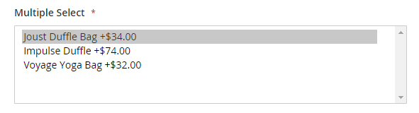

# Paquete de productos

Un paquete es un _producto personalizable_ que puedes crear tú mismo. Cada elemento de un paquete se puede basar en uno de los siguientes tipos de productos:

- [Producto sencillo](product-create-simple.md)
- [Producto virtual](product-create-virtual.md)

{width="700" zoomable="yes"}

Las opciones aparecen cuando el cliente hace clic en **[!UICONTROL Customize]** o **[!UICONTROL Add to Cart]**. Dado que los productos incluidos en el paquete varían, el SKU, el precio y el peso se pueden establecer en un valor dinámico o fijo.

>[!NOTE]
>
>El precio mínimo anunciado (MAP) no está disponible para los productos agrupados que utilizan precios dinámicos.

>[!NOTE]
>
>El producto del paquete principal siempre se muestra como un producto de mejora de ventas para todos sus productos secundarios automáticamente.

Si [Compra instantánea](../stores-purchase/checkout-instant-purchase.md) está disponible, el botón _Compra instantánea_ aparece debajo del botón _Agregar al carro_ para cada elemento del paquete.

{width="600" zoomable="yes"}

Las siguientes instrucciones lo guían a través del proceso de creación de un paquete de productos usando una [plantilla de producto](attribute-sets.md), campos obligatorios y configuración básica. Cada campo obligatorio está marcado con un asterisco rojo (`*`). Cuando termine los conceptos básicos, puede completar el resto de la configuración del producto según sea necesario.

## Paso 1: Elija el tipo de producto

1. En la barra lateral _Admin_, vaya a **[!UICONTROL Catalog]** > **[!UICONTROL Products]**.

1. En la esquina superior derecha del menú _[!UICONTROL Add Product]_( {width="25"} ), elija **[!UICONTROL Bundle Product]**.

   {width="700" zoomable="yes"}

## Paso 2: Selección del conjunto de atributos

Para elegir el [conjunto de atributos](attribute-sets.md) que se usa como plantilla para el producto, siga uno de estos procedimientos:

- Para **[!UICONTROL Search]**, escriba el nombre del conjunto de atributos,
- En la lista, elija el conjunto de atributos que desea utilizar.

El formulario se actualiza para reflejar el cambio.

{width="600" zoomable="yes"}

## Paso 3: complete la configuración necesaria

1. Escriba el producto **[!UICONTROL Product Name]**.

1. Acepte el valor predeterminado **[!UICONTROL SKU]** basado en el nombre del producto o escriba un valor diferente.

   Para determinar el tipo de SKU asignado a cada elemento del paquete, haga lo siguiente:

   - Se puede asignar automáticamente un **[!UICONTROL Dynamic SKU]** a cada elemento del paquete agregando un sufijo al SKU predeterminado. De manera predeterminada, se establece en `Yes`.

   - Si prefiere asignar un SKU único para cada elemento del paquete, establezca **[!UICONTROL Dynamic SKU]** en `No`.

   {width="600" zoomable="yes"}

1. Para determinar el precio del paquete, realice una de las siguientes acciones:

   - Para que el precio refleje las opciones elegidas por el cliente, establezca **[!UICONTROL Dynamic Price]** en `Yes` y deje **[!UICONTROL Price]** en blanco. En este caso, un producto agrupado no tiene su propio precio del catálogo y el precio del producto se deriva del precio de los productos individuales incluidos en el agrupamiento.

   - Para cargar un precio fijo para el paquete, establezca **[!UICONTROL Dynamic Price]** en `No` e introduzca el **[!UICONTROL Price]** que desea cargar para el paquete.

   >[!NOTE]
   >
   >[!UICONTROL Special Price] y [!UICONTROL Customer Group Price] (Precio de nivel) siempre se establecen como porcentaje de descuento para todos los tipos de productos de paquetes.

1. Dado que el producto aún no está listo para publicarse, establezca **[!UICONTROL Enable Product]** en `No`.

1. Haga clic en **[!UICONTROL Save]** y continúe.

   Cuando se guarda el producto, aparece el selector [Vista de tienda](introduction.md#product-scope) en la esquina superior izquierda.

1. Elija el **[!UICONTROL Store View]** en el que el producto estará disponible.

   {width="600" zoomable="yes"}

## Paso 4: completar la configuración básica

1. Si el paquete tiene precios fijos, establezca **[!UICONTROL Tax Class]** en uno de los siguientes:

   - `None`
   - `Taxable Goods`

   Si el paquete tiene precios dinámicos, el impuesto se determina para **_cada_** artículo del paquete. Si el paquete tiene Precio fijo, el impuesto se determina para el paquete **_entero_**.

1. Tome nota de lo siguiente:

   - **[!UICONTROL Quantity]** no está disponible porque el valor se determina para cada elemento del paquete.

   - De manera predeterminada, **[!UICONTROL Stock Status]** está establecido en `In Stock`.

1. Para determinar el peso del paquete, realice una de las siguientes acciones:

   - Para que el peso refleje las opciones elegidas por el cliente, establezca **[!UICONTROL Dynamic Weight]**, establezca `Yes` y deje **[!UICONTROL Weight]** en blanco.

   - Para asignar un peso fijo al paquete, establezca **[!UICONTROL Dynamic Weight]** en `No` e introduzca **[!UICONTROL Weight]** del paquete.

   {width="600" zoomable="yes"}

1. Para incluir el producto en la lista de [nuevos productos](../content-design/widget-new-products-list.md), seleccione la casilla de verificación **[!UICONTROL Set Product as New]**.

1. Acepte la configuración predeterminada **[!UICONTROL Visibility]** de `Catalog, Search`.

1. Para asignar _[!UICONTROL Categories]_&#x200B;al producto, haga clic en el cuadro **[!UICONTROL Select…]**&#x200B;y realice una de las acciones siguientes:

   **Elija una categoría existente:**

   - Empiece a escribir en el cuadro hasta que encuentre una coincidencia.

   - Seleccione la casilla de verificación de cada categoría que se va a asignar.

   {width="600" zoomable="yes"}

   **Crear una categoría:**

   - Haga clic en **[!UICONTROL New Category]**.

   - Escriba **[!UICONTROL Category Name]** y elija **[!UICONTROL Parent Category]**, que determina su posición en la estructura de menú.

   - Haga clic en **[!UICONTROL Create Category]**.

1. Elija **[!UICONTROL Country of Manufacture]**.

   Puede haber atributos adicionales que describan el producto. La selección varía según el conjunto de atributos y puede completarlos más adelante.

## Paso 5: Añadir los elementos del paquete

La sección _[!UICONTROL Bundle Items]_&#x200B;se usa para agregar elementos a un tipo de producto Paquete y editar la selección actual de elementos.

{width="600" zoomable="yes"}

1. Desplácese hacia abajo hasta la sección _Elementos del paquete_ y establezca **[!UICONTROL Ship Bundle Items]** en una de las siguientes opciones:

   - `Separately`
   - `Together`

   Si selecciona `Together`, todos los elementos del paquete deben asignarse al mismo [origen](../inventory-management/sources-manage.md).

1. Haga clic en **[!UICONTROL Add Option]** y haga lo siguiente:

   - Escriba un(a) **[!UICONTROL Option Title]** para utilizarlo como etiqueta de campo.

   - Establezca **[!UICONTROL Input Type]** en una de las siguientes opciones:

      - `Drop-down`
      - `Radio buttons`
      - `Checkbox`
      - `Multiple Select`

   - Para que el campo sea una entrada obligatoria, active la casilla de verificación **[!UICONTROL Required]**.

   - Haga clic en **[!UICONTROL Add Products to Option]** y seleccione la casilla de verificación de cada producto que desee incluir en esta opción.

     Si hay muchos productos, utilice los filtros de lista y los controles de paginación para encontrar los productos que necesita.

   - Haga clic en **[!UICONTROL Add Selected Products]**.

     {width="600" zoomable="yes"}

   - Una vez que los elementos aparezcan en la sección _Opciones_, elija un elemento que será la selección **[!UICONTROL Default]**.

   - En la columna _Cantidad predeterminada_, escriba la cantidad de cada artículo que se agregará al paquete cuando un cliente elija el artículo.

   - Para permitir que los clientes cambien la cantidad de un artículo del paquete, seleccione **[!UICONTROL User Defined]**.

     >[!NOTE]
     >
     >La cantidad puede ser un valor preestablecido o definido por el usuario. Sin embargo, no asigne la propiedad _[!UICONTROL User Defined]_&#x200B;a tipos de entrada de selección múltiple o casilla de verificación.

     De forma predeterminada, el cliente no puede cambiar la cantidad predeterminada que se incluye en un artículo agrupado. Sin embargo, el cliente puede introducir la cantidad del artículo que se va a incluir en el paquete.

     Por ejemplo, si la cantidad predeterminada de la bola de estado de Sprite está establecida en `2` y el cliente solicita `4` de esa opción de paquete, el número total de bolas compradas es `8`.

     {width="600" zoomable="yes"}

1. Repita estos pasos para cada elemento que desee agregar al paquete.

1. Para cambiar el orden de los elementos en una sección del paquete, haga clic en el icono _Mover_ (  ) al principio de la fila y arrastre el elemento a su posición.

   {width="600" zoomable="yes"}

   El orden de los elementos también se puede cambiar en los datos de un paquete de productos exportado y, a continuación, volver a importarse en el catálogo. Para obtener más información, consulte [Importación de productos en paquete](../systems/data-transfer-bundle-products.md).

   Para obtener una mejor vista del espacio de trabajo, contraiga primero cada sección y, a continuación, arrástrela a su posición.

1. Para quitar cualquier elemento del paquete, haga clic en el icono **[!UICONTROL Delete]** (  ).

1. Una vez finalizado, haga clic en **[!UICONTROL Save]**.

## Paso 6: Completar la información del producto

Desplácese hacia abajo y complete la información de las siguientes secciones según sea necesario:

- [Contenido](product-content.md)
- [Imágenes y vídeos](product-images-and-video.md)
- [Optimización del motor de búsqueda](product-search-engine-optimization.md)
- [Productos relacionados, ampliación de ventas y ventas cruzadas](related-products-up-sells-cross-sells.md)
- [Opciones personalizables](settings-advanced-custom-options.md)
- [Productos en sitios web](settings-basic-websites.md)
- [Diseño](settings-advanced-design.md)
- [Opciones de regalo](product-gift-options.md)

## Paso 7: Publish del producto

1. Si está listo para publicar el producto en el catálogo, establezca **[!UICONTROL Enable Product]** en `Yes` (  ).

1. Realice una de las siguientes acciones:

   **Método 1:** Guardar y previsualizar

   - En la esquina superior derecha, haga clic en **[!UICONTROL Save]**.

   - Para ver el producto en tu tienda, elige **[!UICONTROL Customer View]** en el menú _Administrador_ (  ).

     La tienda se abre en una nueva pestaña del explorador.

   {width="600" zoomable="yes"}

   **Método 2:** Guardar y cerrar

   En el menú _[!UICONTROL Save]_( {width="25"} ), elija **[!UICONTROL Save & Close]**.

## Controles de entrada

| Control | Descripción | Ejemplo |
|--- |--- |--- |
| [!UICONTROL Drop-down] | Muestra una lista desplegable de opciones con el nombre del producto y el precio. Solo se puede seleccionar un elemento. | {width="200"} |
| [!UICONTROL Radio Buttons] | Muestra un botón de opción para cada opción, seguido del nombre y el precio del producto. Solo se puede seleccionar un elemento. | {width="200"} |
| [!UICONTROL Checkbox] | Muestra una casilla de verificación para cada opción, seguida del nombre y el precio del producto. Se pueden seleccionar varios elementos. | {width="200"} |
| [!UICONTROL Multiple Select] | Muestra una lista de opciones con el nombre del producto y el precio. Para seleccionar varios elementos, mantenga presionada la tecla Ctrl (PC) o la tecla Comando (Mac) y haga clic en cada elemento. | {width="200"} |

{style="table-layout:auto"}

## Descripciones de campos

| Campo | Descripción |
|--- |--- |
| [!UICONTROL SKU] | Determina si a cada elemento se le asigna un SKU variable o dinámico, o si se utiliza un SKU fijo para el paquete. Opciones: `Fixed` / `Dynamic` |
| [!UICONTROL Weight] | Especifica si el peso se calcula en función de los elementos seleccionados o si es un peso fijo para todo el paquete. Opciones: `Fixed` / `Dynamic` |
| [!UICONTROL Price View] | Determina si el precio del producto se muestra como un intervalo, desde el menos caro al más caro (Intervalo de precios) o con el menos caro mostrado (Tan bajo como). Opciones: `Price Range` / `As Low As` |
| Enviar artículos agrupados | Especifica si los productos individuales se pueden enviar por separado. |

{style="table-layout:auto"}

## Estado de stock del producto agrupado

El estado de existencias del paquete de productos se **_cambia automáticamente a Agotado_** cuando se produce cualquiera de estas situaciones:

- Todas las opciones son opcionales y todos los productos asociados están _Agotados_.

- Se requieren algunas opciones y los productos asociados con las opciones requeridas son _Agotado_.

El estado de las existencias del paquete de productos es **_no se cambió automáticamente a Agotado_** cuando se produce cualquiera de estas situaciones:

- Todas las opciones son opcionales y al menos un producto asociado está _En existencia_.

- Se requieren algunas opciones y al menos un producto asociado en cada opción requerida es _En existencia_.

## Cosas que recordar

 Los clientes pueden _crear su propio paquete de productos_.

: todos los productos secundarios se asignan y se quitan de la asignación del producto del paquete **_globalmente_** para todos los sitios web, tiendas y vistas de tiendas al mismo tiempo.

 Los elementos del paquete pueden ser productos simples o virtuales sin opciones personalizadas.

 La vista de precio puede establecerse en `Price Range` o `As Low As`.

El SKU y el peso de la  pueden ser `Fixed` o `Dynamic`.

 La cantidad puede ser un valor preestablecido o definido por el usuario. Sin embargo, no asigne la propiedad _[!UICONTROL User Defined]_&#x200B;a tipos de entrada de selección múltiple o casilla de verificación.

 Los artículos del paquete se pueden enviar juntos o por separado.

 El producto del paquete principal siempre se muestra como un producto de ampliación de venta para todos sus productos secundarios de forma automática.

 [!UICONTROL Special Price] y [!UICONTROL Customer Group Price] (Precio de nivel) siempre se establecen como porcentaje de descuento para todos los tipos de productos de paquete.
