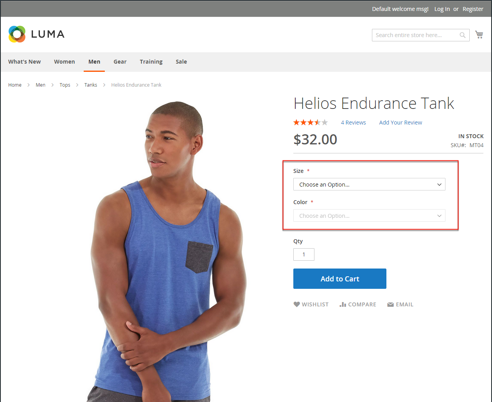
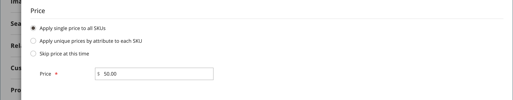
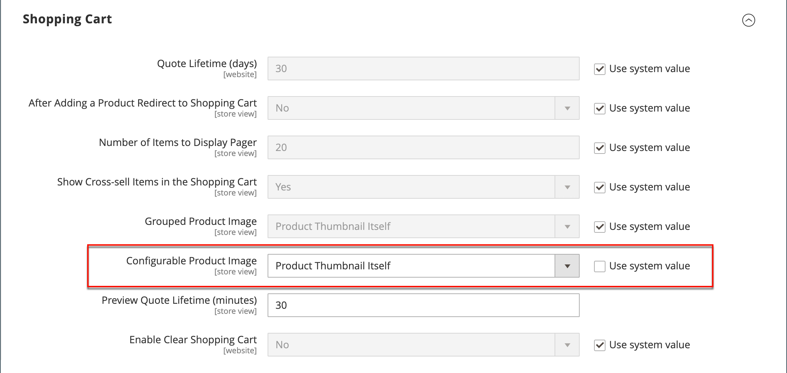

# Producto configurable

Un producto configurable parece un único producto con una lista desplegable de cada variación. Cada elemento de la lista es en realidad un producto simple independiente con un SKU único, que permite rastrear el inventario para cada variación de producto. Podría lograr un efecto similar utilizando un producto simple con opciones personalizadas, pero sin la capacidad de realizar un seguimiento del inventario para cada variación.

Las siguientes instrucciones muestran el proceso de creación de un producto configurable mediante una [plantilla de producto](attribute-sets.md), campos obligatorios y configuración básica. Cada campo obligatorio está marcado con un asterisco rojo (`*`). Cuando termine los conceptos básicos, puede completar el resto de la configuración del producto según sea necesario.

{width="700" zoomable="yes"}

## Parte 1: Creación de un producto configurable

Aunque un producto configurable utiliza más SKU y puede tardar un poco más en configurarse, puede ahorrarle tiempo al final. Si planea hacer crecer su negocio, el tipo de producto configurable es una buena opción para productos con varias opciones.

Antes de empezar, prepare una [conjunto de atributos](attribute-sets.md) que incluye un atributo que se establece en uno de los tipos de entrada permitidos para cada variación de producto. Por ejemplo, el conjunto de atributos puede incluir atributos desplegables de color y tamaño.

Las propiedades de cada atributo que se utiliza para una variación de producto configurable deben tener la siguiente configuración:

### Requisitos de atributos de variación del producto

| Propiedad | Configuración |
|--- |--- |
| [!UICONTROL Scope] | `Global` |
| [!UICONTROL Catalog Input Type for Store Owner] | El tipo de entrada de cualquier atributo que se utilice para una variación de producto debe ser uno de los siguientes: `Dropdown`, `Visual Swatch`, o `Text Swatch`. |
| [!UICONTROL Values Required] | `Yes` |

{style="table-layout:auto"}

### Paso 1: Elija el tipo de producto

1. En el _Administrador_ barra lateral, vaya a  **[!UICONTROL Catalog]** > **[!UICONTROL Products]**.

1. En el _[!UICONTROL Add Product]_( {width="25"} ) en la esquina superior derecha, seleccione **[!UICONTROL Configurable Product]**.

   {width="700" zoomable="yes"}

### Paso 2: Selección del conjunto de atributos

El [conjunto de atributos](attribute-sets.md) determina la selección de campos que se utilizan en el producto. El conjunto de atributos que se utiliza en el ejemplo siguiente tiene atributos para el color y el tamaño. El nombre del conjunto de atributos se indica en la parte superior de la página y se establece inicialmente en `Default`.

1. Para elegir el conjunto de atributos del producto, haga clic en el campo en la parte superior de la página y realice una de las siguientes acciones:

   - Para **[!UICONTROL Search]**, introduzca el nombre del conjunto de atributos.
   - En la lista, elija el conjunto de atributos que desea utilizar.

   El formulario se actualiza para reflejar el cambio.

1. Si desea añadir otro atributo al conjunto de atributos, haga clic en **[!UICONTROL Add Attribute]** y siga las instrucciones de [Adición de un atributo](product-attributes-add.md).

   {width="600" zoomable="yes"}

### Paso 3: complete la configuración necesaria

1. Introduzca el producto **[!UICONTROL Product Name]**.

1. Aceptar el valor predeterminado **[!UICONTROL SKU]** que se basa en el nombre del producto o introduzca otro.

1. Introduzca el producto **[!UICONTROL Price]**.

1. Como el producto aún no está listo para publicar, establezca **[!UICONTROL Enable Product]** hasta `No`.

1. click **[!UICONTROL Save]** y continuar.

   Cuando se guarda el producto, la variable [Vista de tienda](introduction.md#product-scope) el selector aparece en la esquina superior izquierda.

1. Elija la **[!UICONTROL Store View]** donde vaya a estar disponible el producto.

   {width="600" zoomable="yes"}

### Paso 4: completar la configuración básica

1. Establecer **[!UICONTROL Tax Class]** a uno de los siguientes:

   - `None`
   - `Taxable Goods`

1. El **[!UICONTROL Quantity]** está determinado por las variaciones de productos, por lo que puede dejarlo en blanco.

1. Deje el **[!UICONTROL Stock Status]** como se ha configurado.

   El estado de stock de un producto configurable viene determinado por cada configuración asociada. Como el producto se guardó sin introducir una cantidad, la variable **[!UICONTROL Stock Status]** se establece en `Out of Stock`.

   >[!NOTE]
   >
   >El **Estado de stock** del producto configurable es un **_semimanual_** configuración controlada. Está parcialmente controlado por el estado de existencias de sus productos secundarios. Es parte de un **_de varios criterios_** cálculo del estado de las existencias, que se describe en la [Configuración del estado de Stock](#configure-the-stock-status) sección.

1. Introduzca el producto **[!UICONTROL Weight]**.

>[!NOTE]
>
>Un producto configurable siempre debe tener un peso. Si selecciona **[!UICONTROL This item has no weight]** en la lista desplegable, se cambia automáticamente a **[!UICONTROL This item has weight]** después de guardar el producto.

1. Aceptar el valor predeterminado **[!UICONTROL Visibility]** configuración de `Catalog, Search`.

1. Para incluir el producto en la lista de [nuevos productos](../content-design/widget-new-products-list.md), seleccione la **[!UICONTROL Set Product as New]** casilla de verificación

1. Para asignar categorías al producto, haga clic en **[!UICONTROL Select…]** y realice una de las acciones siguientes:

   **Elija una categoría existente**:

   - Empiece a escribir en el cuadro hasta que encuentre una coincidencia.

   - Seleccione la casilla de verificación de la categoría que se va a asignar.

   {width="600" zoomable="yes"}

   **Crear una categoría**:

   - Clic **[!UICONTROL New Category]**.

   - Introduzca el **[!UICONTROL Category Name]** y elija la **[!UICONTROL Parent Category]**, que determina su posición en la estructura de menú.

   s- Click **[!UICONTROL Create Category]**.

1. Elija la **[!UICONTROL Country of Manufacture]**.

   Puede haber atributos adicionales que se usan para describir el producto. La selección varía según el conjunto de atributos y puede completarla más adelante.

### Paso 5: Guardar y continuar

Ahora es un buen momento para guardar su trabajo. En la esquina superior derecha, haga clic en **[!UICONTROL Save]**. En la siguiente serie de pasos, debe configurar las configuraciones para cada variación del producto.

## Parte 2: Añadir configuraciones

En el siguiente ejemplo se muestra cómo agregar configuraciones para tres colores y tres tamaños. En total, se crean nueve productos simples con SKU únicos para cubrir cada combinación posible de variaciones. De forma predeterminada, el nombre y el SKU del producto de cada variación se basan en el valor del atributo y en el nombre o el SKU del producto principal.

La barra de progreso de la parte superior de la página muestra dónde se encuentra en el proceso y le guía a través de cada paso.

### Paso 1: Elija los atributos

1. Continuando desde arriba, desplácese hacia abajo hasta el _[!UICONTROL Configurations]_y haga clic en **[!UICONTROL Create Configurations]**.

   {width="600" zoomable="yes"}

1. Seleccione la casilla de verificación de cada atributo que desee incluir como configuración.

   Para este ejemplo, `color` y `size` están seleccionados.

   {width="600" zoomable="yes"}

   La lista incluye todos los atributos del conjunto de atributos que se pueden utilizar en un producto configurable.

1. Si desea añadir un atributo, haga clic en **[!UICONTROL Create New Attribute]** y haga lo siguiente:

   - Complete las propiedades del atributo.

   - Clic **[!UICONTROL Save Attribute]**.

   - Seleccione la casilla de verificación del atributo.

1. En la esquina superior derecha, haga clic en **[!UICONTROL Next]**.

### Paso 2: Introduzca los valores de atributo

1. Para cada atributo, seleccione la casilla de los valores que se aplican al producto.

   {width="600" zoomable="yes"}

1. Para reorganizar los atributos, seleccione _Reordenar_ (  ) y mueva la sección a una nueva posición.

   El orden determina la posición de las listas desplegables en la página del producto.

1. En la barra de progreso, haga clic en **[!UICONTROL Next]**.

### Paso 3: Configurar las imágenes, el precio y la cantidad

Este paso determina las imágenes, los precios y la cantidad de cada configuración. Las opciones disponibles son las mismas para cada una y solo puede elegir una. Puede aplicar la misma configuración a todos los SKU, aplicar una configuración única a cada SKU u omitir la configuración por ahora.

Elija las opciones de configuración aplicables.

Utilice uno de los siguientes métodos para configurar el **[!UICONTROL images]**:

**Método 1:** Aplicar un único conjunto de imágenes a todos los SKU

1. Seleccionar **[!UICONTROL Apply single set of images to all SKUs]**.

1. Busque todas las imágenes que desee incluir en la galería de productos o arrástrelas al cuadro.

{width="600" zoomable="yes"}

**Método 2:** Aplicar imágenes únicas a cada SKU

Como la imagen del producto principal ya se ha cargado, puede utilizar esta opción para cargar una imagen de cada color. Puede añadir una imagen diferente que aparezca en el carro de compras cuando alguien compre el artículo en un color específico.

1. Seleccionar **[!UICONTROL Apply unique images by attribute to each SKU]**.

1. Seleccione el **[!UICONTROL Attribute]** que ilustran las imágenes, como `color`.

1. Para cada valor de atributo, vaya a las imágenes que desee utilizar para esa configuración o arrástrelas al cuadro.

   Si arrastra la imagen a un cuadro de valor, también aparecerá en las secciones de los demás valores. Si desea eliminar una imagen, haga clic en el _Papelera_ () icono.

   {width="600" zoomable="yes"}

Utilice uno de los siguientes métodos para configurar el **[!UICONTROL prices]**:

>[!NOTE]
>
>Un producto configurable no tiene su propio precio en el catálogo. El precio configurable del producto se deriva de su [!UICONTROL In Stock] productos secundarios.

**Método 1:** Aplicar el mismo precio a todos los SKU

1. Si el precio es el mismo para todas las variaciones, seleccione **[!UICONTROL Apply single price to all SKUs]**.

1. Introduzca el **[!UICONTROL Price]**.

   {width="600" zoomable="yes"}

**Método 2:** Aplicar un precio diferente para cada SKU

1. Si el precio difiere para cada una o para algunas variaciones del producto, seleccione **[!UICONTROL Apply unique prices by attribute to each SKU]**.

1. Seleccione el **[!UICONTROL Attribute]** esa es la base de la diferencia de precios.

1. Introduzca el **[!UICONTROL Price]** para cada valor de atributo.

   En este ejemplo, el tamaño XL cuesta más.

   {width="600" zoomable="yes"}

Utilice uno de los siguientes métodos para configurar el **[!UICONTROL Quantity]**:

**Método 1:** Aplicar la misma cantidad a todos los SKU

Si la cantidad es la misma para todos los SKU, seleccione **[!UICONTROL Apply single quantity to each SKU]** y especifique la cantidad.

_Comerciantes de origen único_ - Introduzca el **[!UICONTROL Quantity]**.

_Comerciantes de varias fuentes que utilizan [Inventory management](../inventory-management/introduction.md)_ - Asignar orígenes y agregar cantidades para todas las variantes de producto generadas:

1. Seleccione el **[!UICONTROL Apply single quantity to each SKU]** opción.

1. Para añadir una fuente, haga clic en **[!UICONTROL Assign Sources]**.

1. Busque o examine un origen que desee agregar. Seleccione la casilla de verificación situada junto a los orígenes que desee agregar para el producto.

1. Introduzca un importe de inventario disponible por origen.

   {width="600" zoomable="yes"}

**Método 2:** Aplicar cantidad diferente por atributo

_Comerciantes de origen único_ - Introduzca el **[!UICONTROL Quantity]**.

_Comerciantes de varias fuentes que utilizan [Inventory management](../inventory-management/introduction.md)_ - Asignar orígenes y agregar cantidades para todas las variantes de producto generadas:

1. Si la cantidad es diferente para cada SKU, seleccione **[!UICONTROL Apply unique quantity by attribute to each SKU]**.

1. Introduzca el **[!UICONTROL Quantity]** para cada uno.

   {width="600" zoomable="yes"}

Una vez completada la configuración de imágenes, precio y cantidad, haga clic en **[!UICONTROL Next]** en la esquina superior derecha.

### Paso 4: Generar las configuraciones de producto

Espere un momento a que aparezca la lista de productos y realice una de las siguientes acciones:

- Si está satisfecho con las configuraciones, haga clic en **[!UICONTROL Generate Products]**.

- Para realizar correcciones, haga clic en **[!UICONTROL Back]**.

{width="600" zoomable="yes"}

Las variaciones de productos actuales aparecen en la parte inferior de la _Configuración_ sección.

{width="600" zoomable="yes"}

### Paso 5: Añadir imágenes de producto

1. Desplazarse hacia abajo y expandir  el _[!UICONTROL Images and Videos]_sección.

1. Haga clic en _Cámara_ y busque la imagen principal que desee utilizar para el producto configurable.

Para obtener más información, consulte [Imágenes y vídeo](product-images-and-video.md).

### Paso 6: Completar la información del producto

Desplácese hacia abajo y complete la información de las siguientes secciones según sea necesario:

- [Contenido](product-content.md)

- [Productos relacionados, ampliación de ventas y ventas cruzadas](related-products-up-sells-cross-sells.md)

- [Optimización del motor de búsqueda](product-search-engine-optimization.md)

- [Opciones personalizables](settings-advanced-custom-options.md)

- [Productos en sitios web](settings-basic-websites.md)

- [Diseño](settings-advanced-design.md)

- [Opciones de regalo](product-gift-options.md)

### Paso 7: Publicar el producto

1. Si está listo para publicar el producto en el catálogo, establezca **[!UICONTROL Enable Product]** hasta `Yes` y realice una de las siguientes acciones:

   - **Método 1:** Guardar y previsualizar

      - En la esquina superior derecha, haga clic en **[!UICONTROL Save]**.

      - Para ver el producto en tu tienda, elige **[!UICONTROL Customer View]** en el _Administrador_ (  ) menú.

     La tienda se abre en una nueva pestaña del explorador.

     {width="600" zoomable="yes"}

   - **Método 2:** Guardar y cerrar

     En el _[!UICONTROL Save]_( {width="25"} ), seleccione **[!UICONTROL Save & Close]**.

### Paso 8: Configurar las miniaturas del carro de compras

Si tiene una imagen diferente para cada variación, puede establecer la configuración para utilizar la imagen correcta para la miniatura del carro de compras.

1. En el _Administrador_ barra lateral, vaya a **[!UICONTROL Stores]** > _[!UICONTROL Settings]_>**[!UICONTROL Configuration]**.

1. En el panel izquierdo, expanda **[!UICONTROL Sales]** y elija **[!UICONTROL Checkout]** debajo.

1. Expandir  el _[!UICONTROL Shopping Cart]_sección.

1. Establecer **[!UICONTROL Configurable Product Image]** hasta `Product Thumbnail Itself`.

1. Cuando termine, haga clic en **[!UICONTROL Save Config]**.

   {width="600" zoomable="yes"}

## Configuración del estado de Stock

El estado de stock del producto configurable es diferente del estado de stock del producto simple, donde es una representación directa de la disponibilidad del producto. Para un producto configurable, el estado de stock es parte de un **_de varios criterios_** cálculo del estado de las existencias.

### Información general

Los principios principales de las relaciones de estado de stock son los siguientes:

- Cuando cambie el **[!UICONTROL Stock Status]** del producto configurable como `Out of Stock` y haga clic en **[!UICONTROL Save]**, lo es **_no controlado_** por los estados de existencias de sus productos secundarios. Siempre se muestra como `Out of Stock` en el Administrador y en la Tienda.

- Cuando se establece la variable **[!UICONTROL Stock Status]** del producto configurable como `In Stock` y haga clic en **[!UICONTROL Save]**, lo es **_solo parcialmente controlado_** por los estados de existencias de sus productos secundarios, que se reflejan en el Administrador y en la Tienda.

### Descripción detallada

El _Estado de stock_ del producto configurable está parcialmente controlado por el estado de stock de sus productos secundarios y según lo siguiente **_de varios criterios_** cálculos de estado de stock:

#### Solo con origen/stock predeterminado:

- Si el estado de stock del producto configurable es **_manualmente_** establezca en `Out of Stock` por un usuario administrador, importación de archivos o llamada de API, permanece como `Out of Stock` en ambos **_Administrador_** y **_Tienda_** hasta que sea  **_manualmente_** se cambió a `In stock` por un usuario administrador, importación de archivos o llamada de API. No puede estar controlada por el estado de existencias de sus productos secundarios.

- Si el estado de stock del producto configurable es **_manualmente_** establezca en `In Stock` por un usuario administrador, importación de archivos o llamada a la API, su estado de stock es **_automáticamente_** controlado por el estado de existencias de sus productos secundarios tanto en el **_Administrador_** y **_Tienda_**.

>[!NOTE]
>
>Las existencias y fuentes personalizadas forman parte del [Inventory management](../inventory-management/sources-stocks.md) y se recomienda encarecidamente que utilice esta herramienta exclusivamente para gestionar stock y origen. Las funciones de origen y stock predeterminadas forman parte de la variable `CatalogInventory` , que ahora está obsoleto.

#### Con al menos un origen/stock personalizado:

- Si el valor de estado de stock del producto configurable es **_manualmente_** establezca en `Out of Stock` por un usuario administrador, importación de archivos o llamada de API, permanece como `Out of Stock` en ambos **_Administrador_** y **_Tienda_** hasta que sea **_manualmente_** se cambió a `In Stock` por un usuario administrador, importación de archivos o llamada de API. It **_no puede_** estar controlados por el estado de existencias de sus productos secundarios.

- Si el valor de estado de stock del producto configurable es **_manualmente_** establezca en `In Stock` por un usuario administrador, importación de archivos o llamada a la API, su estado de stock es **_automáticamente_** controlado por el estado de existencias de sus productos secundarios en la **_Tienda_** solo.

- Si el valor de estado de stock del producto configurable es **_manualmente_** establezca en `In Stock` por un usuario administrador, importación de archivos o llamada de API, permanece como `In Stock` en el **_Administrador_** hasta que sea **_manualmente_** se cambió a `Out of Stock` por un usuario administrador, importación de archivos o llamada de API. It **_no puede_** estar controlados por el estado de existencias de sus productos secundarios.

## Cosas que recordar

- Un producto configurable permite al comprador elegir entre tipos de entrada de muestras desplegables, de selección múltiple, de muestra visual y de muestra de texto. Cada opción es un producto independiente y sencillo.

- [Estado de stock](../inventory-management/sources-stocks.md) para un producto configurable es una configuración controlada semimanualmente. Es diferente al estado de stock del producto simple, donde es una representación directa de la disponibilidad del producto. Para un producto configurable, el estado de las existencias forma parte de un cálculo del estado de las existencias con varios criterios.

- Los productos secundarios configurables pueden ser productos simples o virtuales **sin opciones personalizadas**. Para hacer virtuales los productos secundarios personalizados, debe seleccionar `Тhis item has no weight` para el **[!UICONTROL Weight]** configuración para cada uno de ellos.

- Un producto configurable no tiene su propio precio en el catálogo. El precio configurable del producto se deriva de su [!UICONTROL In Stock] productos secundarios.

- Los atributos que se utilizan para las variaciones de productos deben tener un ámbito global y se debe exigir al cliente que elija un valor. Los atributos de variación del producto deben incluirse en el conjunto de atributos que se utiliza como plantilla para el producto configurable.

- El conjunto de atributos que se utiliza como plantilla para un producto configurable debe incluir los atributos que contienen los valores necesarios para cada variación de producto.

- La imagen en miniatura del carro de compras se puede configurar para que muestre la imagen del registro de producto configurable o de la variación de producto.

- [Atributos de muestra](swatches.md#create-swatches-for-products) se puede configurar para que no muestre las imágenes de producto simples correspondientes cuando se seleccione la muestra configurando la variable **[!UICONTROL Update Product Preview Image]** valor de opción para `No` en la página de edición de atributos de Admin.

- El tema controla cómo se comporta la Galería de imágenes cuando un usuario cambia entre configuraciones de producto. El comportamiento predeterminado para _Vacío_ La temática es anular las imágenes de producto configurables principales con la variación de producto seleccionada. Para la temática de Luma, el comportamiento predeterminado es anteponer las imágenes de variación de producto seleccionadas a las imágenes de producto configurables principales.
