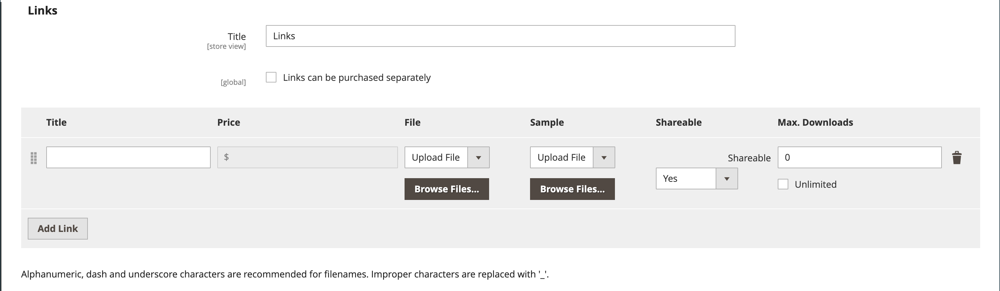

# Producto descargable

Un producto descargable puede ser cualquier cosa que pueda enviar como archivo, como un libro electrónico, música, vídeo, aplicación de software o actualización. Puedes ofrecer un álbum a la venta y vender cada canción individualmente. También puede utilizar un producto descargable para entregar una versión electrónica del catálogo de productos.

Como la descarga no estará disponible hasta después de la compra, puede proporcionar muestras, como un extracto de un libro, un clip de un archivo de audio o un trailer de un vídeo. Una muestra es algo que el cliente puede probar antes de comprar el producto. Los archivos que pone a disposición para su descarga se pueden cargar en su servidor o desde un servidor diferente.

{width="700" zoomable="yes"}

Los productos descargables se pueden configurar para que requieran que el cliente inicie sesión en una cuenta para recibir el vínculo o se pueden enviar por correo electrónico y compartir con otros. El estado del pedido antes de que la descarga esté disponible, los valores predeterminados y otras opciones de entrega se establecen en la configuración. A medida que planifique las adiciones a catálogos descargables, tome nota de lo siguiente:

- Los productos descargables pueden cargarse en el servidor o vincularse desde otro servidor en Internet.

- Puede determinar la cantidad de veces que un cliente puede descargar un producto.

- Los clientes que compren un producto descargable pueden tener que iniciar sesión antes de pasar por el proceso de cierre de compra.

- La entrega de un producto descargable se puede realizar cuando el pedido está en un `Pending` o `Invoiced` estado.

- Como los productos descargables no se envían, la variable _Envío_ El paso del cierre de compra se omite cuando el carro solo contiene el producto descargable.

## Configurar las opciones de descarga

Las opciones de configuración descargables determinan los valores predeterminados y las opciones de entrega de los productos descargables y especifican si los invitados pueden comprar descargas.

1. En el _Administrador_ barra lateral, vaya a **[!UICONTROL Stores]** > _[!UICONTROL Settings]_>**[!UICONTROL Configuration]**.

1. En el panel izquierdo, expanda **[!UICONTROL Catalog]** y elija **[!UICONTROL Catalog]** debajo.

1. Expandir  el _[!UICONTROL Downloadable Product Options]_sección.

   {width="700" zoomable="yes"}

   Para obtener una lista detallada de estas opciones de configuración, consulte [_Opciones de producto descargables_](../configuration-reference/catalog/catalog.md#downloadable-product-options) en el _Referencia de configuración_.

1. Para determinar el estado del proceso de pedido cuando la descarga esté disponible, establezca **[!UICONTROL Order Item Status to Enable Downloads]** a uno de los siguientes:

   - `Pending`
   - `Invoiced`

1. Para establecer un límite predeterminado en el número de descargas que puede realizar un solo cliente, introduzca el número de **[!UICONTROL Default Maximum Number of Downloads]**.

1. Establecer **[!UICONTROL Shareable]** a uno de los siguientes:

   - `Yes` : permite a los clientes enviar por correo electrónico el vínculo de descarga a otros usuarios.
   - `No` : Impide que los clientes compartan el vínculo de descarga con otros usuarios al exigir que inicien sesión en sus cuentas para acceder a los vínculos de descarga.

1. Para **[!UICONTROL Default Sample Title]**, introduzca el encabezado que desea que aparezca encima de la selección de muestras.

   {width="400"}

1. Para **[!UICONTROL Default Link Title]**, introduzca el texto predeterminado que desee utilizar para los vínculos de descarga.

1. Si desea que el vínculo de descarga se abra en una nueva ventana del explorador, establezca **[!UICONTROL Opens Links in New Window]** hasta `Yes`.

   Esta configuración se utiliza para mantener abierta la ventana del explorador de la tienda.

1. Para determinar cómo se entrega el contenido descargable, establezca **[!UICONTROL Use Content Disposition]** a uno de los siguientes:

   - `Attachment` : envía el vínculo de descarga por correo electrónico como archivo adjunto.
   - `Inline` : envía el vínculo de descarga como un vínculo en una página web.

1. Si desea exigir que los compradores se registren en una cuenta de cliente e inicien sesión antes de comprar una descarga, configure **[!UICONTROL Disable Guest Checkout if Cart Contains Downloadable Items]** hasta `Yes`.

1. Cuando termine, haga clic en **[!UICONTROL Save Config]**.

## Crear un producto descargable

Las siguientes instrucciones muestran el proceso de creación de un producto descargable mediante una [plantilla de producto](attribute-sets.md), campos obligatorios y configuración básica. Cada campo obligatorio está marcado con un asterisco rojo (`*`). Cuando termine los conceptos básicos, puede completar el resto de la configuración del producto según sea necesario.

>[!NOTE]
>
>Los nombres de archivo descargables pueden incluir letras y números. Se puede utilizar un guión o un guión bajo para representar un espacio entre palabras. Cualquier carácter no válido del nombre de archivo se reemplaza por un guion bajo.

### Paso 1: Elija el tipo de producto

1. En el _Administrador_ barra lateral, vaya a **[!UICONTROL Catalog]** > **[!UICONTROL Products]**.

1. En el _[!UICONTROL Add Product]_( {width="25"} ) en la esquina superior derecha, seleccione `Downloadable Product`.

   {width="700" zoomable="yes"}

### Paso 2: Selección del conjunto de atributos

Los datos de ejemplo incluyen un [conjunto de atributos](attribute-sets.md) llamado _Descargable_ que tiene campos especiales para productos descargables. Puede utilizar una plantilla existente o crear otra antes de guardar el producto.

Para elegir el conjunto de atributos que se utiliza como plantilla para el producto, realice una de las siguientes acciones:

- Para **[!UICONTROL Search]**, introduzca el nombre del conjunto de atributos.

- En la lista, elija la `Downloadable` conjunto de atributos.

El formulario se actualiza para reflejar el cambio.

{width="600" zoomable="yes"}

### Paso 3: complete la configuración necesaria

1. Introduzca el **[!UICONTROL Product Name]**.

1. Aceptar el valor predeterminado **[!UICONTROL SKU]** que se basa en el nombre del producto o introduzca otro.

1. Introduzca el producto **[!UICONTROL Price]**.

1. Como el producto aún no está listo para publicar, establezca **[!UICONTROL Enable Product]** hasta `No`.

1. click **[!UICONTROL Save]** y continuar.

   Cuando se guarda el producto, la variable [Vista de tienda](introduction.md#product-scope) el selector aparece en la esquina superior izquierda.

1. Elija la **[!UICONTROL Store View]** donde vaya a estar disponible el producto.

   {width="600" zoomable="yes"}

### Paso 4: completar la configuración básica

1. Establecer **[!UICONTROL Tax Class]** a uno de los siguientes:

   - `None`
   - `Taxable Goods`

1. Introduzca el **[!UICONTROL Quantity]** del producto que está en stock.

   Tome nota de lo siguiente:

   - De forma predeterminada, **[!UICONTROL Stock Status]** se establece en `Out of Stock`.

   - Como los productos descargables no se envían, la variable **[!UICONTROL Weight]** Este campo no se utiliza. Si activa esta función, se convierte en una [Producto sencillo](product-create-simple.md) y el _¿Es este producto descargable?_ no se puede usar la pestaña.

   >[!NOTE]
   >
   >Si activa [Inventory management](../inventory-management/introduction.md), los comerciantes de origen único establecen la cantidad en esta sección. Los comerciantes de varios orígenes agregan orígenes y cantidades en la sección Orígenes. Consulte lo siguiente _Asignación de Orígenes y Cantidades (Inventory management)_ sección.

1. Aceptar el valor predeterminado **[!UICONTROL Visibility]** configuración de `Catalog, Search`.

1. Para presentar el producto en [lista de productos nuevos](../content-design/widget-new-products-list.md), seleccione la **[!UICONTROL Set Product as New]** casilla de verificación

1. Para asignar _[!UICONTROL Categories]_para seleccionar el producto, haga clic en **[!UICONTROL Select…]**y realice una de las acciones siguientes:

   **Elija una categoría existente**:

   - Empiece a escribir en el cuadro hasta que encuentre una coincidencia.

   - Seleccione la casilla de verificación de cada categoría que se va a asignar.

   **Crear una categoría**:

   - Haga clic **[!UICONTROL New Category]**.

   - Introduzca el **[!UICONTROL Category Name]** y elija la **[!UICONTROL Parent Category]**, que determina su posición en [estructura del menú](category-root.md).

   - Haga clic **[!UICONTROL Create Category]**.

1. Establecer **[!UICONTROL Format]** a uno de los siguientes:

   - `Download`
   - `DVD`

   Si es necesario, puede editar la variable [atributo](attribute-product-create.md) para agregar más valores.

   Puede haber atributos adicionales que describan el producto. La selección varía según el conjunto de atributos y puede completarla más adelante.

#### Asignación de orígenes y cantidades ([!DNL Inventory Management])

{{$include /help/_includes/inventory-assign-sources.md}}

### Paso 5: Completar la información descargable

Desplazarse hacia abajo, expandir  el _[!UICONTROL Downloadable Information]_y seleccione la sección **[!UICONTROL Is this downloadable product?]**casilla de verificación

Cuando está activada, la variable _[!UICONTROL Downloadable Information]_tiene dos partes. La primera parte describe cada vínculo de descarga y la segunda parte describe cada archivo de muestra. El valor predeterminado de muchas de estas opciones se puede establecer en la variable [configuración](#configure-the-download-options).

{width="600" zoomable="yes"}

#### Completar los vínculos

1. En el _[!UICONTROL Links]_, introduzca la **[!UICONTROL Title]**que desee utilizar como encabezado para los vínculos de descarga.

1. Si procede, seleccione la **[!UICONTROL Links can be purchased separately]** casilla de verificación

1. Clic **[!UICONTROL Add Link]** y haga lo siguiente:

   - Introduzca el **[!UICONTROL Title]** y **[!UICONTROL Price]** de la descarga.

   - Para ambos **[!UICONTROL File]** y **[!UICONTROL Sample]** , elija uno de los siguientes métodos de distribución para las descargas:

      - `Upload File` - Elija este método para cargar el archivo de distribución en el servidor. Busque el archivo y selecciónelo para cargarlo.
      - `URL` : elija este método para acceder al archivo de distribución desde una URL. Introduzca la dirección URL completa del archivo de descarga.

   >[!NOTE]
   >
   >No puede utilizar vínculos a recursos externos como productos descargables. Los dominios de vínculo válidos están predefinidos mediante programación en `env.php` archivo (consulte [referencia env.php](https://experienceleague.adobe.com/docs/commerce-operations/configuration-guide/files/config-reference-envphp.html) en el _Guía de configuración_).

   - Establecer **[!UICONTROL Shareable]** a uno de los siguientes:

      - `No` : requiere que los clientes inicien sesión en sus cuentas para acceder al vínculo de descarga.

      - `Yes` : envía el vínculo por correo electrónico, que los clientes pueden compartir con otros.

      - `Use Config` : utiliza el método especificado en la variable [Opciones de producto descargables](../configuration-reference/catalog/catalog.md) configuración.

   - Realice una de las siguientes acciones:

      - Para limitar las descargas por cliente, introduzca el número máximo de **[!UICONTROL Max. Downloads]**.
      - Para permitir descargas ilimitadas, seleccione la **[!UICONTROL Unlimited]** casilla de verificación

   {width="600" zoomable="yes"}

1. Para añadir otro vínculo, haga clic en **[!UICONTROL Add Link]** y repita estos pasos.

#### Completar las muestras

1. En el _[!UICONTROL Samples]_, introduzca la **[!UICONTROL Title]**que desee utilizar como encabezado para las muestras.

1. Para completar la información de cada muestra, haga clic en **[!UICONTROL Add Link]**.

   {width="600" zoomable="yes"}

1. Complete los detalles del vínculo de la siguiente manera:

   - Introduzca el **[!UICONTROL Title]** de la muestra individual.

   - Elija uno de los siguientes métodos de distribución:

      - `Upload File` - Elija este método para cargar el archivo de distribución en el servidor. Busque el archivo y selecciónelo para cargarlo.
      - `URL` : elija este método para acceder al archivo de distribución desde una URL. Introduzca la dirección URL completa del archivo de descarga.

   - Para añadir otra muestra, haga clic en **[!UICONTROL Add Link]** y repita estos pasos.

   - Para cambiar el orden de las muestras, tome la _Orden de cambio_ (  ) y arrastre el ejemplo a una nueva posición.

### Paso 6: Completar la información del producto

Desplácese hacia abajo y complete la información de las siguientes secciones según sea necesario:

- [Contenido](product-content.md)
- [Imágenes y vídeos](product-images-and-video.md)
- [Optimización del motor de búsqueda](product-search-engine-optimization.md)
- [Productos relacionados, ampliación de ventas y ventas cruzadas](related-products-up-sells-cross-sells.md)
- [Opciones personalizables](settings-advanced-custom-options.md)
- [Productos en sitios web](settings-basic-websites.md)
- [Diseño](settings-advanced-design.md)
- [Opciones de regalo](product-gift-options.md)

### Paso 7: Publicar el producto

Si está listo para publicar el producto en el catálogo, establezca **[!UICONTROL Enable Product]** hasta `Yes` y realice una de las siguientes acciones:

**Método 1:** Guardar y previsualizar

- En la esquina superior derecha, haga clic en **[!UICONTROL Save]**.

- Para ver el producto en tu tienda, elige **[!UICONTROL Customer View]** en el _Administrador_ (  ) menú.

  La tienda se abre en una nueva pestaña del explorador.

  {width="600" zoomable="yes"}

**Método 2:** Guardar y cerrar

En el _[!UICONTROL Save]_( {width="25"} ), seleccione **[!UICONTROL Save & Close]**.

## Experiencia en tienda

En el panel de cuentas del cliente, la variable _[!UICONTROL My Downloadable Products]_vínculos de página a cada pedido de productos descargables. Las descargas están disponibles en la cuenta del cliente cuando se completa el pedido.

{width="700" zoomable="yes"}

En la tabla siguiente se describe la _Mis productos descargables_ valores:

| Columna | Descripción |
|--- |--- |
| [!UICONTROL Order#] | El [pedido](../stores-purchase/orders.md) en el que se compró el producto descargable. Proporciona un vínculo a los detalles del pedido. |
| [!UICONTROL Date] | Fecha de creación del pedido. |
| [!UICONTROL Title] | El nombre del producto descargable comprado con el pedido. Proporciona un vínculo al producto descargable. |
| [!UICONTROL Status] | Estado de procesamiento del pedido. |
| [!UICONTROL Remaining Downloads] | Número de descargas disponibles del producto descargado. |

_**Para descargar un archivo de producto desde el panel de cuentas**_

1. En su panel de cuentas, el cliente elige **[!UICONTROL My Downloadable Products]**.

1. Busca el orden en la lista y hace clic en el vínculo situado después del título.

1. En la esquina inferior derecha de la ventana de descarga, hace clic en el icono _descargar_ icono.

1. Localiza el archivo en su ubicación de descargas y lo guarda en la ubicación deseada.
