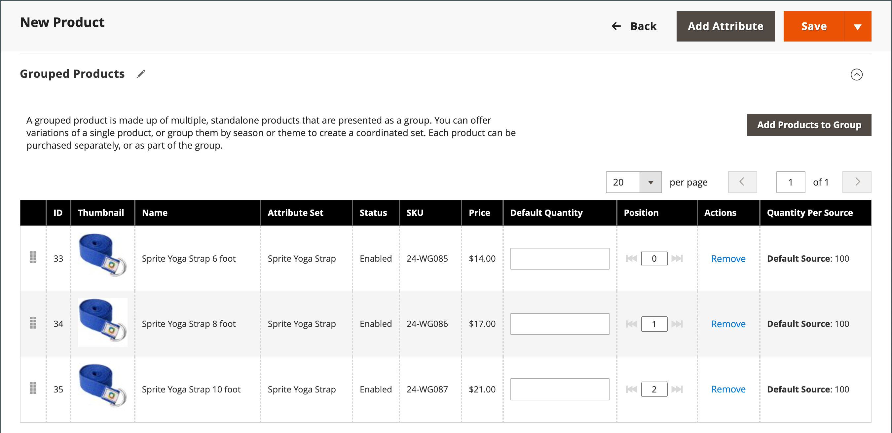

# Producto agrupado

Un producto agrupado consiste en productos independientes simples que se presentan como un grupo. Puede ofrecer variaciones de un solo producto o agruparlas por temporada o tema. La presentación de un producto agrupado puede crear un incentivo para que los clientes compren artículos adicionales. Un producto agrupado proporciona una manera sencilla de ofrecer variaciones de un producto y enumerarlas todas en la misma página.

Por ejemplo, puede vender artículos planos de stock abiertos y enumerar todos los tipos de utensilios que se utilizan en un lugar formal. Algunos pueden pedir varios tenedores para ensaladas, tenedores para pescado, tenedores para la cena, cuchillos para la cena, cuchillos para pescado, cuchillos para mantequilla, cucharas de sopa y cucharas de postre. Otros clientes pueden pedir un tenedor, un cuchillo y una cuchara sencillos. Los clientes pueden pedir cualquier número de cada artículo como deseen.

Aunque se presentan como un grupo, cada producto del grupo se compra como un artículo independiente. En el carro de compras, cada artículo y la cantidad comprada se muestran como un artículo de línea independiente.

Las siguientes instrucciones muestran el proceso de creación de un producto agrupado mediante una [plantilla de producto](attribute-sets.md), campos obligatorios y configuración básica. Cada campo obligatorio está marcado con un asterisco rojo (`*`). Cuando termine los conceptos básicos, puede completar el resto de la configuración del producto según sea necesario.

{width="700" zoomable="yes"}

## Paso 1: Elija el tipo de producto

1. En el _Administrador_ barra lateral, vaya a **[!UICONTROL Catalog]** > **[!UICONTROL Products]**.

1. En el _[!UICONTROL Add Product]_( {width="25"} ) en la esquina superior derecha, seleccione **[!UICONTROL Grouped Product]**.

   {width="700" zoomable="yes"}

## Paso 2: Selección del conjunto de atributos

Para elegir el [conjunto de atributos](attribute-sets.md) que se utiliza como plantilla para el producto, realice una de las siguientes acciones:

- Para buscar, introduzca el nombre del **[!UICONTROL Attribute Set]**.
- En la lista, elija el conjunto de atributos que desea utilizar.

El formulario se actualiza para reflejar el cambio.

{width="600" zoomable="yes"}

Si no existen los atributos necesarios, puede agregar nuevos atributos al crear un producto:

- En la esquina superior derecha, haga clic en **[!UICONTROL Add Attribute]**.
- Defina un nuevo atributo (consulte [Añadir un atributo a un producto](product-attributes-add.md)).

  {width="600" zoomable="yes"}

Para añadir un atributo existente al producto, utilice el [controles de filtro](../getting-started/admin-grid-controls.md) para buscar el atributo en la cuadrícula, haga lo siguiente:

- Seleccione la casilla de verificación de la primera columna de cada atributo que desee añadir.
- Clic **[!UICONTROL Add Selected]**.

## Paso 3: complete la configuración necesaria

1. Introduzca el **[!UICONTROL Product Name]**.

1. Aceptar el valor predeterminado **[!UICONTROL SKU]** que se basa en el nombre del producto o introduzca otro.

   Tome nota de que la variable **[!UICONTROL Quantity]** Este campo no está disponible porque el valor se deriva de los productos individuales que conforman el grupo.

   Un producto agrupado no tiene su propio precio en el catálogo. El precio del producto agrupado se deriva del precio de los productos individuales incluidos en el grupo.

1. Como el producto aún no está listo para publicar, establezca **[!UICONTROL Enable Product]** hasta `No` (  ).

1. Clic **[!UICONTROL Save]** y continuar.

   Cuando se guarda el producto, el nombre del producto aparece en la parte superior de la página y la variable [Vista de tienda](introduction.md#product-scope) el selector aparece en la esquina superior izquierda.

1. Elija la **[!UICONTROL Store View]** donde vaya a estar disponible el producto.

   {width="600" zoomable="yes"}

## Paso 4: completar la configuración básica

1. Acepte el **[!UICONTROL Stock Status]** configuración de `In Stock`.

1. Para asignar **[!UICONTROL Categories]** para seleccionar el producto, haga clic en **[!UICONTROL Select…]** y realice una de las acciones siguientes:

   **Elija una categoría existente:**

   - Empiece a escribir en el cuadro hasta que encuentre una coincidencia.

   - Seleccione la casilla de verificación de la categoría que se va a asignar.

   **Crear una categoría:**

   - Clic **[!UICONTROL New Category]**.

   - Introduzca el **[!UICONTROL Category Name]** y elija la **[!UICONTROL Parent Category]**, que determina su posición en la estructura de menú.

   - Clic **[!UICONTROL Create Category]**.

1. Acepte el **[!UICONTROL Visibility]** configuración de `Catalog, Search`.

1. Para presentar el producto en [lista de productos nuevos](../content-design/widget-new-products-list.md), elija la **[!UICONTROL Set Product as New]** **[!UICONTROL from]** y **[!UICONTROL to]** fechas en el calendario.

1. Elija la **[!UICONTROL Country of Manufacture]**.

   Puede haber atributos individuales adicionales que describan el producto. La selección varía según el conjunto de atributos y puede completarlos más adelante.

## Paso 5: Agregar productos al grupo

1. Desplácese hacia abajo hasta el **[!UICONTROL Grouped Products]** y haga clic en **[!UICONTROL Add Products to Group]**.

   {width="600" zoomable="yes"}

1. Si es necesario, utilice el [filtros](../getting-started/admin-grid-controls.md) para buscar los productos que desea incluir en el grupo.

1. En la lista, active la casilla de verificación de cada elemento que desee incluir en el grupo.

   >[!NOTE]
   >
   >Solo los productos simples, descargables y virtuales sin opciones configurables pueden agruparse como productos secundarios. Otros tipos de productos no aparecen en la lista de selección.

   {width="600" zoomable="yes"}

1. Para añadirlos al grupo de productos, haga clic en **[!UICONTROL Add Selected Products]**.

   Los productos seleccionados aparecen en la _[!UICONTROL Grouped Products]_sección.

   Para comerciantes de varias fuentes con [Inventory management](../inventory-management/sources-stocks.md), la cuadrícula incluye una **[!UICONTROL Quantity per Source]** con cada origen asignado y el importe de stock de inventario.

   {width="600" zoomable="yes"}

1. Introduzca una **[!UICONTROL Default Quantity]** para cualquiera de los elementos.

1. Para cambiar el orden de los productos, coja el _Orden de cambio_ icono (  ) en la primera columna y arrastre el producto a la nueva posición en la lista.

1. Para eliminar un producto del grupo, haga clic en **[!UICONTROL Remove]**.

## Paso 5: Completar la información del producto

Rellene la información de las secciones siguientes según sea necesario:

- [Contenido](product-content.md)
- [Imágenes y vídeos](product-images-and-video.md)
- [Optimización del motor de búsqueda](product-search-engine-optimization.md)
- [Productos relacionados, ampliación de ventas y ventas cruzadas](related-products-up-sells-cross-sells.md)
- [Opciones personalizables](settings-advanced-custom-options.md)
- [Productos en sitios web](settings-basic-websites.md)
- [Diseño](settings-advanced-design.md)
- [Opciones de regalo](product-gift-options.md)

## Paso 6: Publicar el producto

1. Si está listo para publicar el producto en el catálogo, establezca **[!UICONTROL Enable Product]** hasta `Yes`.

1. Realice una de las siguientes acciones:

   **Método 1:** Guardar y previsualizar

   - En la esquina superior derecha, haga clic en **[!UICONTROL Save]**.

   - Para ver el producto en tu tienda, elige **[!UICONTROL Customer View]** en el _Administrador_ (  ) menú.

     La tienda se abre en una nueva pestaña del explorador.

     {width="700" zoomable="yes"}

   **Método 2:** Guardar y cerrar

   - En el _[!UICONTROL Save]_( {width="25"} ), seleccione **[!UICONTROL Save & Close]**.

## Paso 7: Configurar las miniaturas del carro de compras (opcional)

Si tiene una imagen diferente para cada producto del grupo, puede definir la configuración para que utilice la imagen correcta en la miniatura del carro de compras.

1. En el _Administrador_ barra lateral, vaya a **[!UICONTROL Stores]** > _[!UICONTROL Settings]_>**[!UICONTROL Configuration]**.

1. En el panel izquierdo, expanda **[!UICONTROL Sales]** y elija **[!UICONTROL Checkout]**.

1. Expandir  el **[!UICONTROL Shopping Cart]**.

   Para obtener una lista detallada de estas opciones de configuración, consulte [Carro de compras](../configuration-reference/sales/checkout.md#shopping-cart) en el _Referencia de configuración_.

1. Establecer **[!UICONTROL Grouped Product Image]** hasta `Product Thumbnail Itself`.

   {width="600" zoomable="yes"}

   Si es necesario, anule la selección del **[!UICONTROL Use system value]** para establecer esta opción.

1. Clic **[!UICONTROL Save Config]**.

## Cosas que recordar

- Un producto agrupado es esencialmente una colección de productos asociados simples.

- Los productos secundarios agrupados pueden ser productos simples, descargables o virtuales **[!UICONTROL without custom options]**.

- Cada artículo comprado aparece individualmente en el carro de compras, en lugar de como parte del grupo.

- Un producto agrupado no tiene su propio precio en el catálogo. El precio del producto agrupado se deriva del precio de los productos individuales incluidos en el grupo.

- La imagen en miniatura del carro de compras se puede configurar para que muestre la imagen del producto principal agrupado o del producto asociado.
