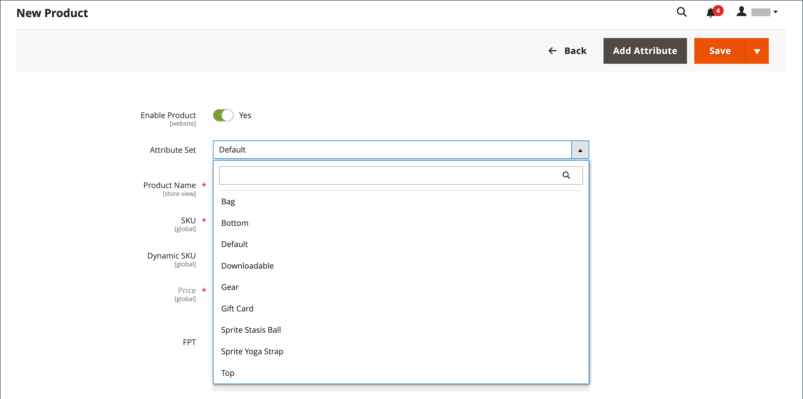
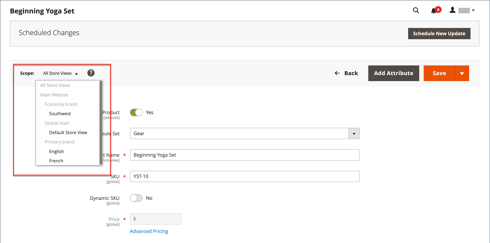

# Producto virtual

Los productos virtuales, o bienes digitales, representan elementos no tangibles como membresías, servicios, garantías o suscripciones y descargas digitales de libros, música, videos u otros productos. Los productos virtuales se pueden vender por separado o incluir como parte de los tipos de producto [Producto agrupado](product-create-grouped.md), [Producto configurable](product-create-configurable.md) o [Producto agrupado](product-create-bundle.md).

Aparte de la ausencia del campo _[!UICONTROL Weight]_, el proceso de creación de un producto virtual y de un producto simple es el mismo. Las siguientes instrucciones muestran el proceso de creación de un producto virtual mediante una [plantilla de producto](attribute-sets.md), los campos obligatorios y la configuración básica. Cuando termine los conceptos básicos, puede completar el resto de la configuración del producto según sea necesario.

>[!NOTE]
>
>PayPal ha dejado de ofrecer asistencia para la venta de artículos digitales a través del proceso de pago y envío de PayPal Express. Te recomiendan usar [PayPal Payments Standard](../stores-purchase/paypal-payments-standard.md) o cualquier otra puerta de pago de PayPal para procesar cualquier pedido que incluya productos virtuales.

{width="700" zoomable="yes"}

## Paso 1: Elija el tipo de producto

1. En la barra lateral _Admin_, vaya a **[!UICONTROL Catalog]** > **[!UICONTROL Products]**.

1. En el menú _[!UICONTROL Add Product]_( {width="25"} ) de la esquina superior derecha, elija **[!UICONTROL Virtual Product]**.

   {width="700" zoomable="yes"}

## Paso 2: Selección del conjunto de atributos

Para elegir el [conjunto de atributos](attribute-sets.md) que se usa como plantilla para el producto, siga uno de estos procedimientos:

- Haga clic en el campo **[!UICONTROL Attribute Set]** e introduzca todo o parte del nombre del conjunto de atributos.

- En la lista mostrada, elija el conjunto de atributos que desea utilizar.

El formulario se actualiza para reflejar el cambio.

{width="600" zoomable="yes"}

## Paso 3: complete la configuración necesaria

1. Escriba **[!UICONTROL Product Name]**.

1. Acepte el valor predeterminado **[!UICONTROL SKU]** basado en el nombre del producto o escriba otro.

1. Escriba el producto **[!UICONTROL Price]**.

1. Dado que el producto aún no está listo para publicarse, establezca **[!UICONTROL Enable Product]** en `No`.

1. Haga clic en **[!UICONTROL Save]** y continúe.

   Cuando se guarda el producto, aparece el selector [Vista de tienda](introduction.md#product-scope) en la esquina superior izquierda.

1. Elija el **[!UICONTROL Store View]** en el que el producto estará disponible.

   {width="600" zoomable="yes"}

## Paso 4: completar la configuración básica

1. Establezca **[!UICONTROL Tax Class]** en una de las siguientes opciones:

   - `None`
   - `Taxable Goods`

1. Escriba el **[!UICONTROL Quantity]** del producto que está en existencias y haga lo siguiente:

   - Acepte la configuración predeterminada **[!UICONTROL Stock Status]** de `In Stock`.

     Como no se envía un producto virtual, no se utiliza el campo **[!UICONTROL Weight]**.

   - Acepte la configuración predeterminada **[!UICONTROL Visibility]** de `Catalog, Search`.

   >[!NOTE]
   >
   >Si habilita [Inventory management](../inventory-management/introduction.md), los comerciantes de un solo origen establecerán la cantidad en esta sección. Los comerciantes de varios orígenes agregan orígenes y cantidades en la sección Orígenes. Consulte la siguiente sección _Asignar orígenes y cantidades (Inventory management)_.

1. Para asignar **[!UICONTROL Categories]** al producto, haga clic en el cuadro **[!UICONTROL Select…]** y realice una de las acciones siguientes:

   **Elija una categoría existente**:

   - Empiece a escribir en el cuadro hasta que encuentre una coincidencia.

   - Seleccione la casilla de verificación de la categoría que se va a asignar.

   **Crear una categoría**:

   - Haga clic en **[!UICONTROL New Category]**.

   - Escriba **[!UICONTROL Category Name]** y elija **[!UICONTROL Parent Category]**, que determina su posición en la estructura de menú.

   - Haga clic en **[!UICONTROL Create Category]**.

   Puede haber atributos individuales adicionales que describan el producto. La selección varía según el conjunto de atributos y puede completarla más adelante.

### Asignar orígenes y cantidades ([!DNL Inventory Management])

{{$include /help/_includes/inventory-assign-sources.md}}

## Paso 5: Completar la información del producto

Rellene la información de las secciones siguientes según sea necesario:

- [Contenido](product-content.md)
- [Imágenes y vídeos](product-images-and-video.md)
- [Optimización del motor de búsqueda](product-search-engine-optimization.md)
- [Productos relacionados, ampliación de ventas y ventas cruzadas](related-products-up-sells-cross-sells.md)
- [Opciones personalizables](settings-advanced-custom-options.md)
- [Productos en sitios web](settings-basic-websites.md)
- [Diseño](settings-advanced-design.md)
- [Opciones de regalo](product-gift-options.md)

>[!NOTE]
>
>La opción _[!UICONTROL Is this downloadable product?]_está deshabilitada de manera predeterminada. Si habilita esta característica para un producto virtual, el producto [se puede descargar](product-create-downloadable.md#downloadable-product).

## Paso 6: Publish del producto

1. Si está listo para publicar el producto en el catálogo, establezca **[!UICONTROL Enable Product]** en `Yes`.

1. Realice una de las siguientes acciones:

   - **Método 1:** Guardar y previsualizar

      - En la esquina superior derecha, haga clic en **[!UICONTROL Save]**.

      - Para ver el producto en tu tienda, elige **[!UICONTROL Customer View]** en el menú _Administrador_ (  ).

     La tienda se abre en una nueva pestaña del explorador.

     {width="600" zoomable="yes"}

   - **Método 2:** Guardar y cerrar

     En el menú _[!UICONTROL Save]_({width="25"} ), elija **[!UICONTROL Save & Close]**.

## Cosas que recordar

- Los productos virtuales se utilizan para productos no tangibles como servicios, suscripciones y garantías.

- Los productos virtuales son muy parecidos a los productos simples, pero sin peso.

- Las opciones de envío no aparecen durante el cierre de compra a menos que haya un producto tangible en el carro de compras.
