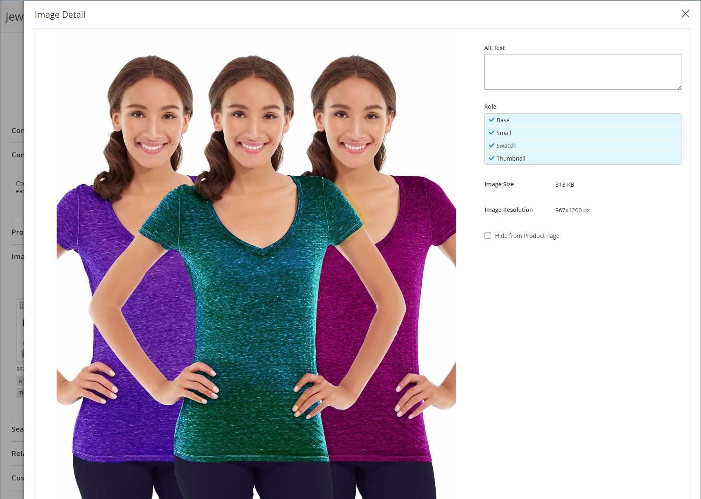

# Administración de imágenes y vídeos de productos

Para cada producto, puede cargar varias imágenes y vídeos, reorganizar su pedido y controlar cómo se utiliza cada uno. Si tiene que administrar una gran cantidad de imágenes, es posible que prefiera importarlas como un lote en lugar de cargar cada una de ellas individualmente. Para obtener más información, consulte [Importar imágenes de productos](../systems/data-import-product-images.md).

Si tiene pensado cargar imágenes grandes para verlas en el _[!UICONTROL Product Details]_, quizá le interese definir un tamaño de píxel máximo (ancho y alto) y cambiar automáticamente el tamaño de los archivos al cargar. Hay una opción para habilitar el cambio de tamaño automático de archivos de imagen más grandes a medida que carga. Para obtener más información, consulte [Cambio de tamaño de imagen de producto](product-image-config.md#product-image-resizing).

## Actualizar las imágenes del producto

1. Abra el producto en modo de edición.

1. Para trabajar con una vista de tienda específica, establezca el **[!UICONTROL Store View]** selector en la esquina superior izquierda de la vista aplicable.

   >[!NOTE]
   >
   >Las nuevas imágenes de producto son **_siempre_** cargado y visible en **_todo_** vistas de la tienda, incluso si la variable `All Store Views` el ámbito no se utiliza para la carga.   Para ocultar cualquier imagen de producto de una vista de tienda específica, debe cambiar a esa vista de tienda y seleccionar **[!UICONTROL Hide from Product Page]** para la imagen y haga clic en **[!UICONTROL Save]**.

1. Desplácese hacia abajo y expanda _[!UICONTROL Images and Videos]_sección.

### Cargar una imagen

Para conseguir la mejor compatibilidad, se recomienda cargar todas las imágenes de productos con `sRGB` perfil de color. Todos los demás perfiles de color se convierten automáticamente en `sRGB` perfil de color durante la carga de la imagen del producto, lo que podría provocar incoherencia de color en la imagen cargada.

La longitud del nombre del archivo de imagen, incluida la extensión, no puede superar los 90 caracteres.

Para cargar una imagen, realice una de las siguientes acciones:

- Arrastre una imagen desde el escritorio y suéltela en el _Cámara_ (  ) mosaico en el _[!UICONTROL Images And Videos]_cuadro.

- En el _[!UICONTROL Images And Videos]_, haga clic en_ Cámara _(  ), seleccione el archivo de imagen del equipo y haga clic en **[!UICONTROL Open]**.

  {width="600" zoomable="yes"}

### Reorganizar imágenes

Para cambiar el orden de las imágenes en la galería, haga clic en _[!UICONTROL Sort]_(  ) icono en la parte inferior del mosaico de la imagen y arrastre la imagen a una posición diferente en la_[!UICONTROL Images And Videos]_ cuadro.

{width="600" zoomable="yes"}

### Eliminar una imagen

Para quitar una imagen de la galería, haga clic en **[!UICONTROL Delete]** (  ) icono en la esquina superior derecha del mosaico de la imagen y haga clic en **[!UICONTROL Save]**.

### Definir detalles de la imagen

Haga clic en la imagen que desea abrir en la vista de detalles y realice una de las acciones siguientes:

{width="600" zoomable="yes"}

Para cerrar la vista de detalles, haga clic en _Cerrar_ (  ) icono en la esquina superior derecha.

Cuando termine, haga clic en **[!UICONTROL Save]**.

#### Introducir texto alternativo

Los lectores de pantalla hacen referencia al texto alternativo de imagen para mejorar la accesibilidad web y los motores de búsqueda al indexar el sitio. Algunos exploradores muestran el texto alternativo al pasar el ratón por encima. El texto alternativo puede tener varias palabras e incluir palabras clave cuidadosamente seleccionadas.

En el _[!UICONTROL Alt Text]_, escriba una breve descripción de la imagen.

#### Asignar funciones

De forma predeterminada, todas las funciones se asignan a la primera imagen cargada en el producto. Para reasignar un rol a otra imagen, haga lo siguiente:

En el _[!UICONTROL Role]_, elija la función que desea asignar a la imagen.

Cuando vuelva a la _Imágenes y vídeos_ , las funciones asignadas actualmente aparecen debajo de cada imagen.

{width="600" zoomable="yes"}

#### Ocultar una imagen

Para excluir una imagen de la galería de miniaturas, seleccione la **[!UICONTROL Hidden]** y haga clic en **[!UICONTROL Save]**.

{width="600" zoomable="yes"}

## Funciones de imagen

| Función de imagen | Descripción |
|--- |--- |
| [!UICONTROL Thumbnail] | Las imágenes en miniatura aparecen en la galería de miniaturas, en el carro de compras y en algunos bloques, como Elementos relacionados. Tamaño de ejemplo: 50 x 50 píxeles |
| [!UICONTROL Small Image] | La imagen pequeña se utiliza para las imágenes de los productos que aparecen en los anuncios de las páginas de categorías y resultados de búsqueda, y para mostrar las imágenes de productos necesarias para secciones como Ampliación de ventas, Venta cruzada y la Nueva lista de productos. Tamaño de ejemplo: 470 x 470 píxeles |
| [!UICONTROL Base Image] | La imagen base es la imagen principal de la página de detalles del producto. El zoom de imagen se activa si se carga una imagen que es más grande que el contenedor de imágenes. Según el nivel de zoom que desee alcanzar, la imagen base debe ser dos o tres veces el tamaño del contenedor. Tamaños de ejemplo: 470 x 470 píxeles (sin zoom), 1100 x 1100 píxeles (con zoom) |
| [!UICONTROL Swatch] | A [muestra](swatches.md) se puede utilizar para ilustrar el color, el motivo o la textura. Tamaño de ejemplo: 50 x 50 píxeles |

{style="table-layout:auto"}

## Filigranas

Si vas a expensas de crear tus propias imágenes originales del producto, no hay mucho que puedas hacer para evitar que competidores sin escrúpulos las roben con un clic del ratón. Sin embargo, puede hacer que sean un destino menos atractivo colocando una marca de agua en cada imagen para identificarlos como su propiedad. Un archivo de marca de agua puede ser un JPG (JPEG), un GIF o una imagen PNG. Los tipos de archivo GIF y PNG admiten capas transparentes, que se pueden utilizar para dar a la marca de agua un fondo transparente.

La marca de agua utilizada para _pequeño_ La imagen del ejemplo siguiente es un logotipo negro con fondo transparente y se guarda como archivo PNG con la siguiente configuración:

- Tamaño: 50x50
- Opacidad: 5
- Posición: Mosaico

{width="700" zoomable="yes"}

### Agregar marcas de agua a imágenes de productos

1. En el _Administrador_ barra lateral, vaya a **[!UICONTROL Content]** > _[!UICONTROL Design]_>**[!UICONTROL Configuration]**.

   Para obtener más información sobre las configuraciones de diseño, consulte [Configuración de diseño](../content-design/configuration.md).

1. Busque la vista de tienda que desee configurar y haga clic en **[!UICONTROL Edit]** en el _[!UICONTROL Action]_columna.

1. En _[!UICONTROL Other Settings]_, expanda  el **[!UICONTROL Product Image Watermarks]**sección.

   {width="600" zoomable="yes"}

   El **[!UICONTROL Base]**, **[!UICONTROL Thumbnail]**, **[!UICONTROL Small]**, y **[!UICONTROL Swatch Image]** la configuración de imagen es la misma.

1. Utilice uno de los siguientes métodos para agregar el recurso de imagen de marca de agua:

   - Clic **[!UICONTROL Upload]** y elija el archivo de imagen del sistema que desee cargar para utilizarlo como marca de agua.
   - Clic **[!UICONTROL Select from Gallery]** y seleccione un recurso de imagen de la [Galería de medios](../content-design/media-gallery.md).

1. Complete la configuración de visualización de la marca de agua:

   - Introduzca el **[!UICONTROL Image Opacity]** como porcentaje. Por ejemplo: `40`

   - Introduzca el **[!UICONTROL Image Size]** en píxeles. Por ejemplo: `200 x 200`

   - Establecer **[!UICONTROL Image Position]** para determinar dónde aparece la marca de agua.

1. Cuando termine, haga clic en **[!UICONTROL Save Config]**.

1. Cuando se le pida que actualice la caché, haga clic en **[!UICONTROL Cache Management]** en el mensaje del sistema y actualice la caché no válida.

   {width="600" zoomable="yes"}

>[!TIP]
>
>Puede hacer clic en **[!UICONTROL Use Default Value]**  para restaurar el valor predeterminado.

### Eliminar una marca de agua

1. En la esquina inferior izquierda de la imagen, haga clic en **[!UICONTROL Delete]** (  ) icono.

   {width="300"}

1. Haga clic **[!UICONTROL Save Config]**.

1. Cuando se le pida que actualice la caché, haga clic en **[!UICONTROL Cache Management]** en el mensaje del sistema y actualice la caché no válida.

   Si la imagen de marca de agua persiste en la tienda, vuelva a la administración de caché y haga clic en **[!UICONTROL Flush Magento Cache]**.
