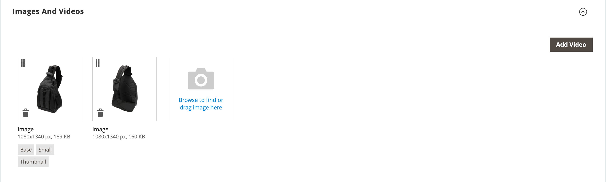

# Configuración del producto - [!UICONTROL Images and Videos]

Desde la sección _[!UICONTROL Images and Videos]_, puede realizar tareas básicas de administración de imágenes, como cargar varias imágenes, reorganizar imágenes y controlar cómo se utiliza cada imagen. Para tener un control adicional sobre las imágenes individuales, puede abrir cada imagen en_ vista de detalles _. Para obtener más información, vea [Imágenes de catálogo y vídeo](catalog-images-video.md).

## Cargar una nueva imagen

1. Abra el producto en modo de edición.

1. Desplácese hacia abajo y expanda  en la sección _[!UICONTROL Images and Videos]_.

   {width="600" zoomable="yes"}

1. Si está listo para agregar una imagen de producto, realice una de las siguientes acciones:

   - Arrastre una imagen desde el escritorio y suéltela en el mosaico _Cámara_ ().

   - Haga clic en el mosaico _Cámara_ (), seleccione el archivo de imagen y haga clic en **[!UICONTROL Open]**.

Aparecerá una imagen [placeholder](product-image-config.md#image-placeholders) en el catálogo hasta que haya una imagen de producto disponible.

## Detalle de imagen

A medida que agregue imágenes de producto, puede personalizar la visualización de la imagen en la ventana _[!UICONTROL Image Detail]_.

{width="600" zoomable="yes"}

Para establecer las opciones de visualización de imágenes de un producto:

1. Haga clic en la imagen del producto.

1. Escriba **[!UICONTROL Alt text]**.

1. Elija un **[!UICONTROL Role]** para mostrar la imagen (se pueden seleccionar todos los roles para una imagen):

   - `Swatch`
   - `Base`
   - `Small`
   - `Thumbnail`

   Todos estos roles están seleccionados de forma predeterminada para la primera imagen añadida.

   {width="600" zoomable="yes"}

Para ocultar la imagen del producto de la página de producto, marque la casilla de verificación **[!UICONTROL Hide from Product Page]**.
