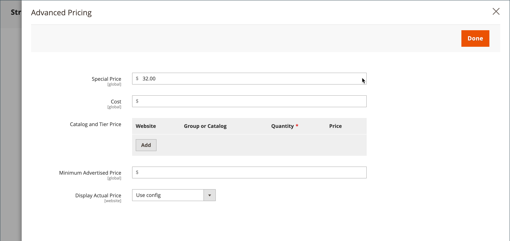

# Precios de grupo

Puede usar los ajustes de configuración del producto en Administración para establecer los precios de los artículos con descuento en función de los grupos de clientes de su tienda. Este modelo de precios estratégicos se denomina _precios de grupo_.

El precio con descuento de cualquier producto se puede ofrecer a los miembros de un grupo de clientes específico cuando el comprador tiene sesión en su cuenta. El precio de grupo del cliente se muestra en la página del producto junto con el precio normal, de modo que un comprador pueda comparar precios fácilmente y actuar en consecuencia. Después de agregar el producto al carro de compras, el precio normal se reemplaza por el precio de grupo basado en el grupo de clientes.

Los precios para los grupos de clientes son un componente de [precios por niveles](product-price-tier.md) y se establecen de manera similar. La única diferencia es que los precios de grupo de clientes tienen una cantidad de 1.

{width="600" zoomable="yes"}

## Ventajas de utilizar los precios de grupo

- Adecuado para compradores mayoristas

- Incentivo para que los clientes actualicen su grupo de clientes para aprovechar los descuentos

- Campañas de marketing dirigidas

- Genere confianza y credibilidad recompensando a los clientes fieles

## Configurar un precio de grupo

1. Abra el producto en modo de edición.

1. Debajo del campo _[!UICONTROL Price]_, haga clic en **[!UICONTROL Advanced Pricing]**.

1. En la sección _[!UICONTROL Customer Group Price]_, haga clic en **[!UICONTROL Add]**.

   Si tu tienda incluye [Adobe Commerce B2B](../b2b/introduction.md) y tiene [catálogos compartidos](../b2b/catalog-shared.md) habilitados, esta sección tiene la etiqueta _[!UICONTROL Catalog and Tier Price]_.

   {width="600" zoomable="yes"}

1. Configure el precio del grupo:

   - Para una instalación en varios sitios, elija **[!UICONTROL Website]** donde se aplica el precio del grupo.

   - Elija el(la) **[!UICONTROL Customer Group]** que recibirá el descuento.

   - Escriba **[!UICONTROL Quantity]** de `1`.

   - Para **[!UICONTROL Price]**, establezca el tipo de precio y la cantidad:

      - `Fixed` - Escriba el precio del producto con descuento.

      - `Discount` - Escriba el precio con descuento como porcentaje del precio del producto.

     {width="600" zoomable="yes"}

1. Para agregar otro precio de grupo, haga clic en **[!UICONTROL Add]** y repita el paso anterior.

1. Una vez finalizado, haga clic en **[!UICONTROL Done]** y luego en **[!UICONTROL Save]**.

>[!NOTE]
>
>El precio del producto **_final_** se calcula como el precio relevante **_mínimo_**, utilizando la siguiente fórmula:  `Final Price=Min(Regular(Base) Price, Group(Tier) Price, Special Price, Catalog Price Rule) + Sum(Min Price per each required custom option)`

>[!NOTE]
>
>**_Precio fijo_** Las opciones personalizables del producto están _no_ afectadas por las reglas de Precio de grupo, Precio de nivel, Precio especial o Precio de catálogo.
