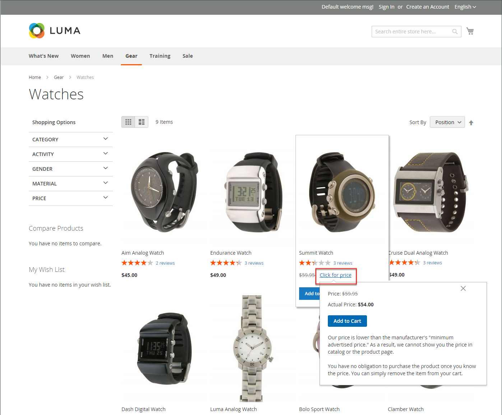

# Precio mínimo anunciado

A veces se prohíbe a los comerciantes mostrar un precio inferior al precio de venta al público sugerido por el fabricante (MSRP). Precio Mínimo Anunciado (MAP) le ofrece la posibilidad de cumplir con los requisitos del fabricante y, al mismo tiempo, ofrecer a sus clientes un mejor precio. Debido a que los requisitos difieren de un fabricante a otro, puede configurar su tienda para evitar que el precio real se muestre en páginas donde no esté permitido.

La función MAP agrega un vínculo _Clic para ver el precio_ en lugar del precio normal del producto. Si el precio en tu tienda está por debajo del precio mínimo establecido para ese producto, hay dos maneras de que la información de precios se pueda manejar en la tienda. La primera forma es que no se muestre el precio. Si el comprador hace clic en el botón _Hacer clic para el precio_, solo entonces se hace visible el precio real al que vendes el producto. La segunda forma es que el precio de lista/mercado se muestre con un tachado para resaltar que el precio es más bajo.

Además, la función MAP le permite sugerir algunas mejoras. Por ejemplo, cuando un cliente agrega un producto de este tipo al carro de compras, no se le redirige al carro de compras y, en su lugar, se muestran ofertas que permiten al comprador lo siguiente:

- Quitar un artículo del carro (se puede hacer si el comprador solo desea aclarar el precio y aún no ha tomado una decisión de compra)

- Déjelo en su carro de compras y siga comprando

- Pasar al cierre de compra

## Lógica de MAPA

Algunos productos tienen precios que dependen de una opción seleccionada, como opciones personalizadas o productos simples con sus propios SKU y gestión de existencias). Para estos productos, se aplica la siguiente lógica, según el tipo de producto y la fijación de precios. El precio real lo utilizan la gestión de pedidos, las herramientas de gestión de clientes y los informes.

## Uso de MAP con tipos de producto

| Tipo de producto | Descripción |
|--- |--- |
| [Simple](product-create-simple.md), [Virtual](product-create-virtual.md) | El precio real no aparece automáticamente en la lista de catálogos y en las páginas de productos, pero se incluye solo según la configuración de [!UICONTROL Display Actual Price]. Los precios de las opciones personalizadas aparecen normalmente. |
| [Agrupados](product-create-grouped.md) | Los precios de los productos simples asociados no aparecen automáticamente en la lista de catálogos y en las páginas de productos, sino que se incluyen solo según la configuración de [!UICONTROL Display Actual Price]. |
| [Configurable](product-create-configurable.md) | El precio real no aparece automáticamente en la lista de catálogos y en las páginas de productos, pero se incluye solo según la configuración de [!UICONTROL Display Actual Price]. Los precios de las opciones aparecen normalmente. |
| [Paquete](product-create-bundle.md) (con precio fijo) | El precio real no aparece automáticamente en las páginas del catálogo, pero se incluye solo según la configuración de [!UICONTROL Display Actual Price]. Los precios de los artículos agrupados aparecen normalmente. El MAP no está disponible para paquetes de productos con precios dinámicos. |
| [Descargable](product-create-downloadable.md) | El precio real no aparece automáticamente en la lista de catálogos y en las páginas de productos, pero se incluye solo según la configuración de [!UICONTROL Display Actual Price]. El precio asociado con cada enlace de descarga aparece normalmente. |

{style="table-layout:auto"}

## Uso del MAP con la configuración de precios

| Configuración de precios | Descripción |
|--- |--- |
| Precio principal | Cuando se aplica el MAP al precio principal, los precios de las opciones, los artículos agrupados y los productos asociados (que suman o restan del precio principal) aparecen normalmente. |
| Precio del producto asociado | Si un producto no tiene un precio principal y su precio se deriva de los precios del producto asociados (como en un producto agrupado), se aplica la configuración MAP de los productos asociados. |
| [MSRP](product-price-minimum-advertised.md) | Si un producto del carro de compras tiene especificado el precio minorista sugerido por el fabricante (MSRP), el precio no se tachará. |
| [Precio de nivel](product-price-tier.md) | Si se establece el precio del nivel, el mensaje de precio del nivel no se muestra en el catálogo. En la página del producto, aparece una notificación que indica que el precio puede ser inferior cuando se hace un pedido de más de una cantidad determinada, pero el descuento solo se muestra en porcentajes. Para los productos asociados de un producto agrupado, los descuentos no se muestran en la página del producto. El precio de nivel aparece según la configuración Mostrar precio real. |
| [Precio especial](product-price-special.md) | Si se especifica el precio especial, este se muestra según la configuración Mostrar precio real. |

## Configuración de MAP

La función de precio mínimo anunciado (MAP) no está activada de forma predeterminada. Si desea agregar esta capacidad a su tienda, debe habilitarla y configurar las opciones de MAP para sus productos. La configuración de MAP se puede aplicar a todos los productos del catálogo o configurarse para productos específicos. Cuando MAP está habilitado globalmente, todos los precios de los productos en la tienda están ocultos. Existen varias opciones de configuración que puede utilizar para cumplir con los términos del acuerdo con el fabricante, al tiempo que ofrece a sus clientes un mejor precio.

{width="700" zoomable="yes"}

A nivel global, puede activar o desactivar el MAP, aplicarlo a todos los productos y definir cómo se muestra el precio real. También puede editar el texto de los mensajes relacionados y las sugerencias de información que aparecen en la tienda.

Cuando MAP está habilitado, la configuración de MAP de nivel de producto está disponible. Puede aplicar MAP a un producto individual introduciendo el MSRP y eligiendo cómo desea que aparezca el precio real en la tienda. La configuración de MAP de nivel de producto anula la configuración global de MAP.

{width="700" zoomable="yes"}

### Paso 1: Habilitar MAP para la vista de tienda

1. En la barra lateral _Admin_, vaya a **[!UICONTROL Stores]** > _[!UICONTROL Settings]_>**[!UICONTROL Configuration]**.

1. Si corresponde, establezca **[!UICONTROL Store View]** en la esquina superior derecha de la vista donde se aplica la configuración.

1. En el panel izquierdo, expanda **[!UICONTROL Sales]** y elija **[!UICONTROL Sales]** debajo.

1. Expanda  en la sección _[!UICONTROL Minimum Advertised Price]_.

1. Si es necesario, establezca **Enable MAP** en `Yes`.

   {width="600" zoomable="yes"}

   Para obtener una lista detallada de estas opciones de configuración, consulte [_Precio mínimo anunciado_](../configuration-reference/sales/sales.md#minimum-advertised-price) en la _Referencia de configuración_.

### Paso 2: Configurar los ajustes de MAP

Utilice uno de los siguientes métodos para configurar las opciones de MAP:

#### Método 1: Configuración de MAP para todos los productos

1. Para determinar cuándo y dónde desea que el precio real sea visible para los clientes, haga lo siguiente:

   - Para cambiar el valor predeterminado, anule la selección de la casilla **[!UICONTROL Use system value]**.

   - Establezca **Mostrar precio real** en una de las siguientes opciones:
      - `In Cart`
      - `Before Order Confirmation`
      - `On Gesture (on click)`

1. Escriba el texto que desea que aparezca en **[!UICONTROL Default Popup Text Message]**.

1. Escriba cualquier explicación adicional que desee que aparezca en **[!UICONTROL Default "What's This" Text Message]**.

1. Una vez finalizado, haga clic en **[!UICONTROL Save Config]**.

#### Método 2: Configuración de MAP para un solo producto

1. En la barra lateral _Admin_, vaya a **[!UICONTROL Catalog]** > **[!UICONTROL Inventory]** > **[!UICONTROL Products]**.

1. Abra el producto en modo **[!UICONTROL Edit]**.

1. En el panel izquierdo, expanda **[!UICONTROL Advanced Settings]** y elija **[!UICONTROL Advanced Pricing]**.

   >[!NOTE]
   >
   >Los campos [!UICONTROL Manufacturer's Suggested Retail Price] y [!UICONTROL Display Actual Price] solo aparecen cuando [Precio mínimo anunciado](../configuration-reference/sales/sales.md#minimum-advertised-price) está habilitado en la configuración.

1. Escriba **[!UICONTROL Manufacturer's Suggested Retail Price]** (MSRP).

   En este ejemplo, el precio del producto es de 54,00 $ y el MSRP es de 59,95.

   {width="600" zoomable="yes"}

1. Establezca **[!UICONTROL Display Actual Price]** en una de las siguientes opciones:

   - `Use config` - (Predeterminado) Aplica la configuración de visualización como [configurada](../configuration-reference/sales/sales.md#minimum-advertised-price) para la tienda. |
   - `On Gesture` - Muestra el precio real del producto en una ventana emergente cuando el cliente hace clic en _Haga clic para ver el precio_ o _¿Qué es esto?_ vínculo.
   - `In Cart` - Muestra el precio real del producto en el carro de compras.
   - `Before Order Confirmation` - Muestra el precio real del producto al final del proceso de cierre de compra, justo antes de que se confirme el pedido.

1. Una vez finalizado, haga clic en **[!UICONTROL Done]** y luego en **[!UICONTROL Save]**.
