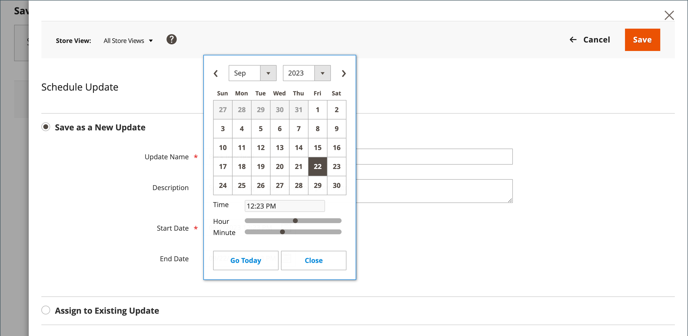
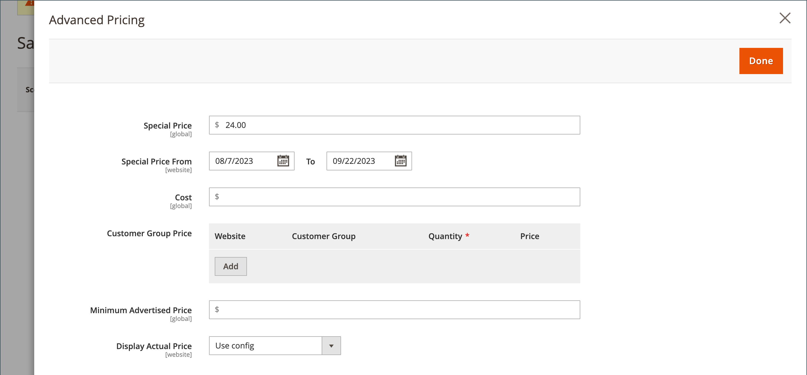

# Precios especiales

Se puede ofrecer un precio especial por un período de tiempo determinado. Durante el período de tiempo especificado, aparece el precio especial en lugar del precio normal, seguido de una anotación que muestra el precio normal.

{width="700" zoomable="yes"}

## Aplicar un precio especial a un producto individual

Puede establecer fácilmente un precio especial para un solo producto en el catálogo.

### Usar una actualización programada

{{ee-feature}}

Adobe Commerce incluye compatibilidad con [actualizaciones programadas](../content-design/content-staging-scheduled-update.md). Utilice estas herramientas promocionales para aplicar un precio especial a un producto específico durante un periodo de tiempo especificado.

1. Abra el producto en modo de edición.

1. Haga clic en **[!UICONTROL Scheduled Update]**.

   {width="600" zoomable="yes"}

1. Para **Actualizar nombre**, escriba un nombre para la promoción de precio especial.

1. Escriba una breve **[!UICONTROL Description]**.

1. Usa el icono _Calendario_ ( ) para elegir **[!UICONTROL Start Date]** y **[!UICONTROL End Date]** para la promoción de precio especial.

   También puede usar los controles deslizantes **[!UICONTROL Hour]** y **[!UICONTROL Minute]** para elegir la hora de inicio y finalización. Haga clic en **[!UICONTROL Close]** cuando se establezcan el inicio y el final.

   {width="600" zoomable="yes"}

1. Desplácese hacia abajo hasta el campo _Precio_, haga clic en **[!UICONTROL Advanced Pricing]** e introduzca la cantidad de **[!UICONTROL Special Price]** que se aplicará según la actualización programada.

   {width="600" zoomable="yes"}

1. Una vez finalizado, haga clic en **[!UICONTROL Done]** y luego en **[!DNL Save]**.

   En la tienda, el precio especial debe aparecer en la lista del catálogo y en la página del producto.

   _[!UICONTROL Scheduled Change]_aparece en la parte superior de la página.

   {width="600" zoomable="yes"}

### Usar una fecha de inicio y de finalización sencilla

{{ce-feature}}

Magento Open Source incluye opciones sencillas de fecha de inicio y finalización en las opciones de Advanced Pricing.

1. Abra el producto en modo de edición.

1. Desplácese hacia abajo hasta el campo _[!UICONTROL Price]_, haga clic en **[!UICONTROL Advanced Pricing]**e introduzca la cantidad **[!UICONTROL Special Price]**.

1. Usa el icono _Calendario_ ( ) para elegir **[!UICONTROL Start Date]** y **[!UICONTROL End Date]** para la promoción de precio especial.

   El precio especial entra en vigor inmediatamente después de la medianoche al principio de la fecha de inicio (00:01) y continúa hasta justo antes de la medianoche (23:59) del día anterior a la fecha de finalización.

   {width="600" zoomable="yes"}

1. Una vez finalizado, haga clic en **[!UICONTROL Done]** y luego en **[!UICONTROL Save]**.

   En la tienda, el precio especial debe aparecer en la lista del catálogo y en la página del producto.

## Aplicar un precio especial a varios productos

También puedes asignar un precio especial a varios productos, como múltiples variaciones de un [producto configurable](product-create-configurable.md).

### Establecer un precio especial para los productos seleccionados

{{ee-feature}}

El siguiente ejemplo muestra cómo asignar el mismo precio especial a varias variaciones de producto de un producto configurable en Adobe Commerce.

1. En la página _[!UICONTROL Products]_, haga clic en **[!UICONTROL Filters]**e introduzca **[!UICONTROL Name]**del producto configurable.

1. Establezca **[!UICONTROL Type]** en `Configurable Product` y haga clic en **[!UICONTROL Apply Filters]**.

1. Si desea asignar el mismo precio especial a todos los productos, establezca el control del encabezado de la primera columna en `Select All`.

   Como alternativa, puede seleccionar la casilla de verificación de cada producto que desee incluir.

1. Establezca el control **[!UICONTROL Actions]** en `Update attributes`.

1. Desplácese hacia abajo hasta el campo _[!UICONTROL Special Price]_, seleccione la casilla **[!UICONTROL Change]**situada debajo del campo_[!UICONTROL Special Price]_ e introduzca el precio especial que desea ofrecer.

   {width="600" zoomable="yes"}

1. Una vez finalizado, haga clic en **[!UICONTROL Save]**.

El precio especial disponible en la tienda aparece en los listados del catálogo y en la página del producto. Para un producto configurable, el precio normal también aparece en la página del producto cuando se eligen las opciones.

### Establezca un precio especial y un intervalo de fechas para los productos seleccionados

{{ce-feature}}

El siguiente ejemplo muestra cómo asignar el mismo precio especial a varias variaciones de producto de un producto configurable en Magento Open Source.

1. En la barra lateral _Admin_, vaya a **[!UICONTROL Catalog]** > **[!UICONTROL Products]**.

1. Haga clic en **[!UICONTROL Filters]**.

1. Escriba **[!UICONTROL Name]** del producto configurable.

1. Establezca **[!UICONTROL Type]** en `Simple Product`.

   {width="600" zoomable="yes"}

1. Haga clic en **[!UICONTROL Apply Filters]**.

   La cuadrícula enumera todos los productos simples asociados como variaciones del producto configurable.

1. Si desea asignar el mismo precio especial a todos los productos, establezca el control del encabezado de la primera columna en `Select All`.

   Como alternativa, puede seleccionar la casilla de verificación de cada producto que desee incluir.

1. Establezca el control **[!UICONTROL Actions]** en `Update attributes`.

   {width="600" zoomable="yes"}

1. Desplácese hacia abajo hasta el campo _[!UICONTROL Special Price]** y haga lo siguiente:

   - Seleccione la casilla de verificación **[!UICONTROL Change]** debajo del campo _[!UICONTROL Special Price]** e introduzca el precio especial que desea ofrecer.

   - Seleccione la casilla de verificación **[!UICONTROL Change]** debajo del campo _Precio especial desde la fecha_, haga clic en el _Calendario_ (  ) y elija la primera fecha de la promoción de precio especial.

     El precio especial entra en vigor inmediatamente después de la medianoche al principio de la fecha de inicio (00:01) y continúa hasta justo antes de la medianoche (23:59) del día anterior a la fecha de finalización.

   - Seleccione la casilla de verificación **[!UICONTROL Change]** debajo del campo _Precio especial hasta la fecha_, haga clic en el _Calendario_ (  ) y elija la última fecha de la promoción de precio especial.

   {width="600" zoomable="yes"}

1. Una vez finalizado, haga clic en **[!UICONTROL Save]**.

   Un mensaje indica cuántos registros se actualizaron con el precio especial.

   El precio especial está disponible en la tienda en la fecha especificada y aparece en los listados del catálogo y en la página del producto. Para un producto configurable, el precio normal también aparece en la página del producto cuando se eligen las opciones.

   {width="600" zoomable="yes"}

## Pruebas

Si el precio especial no aparece correctamente en la tienda ni en la lista de catálogos ni en las páginas de productos, borre la caché del explorador:

1. En la barra lateral _Admin_, vaya a **[!UICONTROL System]** > **[!UICONTROL Cache Management]**.

1. Haga clic en **[!UICONTROL Flush Magento Cache]**.

>[!NOTE]
>
>El precio del producto **_final_** se calcula como el precio relevante **_mínimo_**, utilizando la siguiente fórmula:  `Final Price=Min(Regular(Base) Price, Group(Tier) Price, Special Price, Catalog Price Rule) + Sum(Min Price per each required custom option)`

>[!NOTE]
>
>**_Precio fijo_** Las opciones personalizables del producto están _no_ afectadas por las reglas de Precio de grupo, Precio de nivel, Precio especial o Precio de catálogo.
