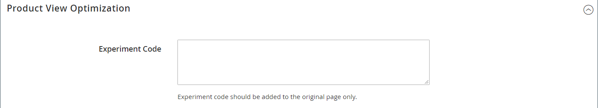

# Configuración del producto - [!UICONTROL Product View Optimization]

Después de usar [Experimentos de contenido de Google](../merchandising-promotions/google-content-experiments.md) para configurar una serie de pruebas A/B, utilice el _[!UICONTROL Product View Optimization]_para pegar el fragmento de código de Google en el producto original que se va a probar.

Esta sección solo aparece si **[!UICONTROL Google Content Experiments]** está habilitado en la [Google Analytics](../merchandising-promotions/google-analytics.md) Configuración de la API de Google.

{width="600" zoomable="yes"}
