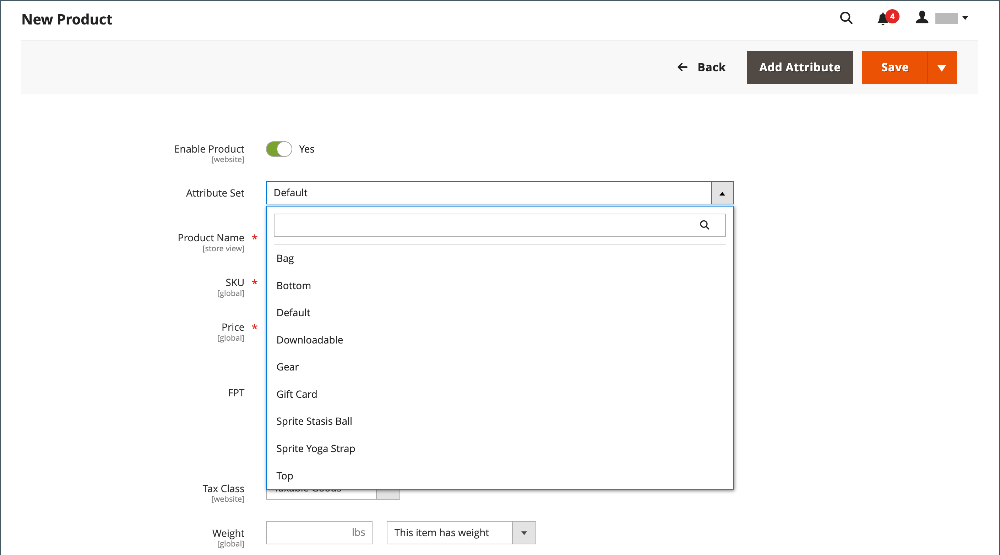

# Espacio de trabajo de productos

El espacio de trabajo de productos es básicamente el mismo para todos los tipos de productos, aunque la selección de campos cambia según el conjunto de atributos que se utilice. Los atributos del producto se encuentran en la parte superior del formulario, seguidos de secciones ampliables de información del producto. Cuando se guarda un nuevo producto por primera vez, aparece el selector _[!UICONTROL Store View]_&#x200B;en la parte superior izquierda del formulario.

{width="700" zoomable="yes"}

## Configuración de [!UICONTROL Enable Product]

El estado en línea del producto se indica mediante el interruptor situado en la parte superior del formulario. Para cambiar el estado en línea, establezca el conmutador **[!UICONTROL Enable Product]** en `Yes` o `No`.

| Control | Descripción |
|-------- | ----------- |
|  | Indica que el producto está en línea. |
|  | Indica que el producto está sin conexión. |

{style="table-layout:auto"}

## Conjunto de atributos

El nombre del [conjunto de atributos](attribute-sets.md) aparece en la esquina superior izquierda y determina los campos que aparecen en el registro del producto. Para elegir un conjunto de atributos diferente, haga clic en la flecha hacia abajo situada junto al nombre del conjunto de atributos por defecto.

{width="600" zoomable="yes"}

## Expandir/contraer

Para expandir o contraer una sección, haga clic en el icono Expandir  o contraer .

## Menú [!UICONTROL Save]

El menú _[!UICONTROL Save]_&#x200B;incluye varias opciones que permiten guardar y continuar, guardar y crear un producto, guardar y duplicar el producto o guardar y cerrar.

{width="600" zoomable="yes"}

| Comando | Descripción |
|--- |--- |
| [!UICONTROL Save] | Guarde el producto actual y continúe trabajando. |
| [!UICONTROL Save & New] | Guarde y cierre el producto actual y empiece un nuevo producto basado en el mismo tipo de producto y plantilla. |
| [!UICONTROL Save & Duplicate] | Guarde y cierre el producto actual y abra una nueva copia duplicada. |
| [!UICONTROL Save & Close] | Guarde el producto actual y vuelva al área de trabajo _[!UICONTROL Products]_. |

{style="table-layout:auto"}

## Valores de campo predeterminados

Para ahorrar tiempo al crear productos, el valor predeterminado de varios campos de producto hace referencia a los valores de otro campo. Puede aceptar el valor predeterminado o escribir otro. Los siguientes campos han generado automáticamente valores predeterminados:

| Campo | Predeterminado |
|----- |------- |
| [!UICONTROL SKU] | Según el nombre del producto. |
| [!UICONTROL Meta Title] | Según el nombre del producto. |
| [!UICONTROL Meta Keywords] | Según el nombre del producto. |
| [!UICONTROL Meta Description] | Según el nombre y la descripción del producto. |

{style="table-layout:auto"}

Los marcadores de posición que representan el valor de otro campo se encierran entre llaves dobles. Cualquier código de atributo que se incluya en el producto [conjunto de atributos](attribute-sets.md) puede utilizarse como marcador de posición.

{width="600" zoomable="yes"}

Para obtener una lista detallada de esta configuración, consulte [Generación automática de campos de producto](../configuration-reference/catalog/catalog.md#product-fields-auto-generation) en _Referencia de configuración_.

### Editar el valor del marcador de posición

1. En la barra lateral _Admin_, vaya a **[!UICONTROL Stores]** > _[!UICONTROL Settings]_>**[!UICONTROL Configuration]**.

1. En el panel izquierdo, expanda **[!UICONTROL Catalog]** y elija **[!UICONTROL Catalog]** debajo.

1. Expanda  en la sección **[!UICONTROL Product Fields Auto-Generation]** y realice los cambios necesarios en los valores de marcador de posición.

   Por ejemplo, si hay una palabra clave específica que desea incluir para cada producto o una frase que desea incluir en cada metadescripción, introduzca el valor directamente en el campo correspondiente.

   >[!NOTE]
   >
   >Si desea conservar los valores de marcador de posición existentes, conserve las llaves dobles que encierran cada etiqueta de marcado.

1. Una vez finalizado, haga clic en **[!UICONTROL Save Config]**.

### Marcadores de posición comunes

- `{{color}}`
- `{{country_of_manufacture}}`
- `{{description}}`
- `{{gender}}`
- `{{material}}`
- `{{name}}`
- `{{short_description}}`
- `{{size}}`
- `{{sku}}`
